.. include:: ../../Includes.txt

.. _core-wizards:

Wizard scripts in the core
^^^^^^^^^^^^^^^^^^^^^^^^^^

The wizard interface allows you to use any PHP-script for your wizards
but there is a useful set of default wizard scripts available in the
core of TYPO3. These are found mostly in
:file:`typo3/sysext/backend/Classes/Controller/Wizard/`.

Below is a description of each of them including a description of
their special parameters and an example of usage.

.. _core-wizards-add:

Add wizard
""""""""""

This script links to a form which allows you to create a new record in
a given table which may optionally be set as the value on return to
the real form.

.. _core-wizards-add-properties:

Properties
~~~~~~~~~~

.. _core-wizards-add-properties-table:

table
'''''

.. container:: table-row

   Key
         table

   Type
         string

   Description
         Table to add record in.

.. _core-wizards-add-properties-pid:

pid
'''

.. container:: table-row

   Key
         pid

   Type
         int

   Description
         pid of the new record.

         Several markers are available instead:

         - :code:`###CURRENT_PID###`
         - :code:`###THIS_UID###`
         - :code:`###SITEROOT###`
         - :code:`###PAGE_TSCONFIG_ID###`
         - :code:`###PAGE_TSCONFIG_IDLIST###`
         - :code:`###PAGE_TSCONFIG_STR###`

         (see :ref:`TCA/select <columns-select-properties-foreign-table-where>` for description)

.. _core-wizards-add-properties-setvalue:

setValue
''''''''

.. container:: table-row

   Key
         setValue

   Type
         "prepend", "set", "append"

   Description
         "set" = the field will be forced to have the new value on return

         "append"/"prepend" = the field will have the value appended/prepended.

         You must set one of these values.

.. _core-wizards-add-example:

Example
~~~~~~~

As an example, let's look at BE user records where one can see several
wizards in use:

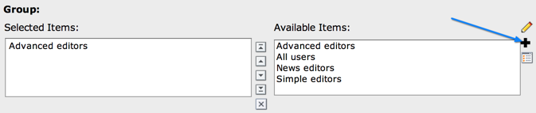

   The icon of the add wizard

The wizard appears as a "+" icon. When clicked, the user is directed
to a form where a new BE user group can be created:

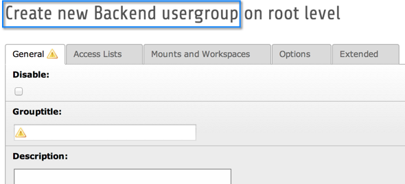

   The form for creating a new BE user group, as a result of clicking the add wizard's icon

When the new group is saved and the user clicks the close button of
the form the new group is automatically inserted as the list of
selected groups.

The configuration looks like this:

.. code-block:: php
   :emphasize-lines: 21-33

   'usergroup' => array(
      'label' => 'LLL:EXT:lang/locallang_tca.xlf:be_users.usergroup',
      'config' => array(
         'type' => 'select',
         'foreign_table' => 'be_groups',
         'foreign_table_where' => 'ORDER BY be_groups.title',
         'size' => '5',
         'maxitems' => '20',
         'wizards' => array(
            '_VERTICAL' => 1,
            'edit' => array(
               'type' => 'popup',
               'title' => 'LLL:EXT:lang/locallang_tca.xlf:be_users.usergroup_edit_title',
               'module' => array(
                  'name' => 'wizard_edit',
               ),
               'popup_onlyOpenIfSelected' => 1,
               'icon' => 'actions-open',
               'JSopenParams' => 'height=350,width=580,status=0,menubar=0,scrollbars=1'
            ),
            'add' => array(
               'type' => 'script',
               'title' => 'LLL:EXT:lang/locallang_tca.xlf:be_users.usergroup_add_title',
               'icon' => 'actions-add',
               'params' => array(
                  'table' => 'be_groups',
                  'pid' => '0',
                  'setValue' => 'prepend'
               ),
               'module' => array(
                  'name' => 'wizard_add'
               )
            ),
            'list' => array(
               'type' => 'script',
               'title' => 'LLL:EXT:lang/locallang_tca.xlf:be_users.usergroup_list_title',
               'icon' => 'actions-system-list-open',
               'params' => array(
                  'table' => 'be_groups',
                  'pid' => '0'
               ),
               'module' => array(
                  'name' => 'wizard_list'
               )
            )
         )
      )
   ),

The highlighted lines are related specifically to the Add wizard. Note the
reference to the :code:`wizard_add` key. The "params" array instructs the Add
wizard on how to handle the creation of the new record, i.e. which table,
where to store it, etc.. In particular the "setValue" parameter tells
the wizard script that the uid of the newly created record should be
inserted in the relations field of the original record (the one where
we clicked the Add wizard's icon).

.. _core-wizards-edit:

Edit wizard
"""""""""""

The Edit wizard gives you a shortcut to edit references in "select" or
"group" type form elements. Again let's look at the BE user records:

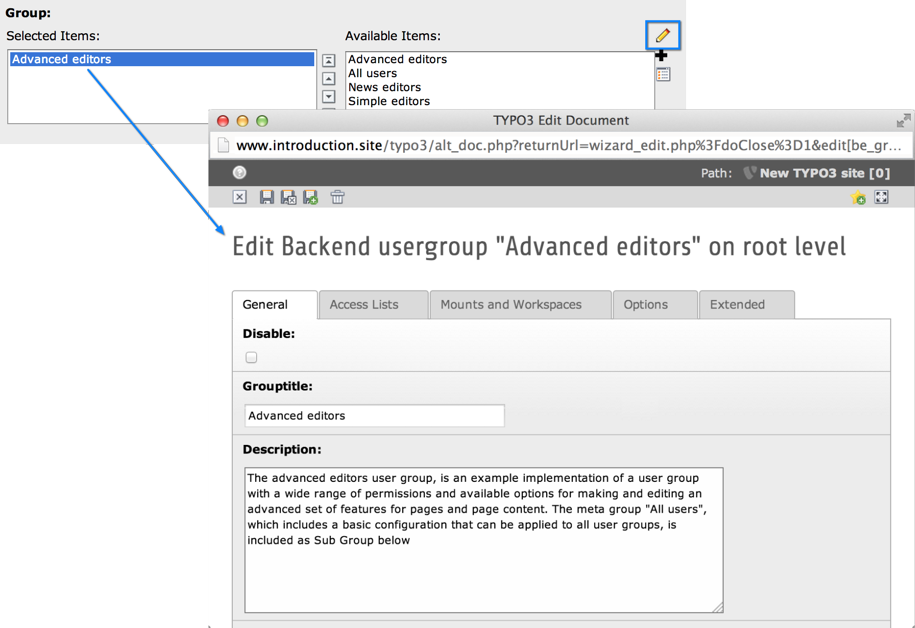

   Edit a related record directly thanks to the Edit wizard

When a record is selected and the Edit wizard button is clicked, that
record opens in a new window for modification. Let's look again at the
configuration (just the Edit wizard part):

.. code-block:: php

   'usergroup' => array(
      'label' => 'LLL:EXT:lang/locallang_tca.xlf:be_users.usergroup',
      'config' => array(
         ...
         'wizards' => array(
            ...
            'edit' => array(
               'type' => 'popup',
               'title' => 'LLL:EXT:lang/locallang_tca.xlf:be_users.usergroup_edit_title',
               'module' => array(
                  'name' => 'wizard_edit',
               ),
               'popup_onlyOpenIfSelected' => 1,
               'icon' => 'actions-open',
               'JSopenParams' => 'height=350,width=580,status=0,menubar=0,scrollbars=1'
            ),
            ...
         )
      )
   ),

The wizard is set to type :code:`popup` which makes it so that the selected
record will open in a new window. There are no parameters to pass
along like there were for the Add wizard.

.. _core-wizards-list:

List wizard
"""""""""""

This links to the Web > List module for only one table and allows the
user to manipulate stuff there. Again, the BE user records have it:

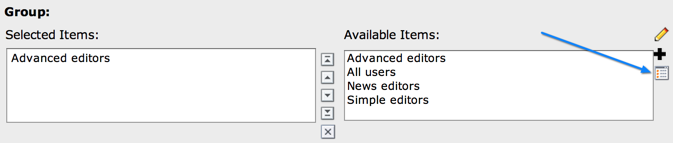

   Click on the list icon wizard to switch to the Web > List view

By clicking the icon the user gets taken to the Web > List module.
Notice the "Back" link found in the upper left corner, which leads
back to the edit form.

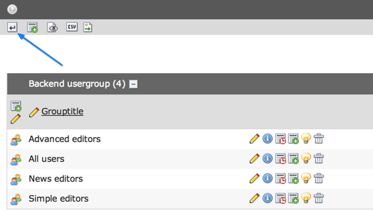

   The back link will return the user to the edit form

This wizard has a few parameters to configure in the "params" array:

.. _core-wizards-list-properties:

Properties
~~~~~~~~~~

.. _core-wizards-list-properties-table:

table
'''''

.. container:: table-row

   Key
         table

   Type
         string

   Description
         Table to manage records for

.. _core-wizards-list-properties-pid:

pid
'''

.. container:: table-row

   Key
         pid

   Type
         int

   Description
         id of the records you wish to list.

         Several markers are available instead:

         - :code:`###CURRENT_PID###`
         - :code:`###THIS_UID###`
         - :code:`###SITEROOT###`
         - :code:`###PAGE_TSCONFIG_ID###`
         - :code:`###PAGE_TSCONFIG_IDLIST###`
         - :code:`###PAGE_TSCONFIG_STR###`

         (see :ref:`TCA/select <columns-select-properties-foreign-table-where>` for description)

.. _core-wizards-list-example:

Example
~~~~~~~

For the BE users table, the configuration look like this (just the
List-wizard part):

.. code-block:: php

   'usergroup' => array(
      'label' => 'LLL:EXT:lang/locallang_tca.xlf:be_users.usergroup',
      'config' => array(
         ...
         'wizards' => array(
            ...
            'list' => array(
               'type' => 'script',
               'title' => 'LLL:EXT:lang/locallang_tca.xlf:be_users.usergroup_list_title',
               'icon' => 'actions-system-list-open',
               'params' => array(
                  'table' => 'be_groups',
                  'pid' => '0'
               ),
               'module' => array(
                  'name' => 'wizard_list'
               )
            )
         )
      )
   ),

In the "params" array the table and pid passed to the script is set.

.. _core-wizards-colorpicker:

Color picker
""""""""""""

The color picker wizard allows you to select a HTML color value from a
user-friendly pop-up box. The wizard type is "colorbox" which will
first of all add a colored box next to an input field. Here's how it
looks in a "haiku" record of the "examples" extension:

.. figure:: ../../Images/CoreWizardColorIcon.png
   :alt: The color wizard's icon

   Click on the color icon wizard to display a color selector

The color of the box is set to the value of the text field. Clicking
the box will open a popup window with the full color picker wizard:

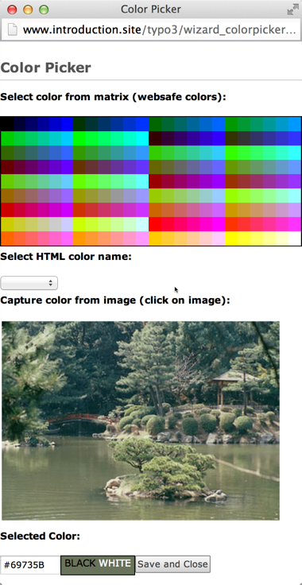

   Full color selector, with palette, dropdown-menu and image

Here you can select from the web-color matrix, pick a color from the
sample image or select a HTML-color name from a selector box.

The corresponding TCA configuration looks like this:

.. code-block:: php

   'color' => array(
      'exclude' => 0,
      'label' => 'LLL:EXT:examples/Resources/Private/Language/locallang_db.xlf:tx_examples_haiku.color',
      'config' => array(
         'type' => 'input',
         'size' => 10,
         'eval' => 'trim',
         'wizards' => array(
            'colorChoice' => array(
               'type' => 'colorbox',
               'title' => 'LLL:EXT:examples/Resources/Private/Language/locallang_db.xlf:tx_examples_haiku.colorPick',
               'module' => array(
                  'name' => 'wizard_colorpicker',
               ),
               'JSopenParams' => 'height=600,width=380,status=0,menubar=0,scrollbars=1',
               'exampleImg' => 'EXT:examples/res/images/japanese_garden.jpg',
            )
         )
      )
   ),

Notice the wizard type which is "colorbox".

.. _core-wizards-forms:

Forms wizard
""""""""""""

The forms wizard is used typically with the Content Elements, type
"Mailform". It allows to edit the code-like configuration of the mail
form with a more visual editor.

.. _core-wizards-forms-properties:

Properties
~~~~~~~~~~

.. _core-wizards-forms-properties-xmloutput:

xmlOutput
'''''''''

.. container:: table-row

   Key
         xmlOutput

   Type
         boolean

   Description
         If set, the output from the wizard is XML instead of the strangely
         formatted TypoScript form-configuration code.

.. _core-wizards-forms-example:

Example
~~~~~~~

System extension "form" overrides the default "forms" wizard configuration
to provide its more advanced visual editor (specific forms-wizard parameters
highlighted):

.. code-block:: php
   :emphasize-lines: 10-12

   $GLOBALS['TCA']['tt_content']['columns']['bodytext']['config']['wizards']['forms'] = array(
      'notNewRecords' => 1,
      'enableByTypeConfig' => 1,
      'type' => 'script',
      'title' => 'Form wizard',
      'icon' => 'EXT:backend/Resources/Public/Images/FormFieldWizard/wizard_forms.gif',
      'module' => array(
         'name' => 'wizard_form'
      ),
      'params' => array(
         'xmlOutput' => 0
      )
   );

This is how it looks in a "mailform" content element:

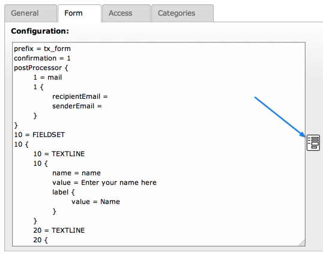

   Click on the forms icon wizard to display the forms editor

And this is the wizard's window:

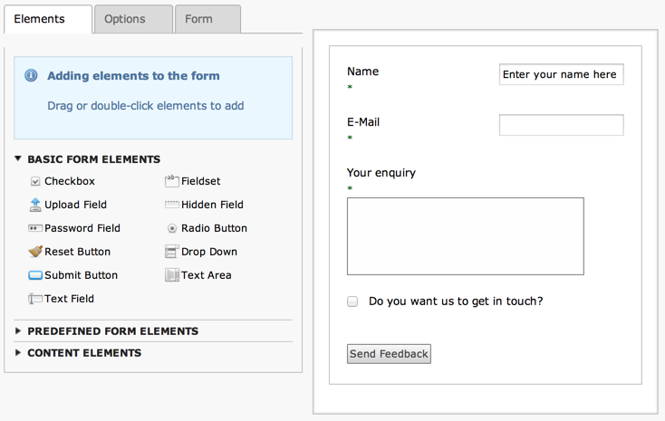

   The visual forms editor provided by the "form" system extension

.. _core-wizards-table:

Table wizard
""""""""""""

The table wizard is used typically with the Content Elements, type
"Table". It allows to edit the code-like configuration of the tables
with a visual editor.

.. _core-wizards-table-properties:

Properties
~~~~~~~~~~

.. _core-wizards-table-properties-xmloutput:

xmlOutput
'''''''''

.. container:: table-row

   Key
         xmlOutput

   Type
         boolean

   Description
         If set, the output from the wizard is XML instead of the TypoScript
         table configuration code.

.. _core-wizards-table-properties-numnewrows:

numNewRows
''''''''''

.. container:: table-row

   Key
         numNewRows

   Type
         integer

   Description
         Setting the number of blank rows that will be added in the bottom of
         the table when the plus-icon is pressed. The default is 5, the range
         is 1-50.

.. _core-wizards-table-example:

Example
~~~~~~~

This is the configuration code used for the table wizard in the
Content Elements:

.. code-block:: php

   'table' => array(
      'notNewRecords' => 1,
      'enableByTypeConfig' => 1,
      'type' => 'script',
      'title' => 'LLL:EXT:cms/locallang_ttc.xlf:bodytext.W.table',
      'icon' => 'EXT:backend/Resources/Public/Images/FormFieldWizard/wizard_table.gif',
      'module' => array(
         'name' => 'wizard_table'
      ),
      'params' => array(
         'xmlOutput' => 0
      )
   ),

This is how the wizard looks like:

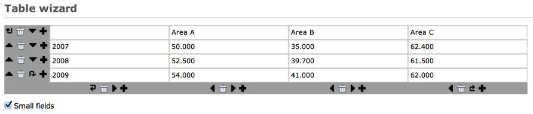

   The visual table editor

.. _core-wizards-rte:

RTE wizard
""""""""""

This wizard is used to show a "full-screen" Rich Text Editor field.
The configuration below shows an example taken from the Text field in
Content Elements:

.. code-block:: php

   'RTE' => array(
      'notNewRecords' => 1,
      'RTEonly' => 1,
      'type' => 'script',
      'title' => 'LLL:EXT:frontend/Resources/Private/Language/locallang_ttc.xlf:bodytext.W.RTE',
      'icon' => 'EXT:backend/Resources/Public/Images/FormFieldWizard/wizard_rte.gif',
      'module' => array(
          'name' => 'wizard_rte'
      )
   ),

.. _core-wizards-t3editor:

t3editor
""""""""

System extension "t3editor" provides an enhanced textarea for
TypoScript input, with not only syntax highlighting but also
auto-complete suggestions. This is a very special process reserved
for the "sys_template" template.

However beyond that the "t3editor" extension makes it possible to
add syntax highlighting to textarea fields, for several languages
(currently including HTML, CSS, JavaScript, TypoScript, SPARQL, XML
and PHP). This is how the "bodytext" field of table "tt_content" is
enhanced for HTML content elements:

.. code-block:: php

   'bodytext' => array(
      'label' => 'aLabel',
      'config' => array(
         'type' => 'text',
         'renderType' => 't3editor',
         'format' => 'html',
         'rows' => 42,
      ),
   ),

.. note::

   Since TYPO3 7.3, this display widget is not configured in the `wizard` section, but
   uses `renderType <columns-text-properties-rendertype>`.

.. _core-wizards-browse:

Link browser
""""""""""""

The link browser wizard is used many places where you want to insert link
references.

This works not only in the Rich Text Editor but also in "typolink"
fields.

.. _core-wizards-browse-properties:

Properties
~~~~~~~~~~

.. _core-wizards-browse-properties-allowedextensions:

allowedExtensions
'''''''''''''''''

.. container:: table-row

   Key
         allowedExtensions

   Type
         string

   Description
         Comma separated list of allowed file extensions. By default, all
         extensions are allowed.

.. _core-wizards-browse-properties-blindlinkoptions:

blindLinkOptions
''''''''''''''''

.. container:: table-row

   Key
         blindLinkOptions

   Type
         string

   Description
         Comma separated list of link options that should not be displayed.
         Possible values are file, mail, page, spec, and url. By default, all
         link options are displayed.

.. _core-wizards-browse-properties-blindlinkfields:

blindLinkFields
'''''''''''''''

.. container:: table-row

   Key
         blindLinkFields

   Type
         string

   Description
         Comma separated list of link fields that should not be displayed.
         Possible values are class, params, target and title. By default, all
         link fields are displayed.

.. _core-wizards-browse-example:

Example
~~~~~~~

Here's an example from "tt\_content" for the link that can be placed
on the content element's header:

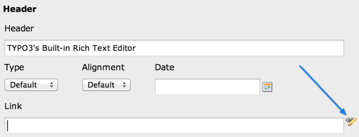

   Click on the browse icon wizard to display the link browser

Clicking the wizard icons opens the Element Browser window:

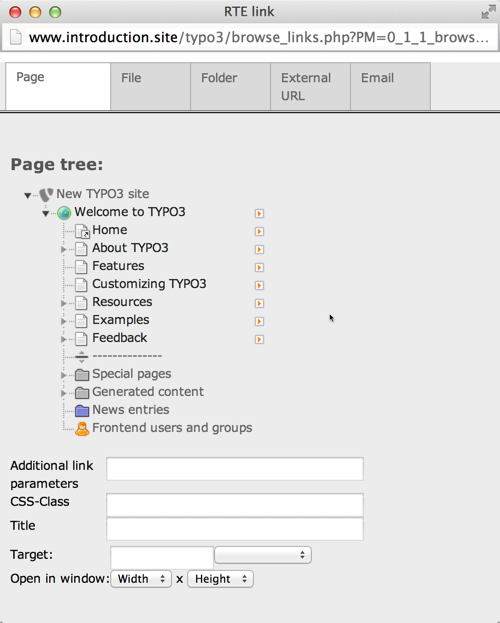

   The link browser popup window and all the link possibilities displayed as tabs

Such a wizard can be configured like this:

.. code-block:: php
   :emphasize-lines: 10-18

   'header_link' => array(
      'label' => 'LLL:EXT:cms/locallang_ttc.xlf:header_link',
      'exclude' => 1,
      'config' => array(
         'type' => 'input',
         'size' => '50',
         'max' => '256',
         'eval' => 'trim',
         'wizards' => array(
            'link' => array(
               'type' => 'popup',
               'title' => 'LLL:EXT:frontend/Resources/Private/Language/locallang_ttc.xlf:header_link_formlabel',
               'icon' => 'EXT:backend/Resources/Public/Images/FormFieldWizard/wizard_link.gif',
               'module' => array(
                  'name' => 'wizard_link',
               ),
               'JSopenParams' => 'height=800,width=600,status=0,menubar=0,scrollbars=1'
            )
         ),
         'softref' => 'typolink'
      )
   ),

Notice how the wizard requires an extra parameter
(highlighted lines) since it has to return content back to the input field
(and not the RTE, for instance, which it also supports).
