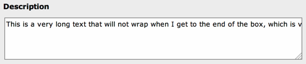

.. ==================================================
.. FOR YOUR INFORMATION
.. --------------------------------------------------
.. -*- coding: utf-8 -*- with BOM.

.. include:: ../../Includes.txt

Special Configuration (defaultExtras)
^^^^^^^^^^^^^^^^^^^^^^^^^^^^^^^^^^^^^

.. _special-configuration-default:

It is possible to pass special parameters to a field. For instance you
can define that a text field should not wrap lines. The following definition
adds :code:`nowrap` configuration to the "description field" in the
:code:`['columns']['field name']` array:

.. code-block:: php

	'columns' => array(
		'description' => array(
			'exclude' => 0,
			'label' => 'LLL:EXT:examples/Resources/Private/Language/locallang_db.xlf:tx_examples_dummy.description',
			'config' => array(
				'type' => 'text',
				'cols' => 50,
				'rows' => 3
			),
			'defaultExtras' => 'nowrap'
		),
	),

.. _special-configuration:

Additionally, it is possible to overwrite or add this setting for certain types only.
The following definition (in the "tx_examples_dummy" table of the "examples" extension)
adds a :code:`nowrap` configuration to the "description field":

.. code-block:: php

	'0' => array(
		'showitem' => 'hidden, record_type, title, description;;;nowrap, some_date'
		'columnsOverrides' => array(
			'description' => array(
				'defaultExtras' => 'nowrap',
			),
		),
	),

The field itself is defined absolutely normally:

.. code-block:: php

	'columns' => array(
		'description' => array(
			'exclude' => 0,
			'label' => 'LLL:EXT:examples/Resources/Private/Language/locallang_db.xlf:tx_examples_dummy.description',
			'config' => array(
				'type' => 'text',
				'cols' => 50,
				'rows' => 3
			),
		),
	),

The result is a textarea field where lines are not wrapped
automatically when reaching the width of the box:

   A text field which does not wrap automatically

The point of setting :code:`nowrap` in the "types" "columnsOverrides" configuration
is that under other "types"-configurations the field *will* wrap lines.
Likewise you can configure an RTE to appear for a field only if a
certain type of the record is set and in other cases not.
