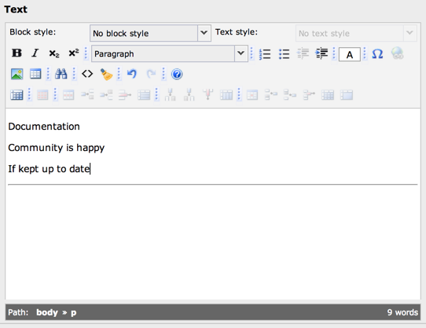

.. ==================================================
.. FOR YOUR INFORMATION
.. --------------------------------------------------
.. -*- coding: utf-8 -*- with BOM.

.. include:: ../../Includes.txt

.. _special-configuration-options:

Special Configuration options
^^^^^^^^^^^^^^^^^^^^^^^^^^^^^

.. _special-configuration-options-keywords:

Keywords
""""""""

This table lists the options for keywords in a special configuration.
Each keyword is followed by a *value* wrapped in :code:`[]` (square
brackets).

It is possible to use several keywords. Each must be separated by a
colon (:code:`:`). See examples below.

.. _special-configuration-options-keywords-nowrap:

nowrap
~~~~~~

.. container:: table-row

   Keyword
         nowrap

   Description
         Disables line wrapping in "text" type fields.

   Value syntax
         [no options]

.. _special-configuration-options-keywords-richtext:

richtext
~~~~~~~~

.. container:: table-row

   Keyword
         richtext

   Description
         Enables the RTE for the field and allows you to set which toolbar
         buttons must be shown on top of the existing configuration.

   Value syntax
         Blank, \* or

         keywords separated by "\|"

   Examples
         richtext[\*] = all RTE options

         richtext[] = inherit default configuration

         richtext[cut\|copy\|paste] = ensures that cut, copy and paste options
         are shown regardless of RTE configuration

         See :ref:`RTE API <t3api:rte>` for more details.

.. _special-configuration-options-keywords-rte-transform:

rte\_transform
~~~~~~~~~~~~~~

.. container:: table-row

   Keyword
         rte\_transform

   Description
         Configuration of RTE transformations and other options.

         :ref:`See table for a list of possible key values <special-configuration-options-rte>`.

   Value syntax
         key1=value2\|key2=value2\|key3=value3\|...

   Examples
         rte\_transform[key1=value1\|key2=value2\|key3=value3]

.. _special-configuration-options-keywords-fixed-font:

fixed-font
~~~~~~~~~~

.. container:: table-row

   Keyword
         fixed-font

   Description
         Use a monospace font in "textarea" type fields.

   Value syntax
         [no options]

.. _special-configuration-options-keywords-enable-tab:

enable-tab
~~~~~~~~~~

.. container:: table-row

   Keyword
         enable-tab

   Description
         Enable tabulator inside "textarea" type fields.

   Value syntax
         [no options]

.. _special-configuration-options-keywords-rte-only:

rte\_only
~~~~~~~~~

.. container:: table-row

   Keyword
         rte\_only

   Description
         If set, the field can *only* be edited with a Rich Text Editor -
         otherwise it will not show up.

   Value syntax
         boolean (0/1)

.. _special-configuration-options-keywords-static-write:

static\_write
~~~~~~~~~~~~~

.. container:: table-row

   Keyword
         static\_write

   Description
         This allows to configure a field value to be written to a file.

         :ref:`See below for explanations about keys f1-f5 <special-configuration-options-static>`.

   Value syntax
         f1\|f2\|f3\|f4\|f5

.. _special-configuration-options-keywords-wizards:

wizards
~~~~~~~

.. container:: table-row

   Keyword
         wizards

   Description
         Used to specifically enable wizards configured for a field. See option
         "enableByTypeConfig" in the wizard configuration.

   Value syntax
         wizard-key1\|wizard-key2\|...

   Examples
         wizards[table]

.. _special-configuration-options-rte:

rte\_transform[] key/value pairs
""""""""""""""""""""""""""""""""

.. _special-configuration-options-rte-mode:

mode
~~~~

.. container:: table-row

   Keyword
         mode

   Description
         Configures which transformations the content will pass through between
         the database and the RTE application.

   Value syntax
         Transformation keywords separated by dashes ("-").

         The order is calling order when direction is "db".

         *See* ` *RTE API*  <#Transformation%20overview%7Coutline>`_  *section
         for list of transformations available.*

   Examples
         rte\_transform[mode=ts\_css-images]

.. _special-configuration-options-rte-imgpath:

imgpath
~~~~~~~

.. container:: table-row

   Keyword
         imgpath

   Description
         This sets an alternative path for Rich Text Editor images. Default is
         configured by the value :code:`$TYPO3_CONF_VARS['BE']['RTE_imageStorageDir']`
         (default is "uploads/").

   Value syntax
         path relative to PATH\_site, e.g. "uploads/rte\_test/"

.. _special-configuration-options-rte-example:

Example - Setting up Rich Text Editors
~~~~~~~~~~~~~~~~~~~~~~~~~~~~~~~~~~~~~~

Let's take another table from the "examples" extension to look at how
to set up a text will with a RTE. The table "tx\_examples\_haiku"
contains a column called "poem" on which we want to have the RTE.
Its configuration looks like this:

.. code-block:: php
   :emphasize-lines: 10

	'poem' => array(
		'exclude' => 0,
		'label' => 'LLL:EXT:examples/Resources/Private/Language/locallang_db.xlf:tx_examples_haiku.poem',
		'config' => array(
			'type' => 'text',
			'cols' => 40,
			'rows' => 6,
			'softref' => 'typolink_tag,images,email[subst],url',
		),
		'defaultExtras' => 'richtext[]:rte_transform[mode=tx_examples_transformation-ts_css]:static_write[filename|poem]'
	),

Concentrate on just the highlighted line. This example contains no
additional configuration (notice the empty square brackets), meaning
the RTE will inherit from the TYPO3-wide configuration (as defined by
Page and User TSconfig). This may look like this (depending on your
local RTE configuration):

   The "poem" text field with the RTE activated

.. _special-configuration-options-static:

static\_write[] parameters
""""""""""""""""""""""""""

.. _special-configuration-options-static-f1:

f1
~~

.. container:: table-row

   Keyword
         f1

   Description
         The field name which contains the name of the file being edited. This
         filename should be relative to the path configured in
         :code:`$TYPO3_CONF_VARS['BE']['staticFileEditPath']`
         (which is :file:`fileadmin/static/` by default).

         The file  **must** exist and be writable.

.. _special-configuration-options-static-f2:

f2
~~

.. container:: table-row

   Keyword
         f2

   Description
         The field name which will also receive a copy of the content (in the
         database).

         This should probably be the field name that carries this
         configuration.

.. _special-configuration-options-static-f3:

f3
~~

.. container:: table-row

   Keyword
         f3

   Description
         The field name containing the alternative subpart marker used to
         identify the editable section in the file.

         The default marker is :code:`###TYPO3_STATICFILE_EDIT###` and may be
         encapsulated in HTML comments. There must be two markers, one to
         identify the beginning and one for the end of the editable section.

         Optional.

.. _special-configuration-options-static-f4:

f4
~~

.. container:: table-row

   Keyword
         f4

   Description
         The field name of the record which - if true - indicates that the
         content should always be loaded into the form from the file and not
         from the duplicate field in the database.

.. _special-configuration-options-static-f5:

f5
~~

.. container:: table-row

   Keyword
         f5

   Description
         The field name which will receive a status message as a short text
         string.

         Optional.

.. _special-configuration-options-static-example:

Example - Write to static file
~~~~~~~~~~~~~~~~~~~~~~~~~~~~~~

Let's go back to the above example and look at the second part of the
:code:`defaultExtras` configuration (in the highlighted line):

.. code-block:: php
   :emphasize-lines: 10

	'poem' => array(
		'exclude' => 0,
		'label' => 'LLL:EXT:examples/Resources/Private/Language/locallang_db.xlf:tx_examples_haiku.poem',
		'config' => array(
			'type' => 'text',
			'cols' => 40,
			'rows' => 6,
			'softref' => 'typolink_tag,images,email[subst],url',
		),
		'defaultExtras' => 'richtext[]:rte_transform[mode=tx_examples_transformation-ts_css]:static_write[filename|poem]'
	),

This configuration means that the content of the "poem" field will be
written to the file given in "filename". It looks like this in the BE:

.. figure:: ../../Images/SpecialConfigurationStatic.png
   :alt: File name for static storage

   The field containing the file name to write to

Before saving the content of :file:`fileadmin/static/myhaiku.txt` must be:

.. code-block:: text

	###TYPO3_STATICFILE_EDIT###
	###TYPO3_STATICFILE_EDIT###

After saving the content of :file:`fileadmin/static/myhaiku.txt` looks like
this:

.. code-block:: text

	###TYPO3_STATICFILE_EDIT###
	Documentation
	Community is happy
	If kept up to date
	###TYPO3_STATICFILE_EDIT###
