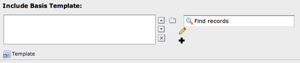
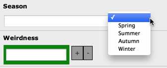
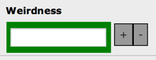
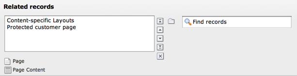
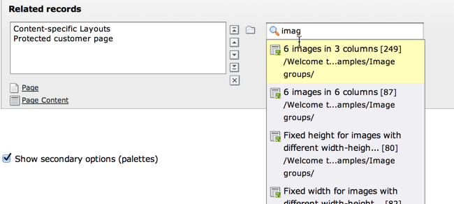
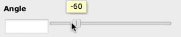

.. ==================================================
.. FOR YOUR INFORMATION
.. --------------------------------------------------
.. -*- coding: utf-8 -*- with BOM.

.. include:: ../../Includes.txt

.. _wizards:

Wizards Configuration
^^^^^^^^^^^^^^^^^^^^^

Wizards are configurable for some field types, namely "input", "text",
"select" and "group" types. They provide a way to insert helper-
elements, links to wizard scripts etc.

A well known example of a wizard application is the form wizard
(as provided by the "form" system extension):

.. figure:: ../../Images/CoreWizardFormsIcon.png
   :alt: The forms wizard's icon

   Click on the forms icon wizard to display the forms editor

The wizard is configured for the text area field and appears as an
icon to the right. Clicking the icon will guide the user to a view
where the "cryptic" form code is presented in a more user-friendly
interface:

.. figure:: ../../Images/CoreWizardFormsWindow.png
   :alt: The forms visual editor

   The visual forms editor provided by the "form" system extension

Another example of wizards are the new / edit / suggest wizards which
are available for "group" or "select" type fields:

   New, edit and suggest wizard, associated with a form field

.. _wizards-configuration:

Configuration of wizards
""""""""""""""""""""""""

The value of the "wizards" key in the field config-array is an array.
Each key is yet another array which configures the individual wizards
for a field. The order of the keys determines the order the wizards
are displayed in. The key-values themselves play no important role
(except from a few reserved words listed in a table below).

.. warning::

   Configuration of wizards has changed since TYPO3 CMS 6.2 to provide
   CSRF protection. To see examples for older version of TYPO3 CMS
   please refer to other versions of this manual.

The configuration for the new / edit / suggest wizards shown above
looks like this:

.. code-block:: php

	'basedOn' => array(
		'label' => 'LLL:EXT:cms/locallang_tca.xlf:sys_template.basedOn',
		'config' => array(
			...
			'wizards' => array(
				'_PADDING' => 4,
				'_VERTICAL' => 1,
				'suggest' => array(
					'type' => 'suggest'
				),
				'edit' => array(
					'type' => 'popup',
					'title' => 'Edit template',
					'module' => array(
						'name' => 'wizard_edit',
					),
					'popup_onlyOpenIfSelected' => 1,
					'icon' => 'edit2.gif',
					'JSopenParams' => 'height=350,width=580,status=0,menubar=0,scrollbars=1'
				),
				'add' => array(
					'type' => 'script',
					'title' => 'LLL:EXT:cms/locallang_tca.xlf:sys_template.basedOn_add',
					'icon' => 'add.gif',
					'params' => array(
						'table' => 'sys_template',
						'pid' => '###CURRENT_PID###',
						'setValue' => 'prepend'
					),
					'module' => array(
						'name' => 'wizard_add'
					)
				)
			)
		)
	),

The first two lines of the "wizards" configuration make use of two reserved
keywords to define settings for the display of icons.

.. _wizards-reserved:

Reserved keys
"""""""""""""

Each wizard is identified by a key string. However some strings are
reserved for general configuration. These are listed in this table and
as a rule of thumb they are prefixed with an underscore ("\_"):

.. _wizards-reserved-position:

\_POSITION
~~~~~~~~~~

.. container:: table-row

   Key
         \_POSITION

   Type
         string

   Description
         Determines the position of the wizard icons/titles.

         Default is "right".

         Possible values are "left", "top", "bottom".

.. _wizards-reserved-vertical:

\_ VERTICAL
~~~~~~~~~~~

.. container:: table-row

   Key
         \_VERTICAL

   Type
         boolean

   Description
         If set, the wizard icons (if more than one) will be positioned in a
         column (vertically) and not a row (horizontally, which is default)

.. _wizards-reserved-distance:

\_ DISTANCE
~~~~~~~~~~~

.. container:: table-row

   Key
         \_DISTANCE

   Type
         int+

   Description
         The distance in pixels between wizard icons (if more than one).

.. _wizards-reserved-padding:

\_PADDING
~~~~~~~~~

.. container:: table-row

   Key
         \_PADDING

   Type
         int+

   Description
         The cellpadding of the table which keeps the wizard icons together.

.. _wizards-reserved-valign:

\_VALIGN
~~~~~~~~

.. container:: table-row

   Key
         \_VALIGN

   Type
         string

   Description
         valign attribute in the table holding things together.

.. _wizards-reserved-any-other-key:

[any other key]
~~~~~~~~~~~~~~~

.. container:: table-row

   Key
         [any other key]

   Type
         PHP array

   Description
         Configuration of the wizard types, see below.

.. _wizards-configuration-general:

General configuration options
"""""""""""""""""""""""""""""

This table lists the general configuration options for (almost) all
wizard types. In particular the value of the "type" key is important
because it denotes what additional options are available.

.. _wizards-configuration-general-type:

type
~~~~

.. container:: table-row

   Key
         type

   Type
         string

   Description
         Defines the type of wizard. The options are listed as headlines in the
         table below.

         **This setting is required!**

.. _wizards-configuration-general-title:

title
~~~~~

.. container:: table-row

   Key
         title

   Type
         string or LLL reference

   Description
         This is the title of the wizard. For those wizards which require a
         physical representation – e.g. a link - this will be the link if no
         icon is presented.

.. _wizards-configuration-general-icon:

icon
~~~~

.. container:: table-row

   Key
         icon

   Type
         fileref

   Description
         This is the icon representing the wizard.

         If the first 3 chars are **not** "../" then the file is expected to be in
         :file:`typo3/sysext/t3skin/icons/gfx/`. To insert custom images,
         put them into an extension and use an icon path like
         :file:`EXT:ext/[extension key]/directory/...`. Generally, the format is the
         same as for referring to icons for selector box options.

         If the icon is not set, the title will be used for the link.

.. _wizards-configuration-general-enablebytypeconfig:

enableByTypeConfig
~~~~~~~~~~~~~~~~~~

.. container:: table-row

   Key
         enableByTypeConfig

   Type
         boolean

   Description
         If set, then the wizard is enabled only if declared in the
         :ref:`Special Configuration of specific types <special-configuration-options-keywords-wizards>`
         (using :code:`wizards[list of wizard-keys]`).

.. _wizards-configuration-general-rteonly:

RTEonly
~~~~~~~

.. container:: table-row

   Key
         RTEonly

   Type
         boolean

   Description
         If set, then this wizard will appear only if the wizard is presented
         for a RTE field.

.. _wizards-configuration-specific:

Specific wizard configuration options based on type
"""""""""""""""""""""""""""""""""""""""""""""""""""

.. _wizards-configuration-script:

Script wizard
~~~~~~~~~~~~~

.. _wizards-configuration-script-type:

type
''''

.. container:: table-row

   Key
         type

   Type
         string

   Description
         *[Must be set to "script"]*

         Creates a link to an external script which can do "context sensitive"
         processing of the field. This is how the Form and Table wizards are
         used.

.. _wizards-configuration-script-notnewrecords:

notNewRecords
'''''''''''''

.. container:: table-row

   Key
         notNewRecords

   Type
         boolean

   Description
         If set, the link will appear *only* if the record is not new (that
         is, it has a proper UID)

.. _wizards-configuration-script-script:

script
''''''

.. container:: table-row

   Key
         script

   Type
         PHP script filename

   Description
         If the first 3 characters are NOT :code:`../` then the file is expected to be in
         :file:`typo3/`. So to link to a custom script, put it in :file:`../typo3conf/`.

         File reference can be prefixed "EXT:[extension key]/" to point to a file
         inside an extension. This is by far the preferred method.

         A lot of parameters are passed to the script as GET-vars in an array :code:`P`.

         .. warning::

            Deprecated since TYPO3 CMS 6.2, use :ref:`module <wizards-configuration-script-module>`
            instead.

.. _wizards-configuration-script-module:

module
''''''

.. container:: table-row

   Key
         module

   Type
         array

   Description
         *(Since TYPO3 CMS 6.2)*

         This array contains configuration matching a declared wizard.
         For example, the "Add record" wizard is declated that way in
         :file:`typo3/sysext/backend/ext_tables.php`:

         .. code-block:: php

			// Register add wizard
			\TYPO3\CMS\Core\Utility\ExtensionManagementUtility::addModulePath(
				'wizard_add',
				\TYPO3\CMS\Core\Utility\ExtensionManagementUtility::extPath($_EXTKEY) . 'Modules/Wizards/AddWizard/'
			);

         Note the key named :code:`wizard_add`. This key is used when
         configuring a wizard, as in:

         .. code-block:: php

			'module' => array(
				'name' => 'wizard_add'
			)

.. _wizards-configuration-script-params:

params
''''''

.. container:: table-row

   Key
         params

   Type
         array

   Description
         Here you can put values which are passed to your script in the :code:`P` array.

.. _wizards-configuration-script-popup-onlyopenifselected:

popup\_onlyOpenIfSelected
'''''''''''''''''''''''''

.. container:: table-row

   Key
         popup\_onlyOpenIfSelected

   Type
         boolean

   Description
         If set, then an element (one or more) from the list must be selected.
         Otherwise the popup will not appear and you will get a message alert
         instead. This is supposed to be used with the :file:`wizard_edit.php` script
         for editing records in "group" type fields.

.. _wizards-configuration-popup:

Popup and colorbox wizards
~~~~~~~~~~~~~~~~~~~~~~~~~~

.. _wizards-configuration-popup-type:

type
''''

.. container:: table-row

   Key
         type

   Type
         string

   Description
         *[Must be set to "popup" or "colorbox"]*

         Creates a link to an external script opened in a pop-up window.

.. _wizards-configuration-popup-notnewrecords:

notNewRecords
'''''''''''''

.. container:: table-row

   Key
         notNewRecords

   Type
         boolean

   Description
         :ref:`See above, type "script" <wizards-configuration-script-notnewrecords>`.

.. _wizards-configuration-popup-script:

script
''''''

.. container:: table-row

   Key
         script

   Type
         PHP script filename

   Description
         :ref:`See above, type "script" <wizards-configuration-script-script>`.

.. _wizards-configuration-popup-module:

module
''''''

.. container:: table-row

   Key
         module

   Type
         array

   Description
         :ref:`See above, type "module" <wizards-configuration-script-module>`.

.. _wizards-configuration-popup-params:

params
''''''

.. container:: table-row

   Key
         params

   Type
         array

   Description
         :ref:`See above, type "script" <wizards-configuration-script-params>`.

.. _wizards-configuration-popup-jsopenparams:

JSopenParams
''''''''''''

.. container:: table-row

   Key
         JSopenParams

   Type
         string

   Description
         Parameters to open JS window:

         **Example**

         .. code-block:: php

            "JSopenParams" => "height=300,width=250,status=0,menubar=0,scrollbars=1",

.. _wizards-configuration-user:

User-defined wizards
~~~~~~~~~~~~~~~~~~~~

.. _wizards-configuration-user-type:

type
''''

.. container:: table-row

   Key
         type

   Type
         string

   Description
         *[Must be set to "userFunc"]*

         Calls a user function/method to produce the wizard or whatever they
         are up to.

.. _wizards-configuration-user-notnewrecords:

notNewRecords
'''''''''''''

.. container:: table-row

   Key
         notNewRecords

   Type
         boolean

   Description
         :ref:`See above, type "script" <wizards-configuration-script-notnewrecords>`.

.. _REPLACE-ME-userfunc:

userFunc
''''''''

.. container:: table-row

   Key
         userFunc

   Type
         string

   Description
         Calls a function or a method in a class.

         **Methods:** [classname]->[methodname]

         **Functions:** [functionname]

         The function/class must be included on beforehand. This is advised to
         be done within the localconf.php file.

         Two parameters are passed to the function/method:

         #. an array with parameters, much like the ones passed to scripts.
            One key is special though: the "item" key, which is passed by reference.
            So if you alter that value it is reflected *back*!
         #. a back-reference to the calling TCEform-object.

         The content returned from the function call is inserted at the
         position where the the icon/title would normally go.

         :ref:`See full example below <wizards-configuration-examples-user>`.

.. _wizards-configuration-colorbox:

Colorbox wizards
~~~~~~~~~~~~~~~~

.. _wizards-configuration-colorbox-type:

type
''''

.. container:: table-row

   Key
         type

   Type
         string

   Description
         *[Must be set to "colorbox"]*

         Renders a square box (table) with the background color set to the
         value of the field. The id-attribute is set to a md5-hash so you might
         change the color dynamically from pop-up- wizard.

         The icon is not used, but the title is given as alt-text inside the
         color-square.

.. _wizards-configuration-colorbox-exampleimg:

exampleImg
''''''''''

.. container:: table-row

   Key
         exampleImg

   Type
         string

   Description
         Reference to a sample (relative to :file:`PATH_typo3` directory).

         You can prefix with :code:`EXT:` to get image from extension.

         An image 350 pixels wide is optimal for display.

         **Example**

         .. code-block:: php

            'exampleImg' => 'gfx/wizard_colorpickerex.jpg'

.. _wizards-configuration-select:

Select wizards
~~~~~~~~~~~~~~

.. _wizards-configuration-select-type:

type
''''

.. container:: table-row

   Key
         type

   Type
         string

   Description
         *[Must be set to "select"]*

         This renders a selector box. When a value is selected in the box, the
         value is transferred to the field and the field (default) element is
         thereafter selected (this is a blank value and the label is the wizard
         title).

         "select" wizards make no use of the icon.

         The "select" wizard's select-properties can be manipulated with the
         same number of TSconfig options which are available for "real"
         :ref:`select-type fields <columns-select>` in :ref:`TCEFORM.[table].[field] <t3tsconfig:tceform>`.
         The position of these properties is
         :code:`TCEFORM.[table].[field].wizards.[wizard-key]`.

.. _wizards-configuration-select-mode:

mode
''''

.. container:: table-row

   Key
         mode

   Type
         append, prepend, [blank]

   Description
         Defines how the value is processed: either added to the front or back
         or (default) substitutes the existing.

.. _wizards-configuration-select-items:

items
'''''

.. container:: table-row

   Key
         items

         foreign\_table\_

         etc...

   Type
         Options related to the selection of elements as known from
         :ref:`select-type fields <columns-select>`.

   Description
         **Example**

         .. code-block:: php

            'items' => array(
                    array('8 px', '8'),
                    array('10 px', '10'),
                    array('11 px', '11'),
                    array('12 px', '12'),
                    array('14 px', '14'),
                    array('16 px', '16'),
                    array('18 px', '18'),
                    array('20 px', '20')
            )

.. _wizards-configuration-suggest:

Suggest wizards
~~~~~~~~~~~~~~~

.. _wizards-configuration-suggest-type:

type
''''

.. container:: table-row

   Key
         type

   Type
         string

   Description
         *[Must be set to "suggest"]*

         This renders an input field next to the selector of
         :ref:`group-type fields <columns-group>`
         (when :ref:`internal_type <columns-group-properties-internal-type>` is :code:`db`)
         or of :ref:`select-type fields <columns-select>`
         (using :ref:`foreign_table <columns-select-properties-foreign-table>`).
         After the user has typed at least 2 (minimumCharacters) characters in this
         field, a search will start and show a list of records matching the
         search word. The "suggest" wizard's properties can be configured
         directly in TCA or in page TSconfig (:ref:`see TCEFORM properties <t3tsconfig:tceform>`).

         .. important::

            The configuration options are applied to each table queried by the
            suggest wizard. There's a general :code:`default` configuration that applies
            to all tables. On top of that, there can be specific configurations
            for each table (use the table name as a key).

         :ref:`See wizard example below <wizards-configuration-examples-suggest>`.

.. _wizards-configuration-suggest-pidlist:

pidList
'''''''

.. container:: table-row

   Key
         pidList

   Type
         list of values

   Description
         Limit the search to certain pages (and their subpages). When pidList
         is empty all pages will be included in the search (as long as the
         be\_user is allowed to see them).

         **Example**

         .. code-block:: php

            $TCA['pages']['columns']['storage_pid']['config']['wizards']['suggest'] = array(
                    'type' => 'suggest',
                    'default' => array(
                            'pidList' => '1,2,3,45',
                    ),
            );

.. _wizards-configuration-suggest-piddepth:

pidDepth
''''''''

.. container:: table-row

   Key
         pidDepth

   Type
         integer

   Description
         Expand pidList by this number of levels. Has an effect only if pidList
         has a value.

         **Example**

         .. code-block:: php

            $TCA['pages']['columns']['storage_pid']['config']['wizards']['suggest'] = array(
                    'type' => 'suggest',
                    'default' => array(
                            'pidList' => '6,7',
                            'pidDepth' => 4
                    ),
            );

.. _wizards-configuration-suggest-minimumcharacters:

minimumCharacters
'''''''''''''''''

.. container:: table-row

   Key
         minimumCharacters

   Type
         integer

   Description
         Minimum number of characters needed to start the search. Works only in
         "default" configuration.

.. _wizards-configuration-suggest-maxpathtitlelength:

maxPathTitleLength
''''''''''''''''''

.. container:: table-row

   Key
         maxPathTitleLength

   Type
         integer

   Description
         Maximum number of characters to display when a path element is too
         long

.. _wizards-configuration-suggest-searchwholephrase:

searchWholePhrase
'''''''''''''''''

.. container:: table-row

   Key
         searchWholePhrase

   Type
         boolean

   Description
         Whether to do a :code:`LIKE=%mystring%` (searchWholePhrase = 1) or a
         :code:`LIKE=mystring%` (to do a real find as you type), default is :code:`0`.

         **Example**

         .. code-block:: php

            $TCA['pages']['columns']['storage_pid']['config']['wizards']['suggest'] = array(
                    'type' => 'suggest',
                    'default' => array(
                            'searchWholePhrase' => 1,
                    ),
            );

.. _wizards-configuration-suggest-searchcondition:

searchCondition
'''''''''''''''

.. container:: table-row

   Key
         searchCondition

   Type
         string

   Description
         Additional WHERE clause (not prepended with :code:`AND`).

         **Example**

         .. code-block:: php

            // configures the suggest wizard for the field "storage_pid" in table "pages" to search only for pages with doktype=1
            $TCA['pages']['columns']['storage_pid']['config']['wizards']['suggest'] = array(
                    'type' => 'suggest',
                    'default' => array(
                            'searchCondition' => 'doktype=1',
                    ),
            );

.. _wizards-configuration-suggest-additionalsearchfields:

additionalSearchFields
''''''''''''''''''''''

.. container:: table-row

   Key
         additionalSearchFields

   Type
         string

   Description
         *(Available since TYPO3 CMS 6.0)*

         Comma-separated list of fields the suggest wizard should also search in.
         By default the wizard looks only in the fields listed in the "label" and "label_alt"
         properties.

.. _wizards-configuration-suggest-cssclass:

cssClass
''''''''

.. container:: table-row

   Key
         cssClass

   Type
         string

   Description
         Add a CSS class to every list item of the result list.

.. _wizards-configuration-suggest-receiverclass:

receiverClass
'''''''''''''

.. container:: table-row

   Key
         receiverClass

   Type
         string

   Description
         PHP class alternative receiver class. Must extend
         :ref:`TYPO3\\CMS\\Backend\\Form\\Element\\SuggestDefaultReceiver <t3cmsapi:TYPO3\\CMS\\Backend\\Form\\Element\\SuggestDefaultReceiver>`.

.. _wizards-configuration-suggest-renderfunc:

renderFunc
''''''''''

.. container:: table-row

   Key
         renderFunc

   Type
         string

   Description
         User function to manipulate the displayed records in the results.

.. _wizards-configuration-slider:

Slider wizards
~~~~~~~~~~~~~~

.. _wizards-configuration-slider-type:

type
''''

.. container:: table-row

   Key
         type

   Type
         string

   Description
         *[Must be set to "slider"]*

         This renders a slider next to the field. It works for either input-
         type fields or select-type fields. For select-type fields, the wizard
         will "slide" through the items making up the field. For input-type
         fields, it will work only for fields evaluated to integer, float and
         time. It is advised to also define a "range" property, otherwise the
         slider will go from 0 to 10000.

.. _wizards-configuration-slider-step:

step
''''

.. container:: table-row

   Key
         step

   Type
         integer/float

   Description
         Sets the step size the slider will use. For floating point values this
         can itself be a floating point value.

.. _wizards-configuration-slider-width:

width
'''''

.. container:: table-row

   Key
         width

   Type
         pixels

   Description
         Defines the width of the slider

.. _wizards-configuration-examples:

Examples
""""""""

:ref:`In the next section <core-wizards>` the more complex core wizard scripts are
demonstrated with examples.

.. _wizards-configuration-examples-preset:

Selector box of preset values
~~~~~~~~~~~~~~~~~~~~~~~~~~~~~

You can add a selector box containing preset values next to a field:

   The select wizard with its list of options

When an option from the selector box is selected it will be
transferred to the input field of the element. The mode of transfer
can be either substitution (default) or prepending or appending the
value to the existing value.

This is the corresponding TCA configuration:

.. code-block:: php

	'season' => array(
		'exclude' => 0,
		'label' => 'LLL:EXT:examples/Resources/Private/Language/locallang_db.xlf:tx_examples_haiku.season',
		'config' => array(
			'type' => 'input',
			'size' => 20,
			'eval' => 'trim',
			'wizards' => array(
				'season_picker' => array(
					'type' => 'select',
					'mode' => '',
					'items' => array(
						array('LLL:EXT:examples/Resources/Private/Language/locallang_db.xlf:tx_examples_haiku.season.spring', 'Spring'),
						array('LLL:EXT:examples/Resources/Private/Language/locallang_db.xlf:tx_examples_haiku.season.summer', 'Summer'),
						array('LLL:EXT:examples/Resources/Private/Language/locallang_db.xlf:tx_examples_haiku.season.autumn', 'Autumn'),
						array('LLL:EXT:examples/Resources/Private/Language/locallang_db.xlf:tx_examples_haiku.season.winter', 'Winter'),
					)
				)
			)
		)
	),

.. _wizards-configuration-examples-user:

User defined wizard (processing with PHP function)
~~~~~~~~~~~~~~~~~~~~~~~~~~~~~~~~~~~~~~~~~~~~~~~~~~

The "userFunc" type of wizard allows you to render all the wizard code
yourself. Theoretically, you could produce all of the other wizard
kinds ("script", "popup", "colorbox", etc.) with your own user
function if you wanted to alter their behavior.

In this example the wizard provides to JavaScript-powered buttons that
make it possible to increase or decrease the value in the field by 1.
The wizard also highlights the field with a background color. This is
how it looks:

   The input field with its custom wizard

The corresponding configuration is:

.. code-block:: php

	'weirdness' => array(
		'exclude' => 0,
		'label' => 'LLL:EXT:examples/Resources/Private/Language/locallang_db.xlf:tx_examples_haiku.weirdness',
		'config' => array(
			'type' => 'input',
			'size' => 10,
			'eval' => 'int',
			'wizards' => array(
				'specialWizard' => array(
					'type' => 'userFunc',
					'userFunc' => 'Documentation\\Examples\\Userfuncs\\Tca->someWizard',
					'params' => array(
						'color' => 'green'
					)
				)
			)
		)
	),

Notice the :code:`params` array, which is passed to the user function that
handles the wizard. And here's the code of the user function (from
file :file:`EXT:examples/Classes/Userfuncs/Tca.php`):

.. code-block:: php

	public function someWizard($PA, $fObj) {
		// Note that the information is passed by reference,
		// so it's possible to manipulate the field directly
		// Here we highlight the field with the color passed as parameter
		$backgroundColor = 'white';
		if (!empty($PA['params']['color'])) {
			$backgroundColor = $PA['params']['color'];
		}
		$PA['item'] = '
' . $PA['item'] . '
';

		// Assemble the wizard itself
		$output = '
';

		$commonJavascriptCalls = $PA['fieldChangeFunc']['TBE_EDITOR_fieldChanged'] . $PA['fieldChangeFunc']['typo3form.fieldGet'] . ' return false;';
		// Create the + button
		$onClick = "document." . $PA['formName'] . "['" . $PA['itemName'] . "'].value++; " . $commonJavascriptCalls;
		$output .= '<a href="#" onclick="' . htmlspecialchars($onClick) . '" style="padding: 6px; border: 1px solid black; background-color: #999">+</a>';
		// Create the - button
		$onClick = "document." . $PA['formName'] . "['" . $PA['itemName'] . "'].value--; " . $commonJavascriptCalls;
		$output .= '<a href="#" onclick="' . htmlspecialchars($onClick) . '" style="padding: 6px; border: 1px solid black; background-color: #999">-</a>';
		$output .= '
';
		return $output;
	}

First the HTML code of the field itself is manipulated, by adding a
div tag around it. Notice how all you need to do is to change the
value of :code:`$PA['item']` since that value is passed by reference to the
function and therefore doesn't need a return value - only to be
changed. In that div, we use the color received as parameter.

After that we create the JavaScript and the links for both the "+" and
"-" buttons and we return the resulting HTML code. Note that the :code:`$PA`
contains important JavaScript code to use. This code marks the field
on which the wizard acted as changed and updates the value in the
corresponding hidden field.

Use the :code:`debug()` function to find more about what is available in the
:code:`$PA` array.

.. _wizards-configuration-examples-suggest:

Add a suggest wizard
~~~~~~~~~~~~~~~~~~~~

As an example, let's look at the suggest wizard setup for the
"related_record" field of the "haiku" table. The wizard looks like this:

   The suggest wizard next to the record selector

And here's the wizard in action:

   The suggest wizard shows suggestions

This is the corresponding TCA configuration:

.. code-block:: php

	'related_records' => array(
		'label' => 'LLL:EXT:examples/Resources/Private/Language/locallang_db.xlf:tx_examples_haiku.related_records',
		'config' => array(
			'type' => 'group',
			'internal_type' => 'db',
			'allowed' => 'pages, tt_content',
			...
			'wizards' => array(
				'suggest' => array(
					'type' => 'suggest',
					'default' => array(
						'searchWholePhrase' => 1
					),
					'pages' => array(
						'searchCondition' => 'doktype = 1'
					)
				)
			)
		)
	)

The tables that are queried are the ones used in the
:code:`allowed` property, i.e. the "pages" and "tt_content" tables.

The wizard can be configured differently for each of these tables. The
settings in "default" is applied to all tables. In the example above,
there's a special setting for the "pages" table to search only standard pages.

.. _wizards-configuration-examples-slider:

Add a slider wizard
~~~~~~~~~~~~~~~~~~~

The "haiku" table in the "examples" extension implements a slider
wizard for the "Angle" field. The field configuration looks like this:

.. code-block:: php

	'angle' => array(
		'exclude' => 0,
		'label' => 'LLL:EXT:examples/Resources/Private/Language/locallang_db.xlf:tx_examples_haiku.angle',
		'config' => array(
			'type' => 'input',
			'size' => 5,
			'eval' => 'trim,int',
			'range' => array(
				'lower' => -90,
				'upper' => 90
			),
			'default' => 0,
			'wizards' => array(
				'angle' => array(
					'type' => 'slider',
					'step' => 10,
					'width' => 200
				)
			)
		)
	),

Note the range which defines the possible values as varying from -90
to 90. With the step property we indicate that we want to progress by
increments of 10. The slider wizard is rendered like this:

   The slider wizard next to the input field
