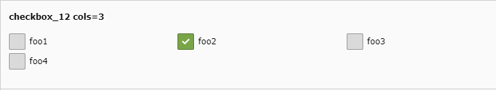

.. include:: ../../Includes.txt

.. _columns-check:

==============
type = 'check'
==============

.. _columns-check-introduction:

Introduction
============

This type creates checkbox(es).

There can be between 1 and 31 checkboxes. The corresponding database field must be of type integer.
Each checkbox corresponds to a single bit of the integer value, even if there is only one checkbox.

.. tip::
    This means that you should check the bit-0 of values from single-checkbox
    fields and not just whether it is true or false.

.. warning::
    Resorting the 'items' of a type='check' config results in single items moving to different bit positions.
    It might be required to migrate existing field data if doing so.

.. _columns-check-examples:
.. _columns-check-examples-single:
.. _columns-check-examples-array:

Examples
========

    Simple checkbox with label (checkbox_2)

    Four checkboxes in three columns (checkbox_12)

    Checkboxes with inline floating (checkbox_16)

.. code-block:: php

    'checkbox_2' => [
        'label' => 'checkbox_2 one checkbox with label',
        'config' => [
            'type' => 'check',
            'items' => [
                [ 'foo', '' ],
            ],
        ],
    ],

.. code-block:: php

    'checkbox_12' => [
        'label' => 'checkbox_12 cols=3',
        'config' => [
            'type' => 'check',
            'items' => [
                [ 'foo1', '' ],
                [ 'foo2', '' ],
                [ 'foo3', '' ],
                [ 'foo4', '' ],
            ],
            'cols' => '3',
        ],
    ],

.. code-block:: php

    'checkbox_16' => [
        'exclude' => 1,
        'label' => 'checkbox_16 cols=inline',
        'config' => [
            'type' => 'check',
            'items' => [
                [ 'Mo', '' ],
                [ 'Tu', '' ],
                [ 'We', '' ],
                [ 'Th', '' ],
                [ 'Fr', '' ],
                [ 'Sa', '' ],
                [ 'Su', '' ],
            ],
            'cols' => 'inline',
        ],
    ],

.. _columns-check-properties:

Properties renderType default
=============================

.. _columns-check-properties-type:

.. _columns-check-properties-behaviour:
.. include:: ../Properties/CommonBehaviour.rst.txt
.. include:: ../Behaviour/CommonAllowLanguageSynchronization.txt

.. _columns-check-properties-cols:
.. include:: ../Properties/CheckCols.rst.txt

.. _columns-check-properties-default:
.. include:: ../Properties/CheckDefault.rst.txt

.. _columns-check-properties-eval:
.. include:: ../Properties/CheckEval.rst.txt

.. _columns-check-properties-fieldInformation:
.. include:: ../Properties/CommonFieldInformation.rst.txt

.. _columns-check-properties-fieldWizard:
.. include:: ../Properties/CommonFieldWizard.rst.txt
.. include:: ../FieldWizard/DefaultLanguageDifferences.rst.txt
.. include:: ../FieldWizard/LocalizationStateSelector.rst.txt
.. include:: ../FieldWizard/OtherLanguageContent.rst.txt

.. _columns-check-properties-items:
.. include:: ../Properties/CheckItems.rst.txt

.. _columns-check-properties-itemsprocfunc:
.. include:: ../Properties/CommonItemsProcFunc.rst.txt

.. _columns-check-properties-readOnly:
.. include:: ../Properties/CommonReadOnly.rst.txt

.. _columns-check-properties-validation:
.. include:: ../Properties/CheckValidation.rst.txt
