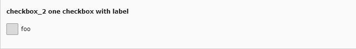

.. include:: /Includes

.. _columns-check-properties:
.. _columns-check-properties-type:
.. _columns-check-default:

================
Default checkbox
================

This page describes the :ref:`check <columns-check>` type with the default
:ref:`renderType <check-properties-renderType>.

This is typically a simple checkbox or a group of checkboxes.
Each checkbox is a toggle that toggles between two icon identifiers.
By default the toggle icons are visually designed to mimic a checkbox.
Its state can be inverted via :code:`invertStateDisplay`.

.. toctree::

   Properties/Index
   Examples/DefaultExamples

   :ref:`Simple checkbox with default render type <tca_example_checkbox_2>`
