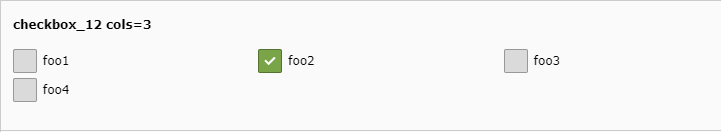
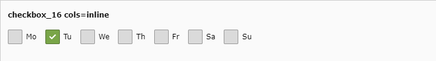

.. include:: /Includes.rst.txt

.. _columns-check-examples:
.. _columns-check-examples-single:
.. _columns-check-examples-array:

========
Examples
========

All examples listed here can be found in the :ref:`extension styleguide
<extension_styleguide_tca_examples>`.

.. _tca_example_checkbox_2:

Example: Simple checkbox with label
===================================

.. figure:: ../Images/TypeCheckStyleguide2.png
  :alt: Simple checkbox with label (checkbox_2)
  :class: with-shadow

  Simple checkbox with label (checkbox_2)

TCA:

.. code-block:: php

  'checkbox_2' => [
     'exclude' => 1,
     'label' => 'checkbox_2 one checkbox with label',
     'config' => [
        'type' => 'check',
        'items' => [
           // label, value
           ['foo', ''],
        ],
     ]
  ],

If the checkbox is checked, the value for the field will be 1,
if unchecked, it will be 0.

:ref:`FlexForm <t3coreapi:flexforms>`:

.. code-block:: xml

  <settings.checkbox_2>
     <TCEforms>
         <label>checkbox_2 one checkbox with label</label>
         <config>
             <type>check</type>
             <items type="array">
                 <numIndex index="0" type="array">
                     <numIndex index="0">foo</numIndex>
                     <numIndex index="1"></numIndex>
                 </numIndex>
             </items>
         </config>
     </TCEforms>
  </settings.checkbox_2>

.. _tca_example_checkbox_12:

Example: Four checkboxes in three columns
=========================================

  Four checkboxes in three columns (checkbox_12)

TCA:

.. code-block:: php

  'checkbox_12' => [
     'exclude' => 1,
     'label' => 'checkbox_12 cols=3',
     'config' => [
        'type' => 'check',
        'items' => [
           // label, value
           ['foo1', ''],
           ['foo2', ''],
           ['foo3', ''],
           ['foo4', ''],
        ],
        'cols' => '3',
     ],
  ],

If all checkboxes are checked, the value for the field will be 15 (:php:`1 | 2 | 4 | 8`).

:ref:`FlexForm <t3coreapi:flexforms>`:

.. code-block:: xml

  <settings.checkbox_2>
     <TCEforms>
         <label>checkbox_12 cols=3</label>
         <config>
             <type>check</type>
             <items type="array">
                 <numIndex index="0" type="array">
                     <numIndex index="0">foo1</numIndex>
                     <numIndex index="1"></numIndex>
                 </numIndex>
                 <numIndex index="1" type="array">
                     <numIndex index="0">foo2</numIndex>
                     <numIndex index="1"></numIndex>
                 </numIndex>
                 <numIndex index="2" type="array">
                     <numIndex index="0">foo3</numIndex>
                     <numIndex index="1"></numIndex>
                 </numIndex>
                 <numIndex index="3" type="array">
                     <numIndex index="0">foo4</numIndex>
                     <numIndex index="1"></numIndex>
                 </numIndex>
             </items>
             <cols>3</cols>
         </config>
     </TCEforms>
  </settings.checkbox_2>

.. _tca_example_checkbox_16:

Example: Checkboxes with inline floating
========================================

  Checkboxes with inline floating (checkbox_16)

.. code-block:: php

  'checkbox_16' => [
     'exclude' => 1,
     'label' => 'checkbox_16 cols=inline',
     'config' => [
        'type' => 'check',
        'items' => [
           ['Mo', ''],
           ['Tu', ''],
           ['We', ''],
           ['Th', ''],
           ['Fr', ''],
           ['Sa', ''],
           ['Su', ''],
        ],
        'cols' => 'inline',
     ],
  ],

This will display as many checkbox items as will fit in one row. Without inline,
each checkbox would be displayed in a separate row.
