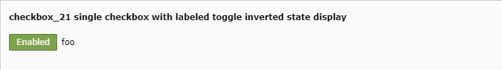

.. include:: /Includes.rst.txt

========
Examples
========

.. _tca_example_checkbox_19:

Single checkbox with labeled toggle
===================================

.. figure:: ../Images/TypeCheckStyleguide19.png
  :alt: Single checkbox with labeled toggle (checkbox_19)
  :class: with-shadow

  Single checkbox with labeled toggle (checkbox_19)

.. code-block:: php

  'checkbox_19' => [
     'exclude' => 1,
     'label' => 'checkbox_19 single checkbox with labeled toggle',
     'config' => [
        'type' => 'check',
        'renderType' => 'checkboxLabeledToggle',
        'items' => [
           [
              0 => 'foo',
              1 => '',
              'labelChecked' => 'Enabled',
              'labelUnchecked' => 'Disabled',
           ]
        ],
     ]
  ],

.. _tca_example_checkbox_21:

Single checkbox with labeled toggle inverted state display
==========================================================

  Single checkbox with labeled toggle inverted state display (checkbox_21)

.. code-block:: php

  'checkbox_21' => [
     'exclude' => 1,
     'label' => 'checkbox_21 single checkbox with labeled toggle inverted state display',
     'config' => [
        'type' => 'check',
        'renderType' => 'checkboxLabeledToggle',
        'items' => [
           [
              0 => 'foo',
              1 => '',
              'labelChecked' => 'Enabled',
              'labelUnchecked' => 'Disabled',
              'invertStateDisplay' => true
           ]
        ],
     ]
  ],
