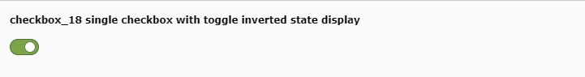

.. include:: /Includes.rst.txt

========
Examples
========

.. _tca_example_checkbox_17:

Example: Single checkbox with toggle
====================================

.. figure:: ../Images/TypeCheckStyleguide17.png
  :alt: Single checkbox with toggle (checkbox_17)
  :class: with-shadow

  Single checkbox with toggle (checkbox_17)

.. code-block:: php

  'checkbox_17' => [
     'exclude' => 1,
     'label' => 'checkbox_17 single checkbox with toggle',
     'config' => [
        'type' => 'check',
        'renderType' => 'checkboxToggle',
        'items' => [
           [
              0 => '',
              1 => '',
           ]
        ],
     ]
  ],

`checkboxToggle`: Instead of checkboxes, a toggle item is displayed.

.. _tca_example_checkbox_18:

Example: Single checkbox with toggle inverted state display
===========================================================

  Single checkbox with toggle inverted state display (checkbox_18)

.. code-block:: php

  'checkbox_18' => [
     'exclude' => 1,
     'label' => 'checkbox_18 single checkbox with toggle inverted state display',
     'config' => [
        'type' => 'check',
        'renderType' => 'checkboxToggle',
        'items' => [
           [
              0 => '',
              1 => '',
              'invertStateDisplay' => true
           ]
        ],
     ]
  ],

`invertedStateDisplay`:  A checkbox is marked checked if the database bit is
not set and vice versa.
