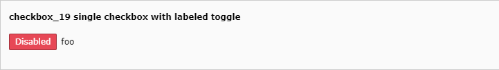

.. include:: /Includes.rst.txt

.. _columns-check-checkboxLabeledToggle:

=======================
Labeled toggle checkbox
=======================

This page describes the :ref:`check <columns-check>` type with the
:ref:`renderType <check-properties-renderType> :php:`'checkboxLabeledToggle'`.

A toggle switch where both states can be labelled (ON/OFF, Visible / Hidden
or alike).

Its state can be inverted via :ref:`invertStateDisplay
<columns-check-properties-invertStateDisplay>`

.. toctree::

   Examples/LabeledToggleExamples

  :ref:`Single checkbox with labeled toggle <tca_example_checkbox_19>`
