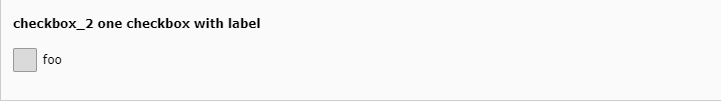

.. include:: /Includes.rst.txt
.. _columns-check-properties-renderType:

==========
renderType
==========

.. confval:: renderType

   :type: boolean
   :Scope: Display
   :Default: default

   Three different render types are currently available for the check box field:

   *  :ref:`default <columns-check-default>`
   *  :ref:`checkboxToggle <columns-check-checkboxToggle>`
   *  :ref:`checkboxLabeledToggle <columns-check-checkboxLabeledToggle>`

Examples
========

   :ref:`Simple checkbox with default render type <tca_example_checkbox_2>`

.. figure:: ../Images/TypeCheckStyleguide17.png
  :alt: Single checkbox with toggle
  :class: with-shadow

  :ref:`Single checkbox with toggle <tca_example_checkbox_17>`

.. figure:: ../Images/TypeCheckStyleguide19.png
  :alt: Single checkbox with labeled toggle
  :class: with-shadow

  :ref:`Single checkbox with labeled toggle <tca_example_checkbox_19>`
