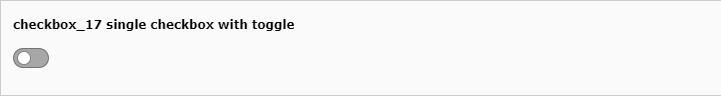

.. include:: /Includes.rst.txt

.. _columns-check-checkboxToggle:

===============
Toggle checkbox
===============

This page describes the :ref:`check <columns-check>` type with the renderType='checkboxToggle'.

Toggle switches are rendered instead of checkboxes.
No additional configuration is necessary. Its state can be inverted via
:code:`invertStateDisplay`.

.. toctree::

   Examples/ToggleExample

  :ref:`Single checkbox with toggle <tca_example_checkbox_17>`
