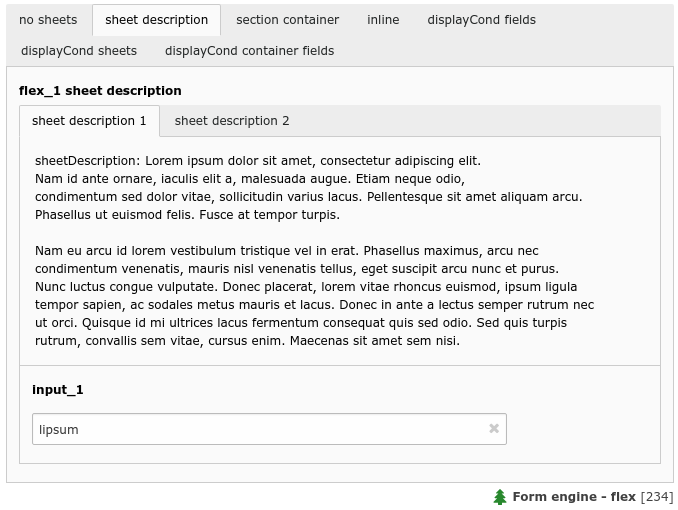

.. include:: /Includes.rst.txt

.. _columns-flex:

=============
type = 'flex'
=============

.. contents:: Table of contents:
   :local:
   :depth: 1

.. _columns-flex-introduction:

Introduction
============

Render a FlexForm element. Essentially this consists in a hierarchically organized set of fields which will have
their values saved into a single field in the database, stored as XML.

The general idea is: There is a data structure that defines which and how single fields should be displayed,
re-using all the `TCA` column type possibilities. The actual values of single fields are then stored
in an XML representation within this "flex" field.

.. _columns-flex-examples:

Examples
========

    A flex form with two sheets and some sheet description (flex_1)

.. figure:: ../../Images/TypeFlexStyleguideFlex2.png
    :alt: A flex form field with two flex section containers (flex_2)
    :class: with-shadow

    A flex form field with two flex section containers (flex_2)

.. _columns-flex-ds-pointer:

Pointing to a Data Structure
============================

Basically, the configuration for a FlexForm field is all about pointing
to the Data Structure which contains form rendering information.

For general information about the backbone of a Data Structure, please
refer to the "<T3DataStructure>" chapter in the :ref:`Core API manual <t3coreapi:t3ds>`.

The mixture of the different "ds" properties can be puzzling at first,
but they allow powerful combinations to specify which data structure should be
used in different scenarios.

**One data structure only**

.. code-block:: php

    'config' => [
        'type' => 'flex',
        'ds' => [
            'default' => 'FILE:EXT:myextension/Configuration/FlexForms/Main.xml',
        ],
    ],

Straight and simple: Whenever a record is handled that has a column field definition with
this TCA, the data structure defined in :file:`FILE:EXT:myextension/Configuration/FlexForms/Main.xml`
is parsed and the flex form defined in there is displayed.

**Data structure selection depends on a field value**

.. code-block:: php

    'config' => [
        'type' => 'flex',
        'ds_pointerField' => 'selector'
        'ds' => [
            'default' => 'FILE:EXT:myextension/Configuration/FlexForms/Default.xml',
            'foo' => 'FILE:EXT:myextension/Configuration/FlexForms/Foo.xml',
            'bar' => 'FILE:EXT:myextension/Configuration/FlexForms/Bar.xml',
        ],
    ],

There are now multiple data structures registered for this "flex" field. It depends on the **value**
of the field "selector" which one is chosen: If "selector" value is "foo", "Foo.xml" is parsed and
displayed, "Bar.xml" is chosen for the value "bar", and if none of the two matches, it falls back
to "Default.xml".

**Data structure selection depends on a combination of two field values**

.. code-block:: php

    'config' => [
        'type' => 'flex',
        'ds_pointerField' => 'list_type,CType',
        'ds' => [
            'default' => 'FILE:...',
            'tt_address_pi1,list' => 'FILE:EXT:tt_address/pi1/flexform.xml',
            '*,table' => 'FILE:EXT:css_styled_content/flexform_ds.xml',
            'tx_myext_pi1' => 'FILE:EXT:myext/flexform.xml',
        ],
    ],

The data structure selection now depends on the values of two different fields. First, there is a general "default"
fallback if nothing else matches. Next, if field "list_type" has the value "tt_address_pi1" and "CType" has the value
"list", then the data structure defined in sub array "tt_address_pi1,list" is chosen. If "list_type" is anything, but
"CType" is "table", then the data structure defined in "\*,table" is selected. And last, if "list_type" is "tx_myext_pi1"
and "CType" is whatever else, then data structure "tx_myext_pi1" is used.

This lookup mechanism is pretty powerful and used for instance in core for data structure selection depending
on a selected "tt_content" element plugin.

**Data structure lookup with tree traversal**

.. code-block:: php

    'config' => [
        'ds_pointerField' => 'my_ds',
        'ds_pointerField_searchParent' => 'pid',
    ]

The data structure is stored in database field "my_ds" directly. This could be an "type=input" field
containing a "FILE:EXT:..." reference, or a "type=text" field with the full data structure. Note that
"ds" is not set at all! The trick is that if field "my_ds" of given record is empty, the parent record
will be fetched to see if that row contains a value in "my_ds". The parent record is determined by
using the value of field "pid". This obviously only makes sense for "tree-like" tables like pages. The
parent lookup will continue until a value is found, or if the tree root is reached. This lookup allows
inheritance of data structure definition to sub pages and sub trees.

**Data structure lookup with tree traversal and pointing to a row in a foreign table**

.. code-block:: php

    'config' => [
        'ds_pointerField' => 'my_ds',
        'ds_pointerField_searchParent' => 'pid',
        'ds_pointerField_searchParent_subField' => 'my_next_ds',
        'ds_tableField' => 'foreignTableName:foreignTableField',
    ]

This is a more complex example to the above one. First note, there is again no "ds" definition. Instead,
the code will again traverse a tree up to the root, until a value in "my_next_ds" or "my_ds" is found. The
second field "my_next_ds" is preferred if it contains a value over "my_ds" field, **if** at least one level
up was searched. This is also known as the "Template on next level" feature from TemplaVoila.

Additionally, the value within "my_ds" and "my_next_ds" is not treated as the final data structure, but
it is the uid of a record in a foreign table. The fields "my_ds" and "my_next_ds" are therefor probably
configured as "type=select" fields with a relation to that table. If that row of table "foreignTableName"
is found, the content of the field "foreignTableField" is chosen as the final data structure.

The configuration above thus basically says: "Fetch rows up in rootline until you find a value in "ds_pointerField"
or "ds_pointerField_searchParent_subField", treat the content as uid, fetch that record from the foreign table, and
use the content of a specific field in there as my data structure".

.. _columns-flex-properties:
.. _columns-flex-properties-type:

Properties
==========

There can be multiple data structures defined in `TCA` and it depends on the
configuration and the record which one is chosen. All the different "ds" properties
allow to specify the lookup mechanism, see the :ref:`example section <columns-flex-ds-pointer>`.

.. note::

   It is **not** possible to override any of these properties in
   :ref:`TCA type columnsOverrides <types-properties-columnsOverrides>` or to manipulate
   them in an inline parent-child relation from the parent `TCA`.

.. contents::
   :local:
   :depth: 1

.. _columns-flex-properties-behaviour:

behaviour
---------

.. include:: ../Properties/CommonBehaviour.rst.txt

behaviour => allowLanguageSynchronization
~~~~~~~~~~~~~~~~~~~~~~~~~~~~~~~~~~~~~~~~~

.. include:: ../Behaviour/CommonAllowLanguageSynchronization.rst.txt

.. _columns-flex-properties-ds:

ds
--

.. include:: ../Properties/FlexDs.rst.txt

.. _columns-flex-properties-ds-pointerfield:

ds\_pointerField
----------------

.. include:: ../Properties/FlexDsPointerField.rst.txt

.. _columns-flex-properties-ds-pointerfield-searchparent:

ds\_pointerField\_searchParent
------------------------------

.. include:: ../Properties/FlexDsPointerFieldSearchParent.rst.txt

.. _columns-flex-properties-ds-pointerfield-searchparent-subfield:

ds\_pointerField\_searchParent\_subField
----------------------------------------

.. include:: ../Properties/FlexDsPointerFieldSearchParentSubField.rst.txt

.. _columns-flex-properties-ds-tablefield:

ds\_tableField
--------------

.. include:: ../Properties/FlexDsTableField.rst.txt

.. _columns-flex-facts:

FlexForm syntax
===============

.. note::
    This section is still messy, should be merged with the section from :ref:`Core API <t3coreapi:t3ds>`
    and :ref:`t3coreapi:flexforms` and should be much easier to understand.

FlexForms create a form-in-a-form. The content coming from this form
is still stored in the associated database field - but as an XML
structure, stored by :code:`\TYPO3\CMS\Core\Utility\GeneralUtility::xml2array()`.

The "TCA" information needed to generate the FlexForm fields are found
inside a <T3DataStructure> XML document. When you configure a FlexForm
field in a Data Structure (DS) you can use basically all column types
documented here for TCA. The limitations are:

- "unique" and "uniqueInPid" evaluation is not available

- You cannot nest FlexForm configurations inside of FlexForms.

- You cannot add, change or remove fields in FlexForms without copying the data structure and changing the configuration accordingly.

- Charset follows that of the current backend UTF-8. When storing FlexForm information in external files,
  make sure that they are using UTF-8 too.

- :php:`type='inline'` and other type's that point to different tables are not allowed in flex form section containers.

.. _columns-flex-tceforms:

For FlexForms the DS is extended with a tag, "<TCEforms>" which define all settings specific to the FlexForms usage.
Also a few meta tag features are used.

The tables below documents the extension elements:

.. _columns-flex-tceforms-array:

Array Elements
--------------

.. _columns-flex-tceforms-array-meta:

<meta>
~~~~~~

:aspect:`Element`
    <meta>

:aspect:`Description`
    Can contain application specific meta settings. For FlexForms this means a definition of how languages
    are handled in the form.

.. _columns-flex-tceforms-array-application-tag:

<[application tag]>
~~~~~~~~~~~~~~~~~~~

:aspect:`Element`
    <TCEforms>

:aspect:`Description`
    A direct reflection of a ['columns']['field name']['config'] PHP array configuring a field in TCA. As XML,
    this is expressed by array2xml()'s output.

.. _columns-flex-tceforms-array-root-tceforms:

<ROOT><TCEforms>
~~~~~~~~~~~~~~~~

:aspect:`Element`
    <ROOT><TCEforms>

:aspect:`Description`
    For <ROOT> elements in the DS you can add application specific information about the
    sheet that the <ROOT> element represents.

   Child elements
         <sheetTitle>

         <sheetDescription>

         <sheetShortDescr>

.. _columns-flex-tceforms-value:

Value Elements
--------------

.. _columns-flex-tceforms-value-sheettitle:

<sheetTitle>
~~~~~~~~~~~~

:aspect:`Element`
    <sheetTitle>

:aspect:`Format`
    string or LLL reference

:aspect:`Description`
    Specifies the title of the sheet.

.. _columns-flex-tceforms-value-sheetdescription:

<sheetDescription>
~~~~~~~~~~~~~~~~~~

:aspect:`Element`
    <sheetDescription>

:aspect:`Format`
    string or LLL reference

:aspect:`Description`
    Specifies a description for the sheet shown in the flexform.

.. _columns-flex-tceforms-value-sheetshortdescr:

<sheetShortDescr>
~~~~~~~~~~~~~~~~~

:aspect:`Element`
    <sheetShortDescr>

:aspect:`Format`
    string or LLL reference

:aspect:`Description`
    Specifies a short description of the sheet used in the tab-menu.

.. _columns-flex-sheets:

Sheets and FlexForms
--------------------

FlexForms always resolve sheet definitions in a Data Structure. If only one sheet is defined that must be
the "sDEF" sheet (default). In that case no tab-menu for sheets will appear (see examples below).

.. _columns-flex-data-format:

FlexForm data format, <T3FlexForms>
-----------------------------------

When saving FlexForm elements the content is stored as XML using
:code:`\TYPO3\CMS\Core\Utility\GeneralUtility::array2xml()` to convert the internal PHP array to XML
format. The structure is as follows:

.. _columns-flex-data-format-array:

.. _columns-flex-data-format-array-t3flexforms:

<T3FlexForms>
~~~~~~~~~~~~~

:aspect:`Element`
    <T3FlexForms>

:aspect:`Description`
    Document tag

    Child elements
        <meta>

        <data>

.. _columns-flex-data-format-array-meta:

<meta>
~~~~~~

:aspect:`Element`
    <meta>

:aspect:`Description`
    Meta data for the content. For instance information about which sheet is active etc.

.. _columns-flex-data-format-array-data:

<data>
~~~~~~

:aspect:`Element`
    <data>

:aspect:`Description`
    Contains the data: sheets, language sections, field and values

    Child elements
         <sheet>

.. _columns-flex-data-format-array-sheet:

<sheet>
~~~~~~~~

:aspect:`Element`
    <sheet>

:aspect:`Description`
    Contains the data for each sheet in the form. If there are no sheets, the default sheet "<sDEF>" is always used.

    Child elements
        <sDEF>

        <s\_[sheet keys]>

.. _columns-flex-data-format-array-sdef:

<sDEF>
""""""

:aspect:`Element`
    <sDEF>

:aspect:`Description`
    For each sheet it contains elements for each language. only the <lDEF> tag is used.

    Child elements
        <lDEF>

.. _columns-flex-data-format-array-ldef:

<lDEF>
~~~~~~

:aspect:`Element`
    <lDEF>

:aspect:`Description`
    For each language the fields in the form will be available on this level.

    Child elements
        <[field name]>

.. _columns-flex-data-format-array-field-name:

<[field name]>
~~~~~~~~~~~~~~

:aspect:`Element`
    <[field name]>

:aspect:`Description`
    For each field name there is at least one element with the value, <vDEF>.

   Child elements
         <vDEF>

.. _columns-flex-data-format-value:

.. _columns-flex-data-format-value-vdef:

<vDEF>
~~~~~~

:aspect:`Element`
    <vDEF>

:aspect:`Format`
    string

:aspect:`Description`
    Content of the field in default or localized versions.

.. _columns-flex-example-simple:

Example: Simple FlexForm
------------------------

The extension "examples" provides some sample FlexForms. The "simple FlexForm" plugin provides a very basic
configuration with just a select-type field to choose a page from the "pages" table.

.. figure:: ../../Images/TypeFlexSimple.png
    :alt: A simple FlexForm field
    :class: with-shadow

    A plugin with a simple, one-field flexform

The DS used to render this field is found in the file "flexform\_ds1.xml" inside the "examples" extension.
Notice the <TCEforms> tags:

.. code-block:: xml

    <T3DataStructure>
        <meta>
            <langDisable>1</langDisable>
        </meta>
        <sheets>
            <sDEF>
                <ROOT>
                    <TCEforms>
                        <sheetTitle>LLL:EXT:examples/locallang_db.xml: examples.pi_flexform.sheetGeneral</sheetTitle>
                    </TCEforms>
                    <type>array</type>
                    <el>
                        <pageSelector>
                            <TCEforms>
                                <label>LLL:EXT:examples/locallang_db.xml: examples.pi_flexform.pageSelector</label>
                                <config>
                                    <type>select</type>
                                    <renderType>selectSingle</renderType>
                                    <items type="array">
                                        <numIndex index="0" type="array">
                                            <numIndex index="0">LLL:EXT:examples/locallang_db.xml:examples.pi_flexform.choosePage</numIndex>
                                            <numIndex index="1">0</numIndex>
                                        </numIndex>
                                    </items>
                                    <foreign_table>pages</foreign_table>
                                    <foreign_table_where>ORDER BY title</foreign_table_where>
                                    <minitems>0</minitems>
                                    <maxitems>1</maxitems>
                                </config>
                            </TCEforms>
                        </pageSelector>
                    </el>
                </ROOT>
            </sDEF>
        </sheets>
    </T3DataStructure>

It's clear that the contents of <TCEforms> is a direct reflection of
the field configurations we normally set up in the :php:`$GLOBALS['TCA']` array.

The Data Structure for this FlexForm is loaded in the "pi\_flexform" field of the "tt\_content" table by adding the
following to the ext\_tables.php file of the "examples" extension:

.. code-block:: php

    $GLOBALS['TCA']['tt_content']['types']['list']['subtypes_addlist']['examples_pi1'] = 'pi_flexform';
    \TYPO3\CMS\Core\Utility\ExtensionManagementUtility::addPiFlexFormValue('examples_pi1', 'FILE:EXT:examples/Configuration/FlexForms/Main.xml');

In the first line the tt\_content field "pi\_flexform" is added to the display of fields when the Plugin type is selected
and set to "examples\_pi1". In the second line the DS xml file is configured to be the source of the FlexForm DS used.

If we browse the definition for the "pi\_flexform" field in "tt\_content" below "columns" using the Admin > Configuration module for "$GLOBALS['TCA'] (Table configuration array)",
we can see the following:

.. figure:: ../../Images/TypeFlexConfigurationCheck.png
    :alt: Checking the configuration
    :class: with-shadow

    Checking the TCA configuration for the newly added Flexform

As you can see there are quite a few extensions that have added pointers to their Data Structures.
Towards the bottom we can find the one we have just been looking at.

.. _columns-flex-example-sheets:

Example: FlexForm with two sheets
---------------------------------

In this example we create a FlexForm field with two "sheets". Each sheet can contain a separate FlexForm structure.
We build it up on top of the previous example, so the first sheet still has a select-type field related to the "pages"
table. In the second sheet, we add a simple input field and a text field.

.. code-block:: xml

    <T3DataStructure>
        <meta>
            <langDisable>1</langDisable>
        </meta>
        <sheets>
            <sDEF>
                <ROOT>
                    <TCEforms>
                        <sheetTitle>LLL:EXT:examples/locallang_db.xml: examples.pi_flexform.sheetGeneral</sheetTitle>
                    </TCEforms>
                    <type>array</type>
                    <el>
                        <pageSelector>
                            <TCEforms>
                                <label>LLL:EXT:examples/locallang_db.xml: examples.pi_flexform.pageSelector</label>
                                <config>
                                    <type>select</type>
                                    <renderType>selectSingle</renderType>
                                    <items type="array">
                                        <numIndex index="0" type="array">
                                            <numIndex index="0">LLL:EXT:examples/locallang_db.xml:examples.pi_flexform.choosePage</numIndex>
                                                <numIndex index="1">0</numIndex>
                                            </numIndex>
                                    </items>
                                    <foreign_table>pages</foreign_table>
                                    <foreign_table_where>ORDER BY title</foreign_table_where>
                                    <minitems>0</minitems>
                                    <maxitems>1</maxitems>
                                </config>
                            </TCEforms>
                        </pageSelector>
                    </el>
                </ROOT>
            </sDEF>
            <s_Message>
                <ROOT>
                    <TCEforms>
                        <sheetTitle>LLL:EXT: examples/locallang_db.xml:examples.pi_flexform.s_Message</sheetTitle>
                    </TCEforms>
                    <type>array</type>
                    <el>
                        <header>
                            <TCEforms>
                                <label>LLL:EXT: examples/locallang_db.xml:examples.pi_flexform.header</label>
                                <config>
                                    <type>input</type>
                                    <size>30</size>
                                </config>
                            </TCEforms>
                        </header>
                        <message>
                            <TCEforms>
                                <label>LLL:EXT: examples/locallang_db.xml:examples.pi_flexform.message</label>
                                <config>
                                    <type>text</type>
                                    <cols>40</cols>
                                    <rows>5</rows>
                                </config>
                            </TCEforms>
                        </message>
                    </el>
                </ROOT>
            </s_Message>
        </sheets>
    </T3DataStructure>

The result from this configuration is a form which looks like this:

..  figure:: ../../Images/TypeFlexSheet1.png
    :alt: The first sheet
    :class: with-shadow

    The first sheet of our more complex FlexForm

This looks very much like the first example, but notice the second tab. Clicking on "Message", we can access
the second sheet which shows some other fields:

.. figure:: ../../Images/TypeFlexSheet2.png
    :alt: The second sheet
    :class: with-shadow

    The second sheet of our more complex FlexForm

If you look at the XML stored in the database field "pi\_flexform" this is how it looks:

.. code-block:: xml

   <?xml version="1.0" encoding="utf-8" standalone="yes" ?>
   <T3FlexForms>
       <data>
           <sheet index="sDEF">
               <language index="lDEF">
                   <field index="pageSelector">
                       <value index="vDEF">9</value>
                   </field>
               </language>
           </sheet>
           <sheet index="s_Message">
               <language index="lDEF">
                   <field index="header">
                       <value index="vDEF">My Header</value>
                   </field>
                   <field index="message">
                       <value index="vDEF">And my message.</value>
                   </field>
               </language>
           </sheet>
       </data>
   </T3FlexForms>

Notice how the data of the two sheets are separated.

.. _columns-flex-example-rte:

Example: Rich Text Editor in FlexForms
--------------------------------------

Creating a RTE in FlexForms is done by enabling "enableRichtext" content to the <TCEforms> tag:

.. code-block:: xml

    <TCEforms>
        <label>Subtitle</label>
        <config>
            <type>text</type>
            <cols>48</cols>
            <rows>5</rows>
            <enableRichtext>1</enableRichtext>
        </config>
    </TCEforms>
