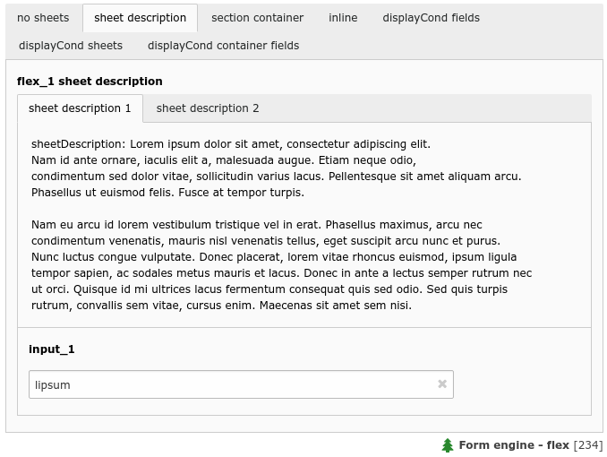
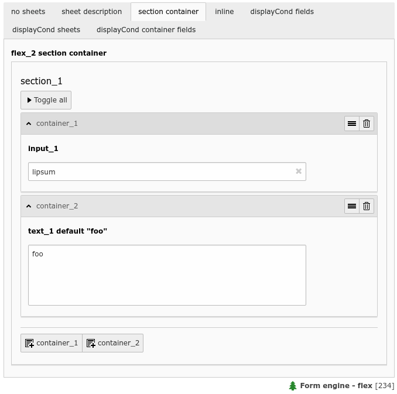
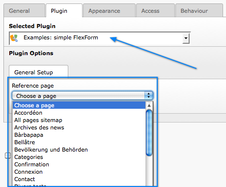
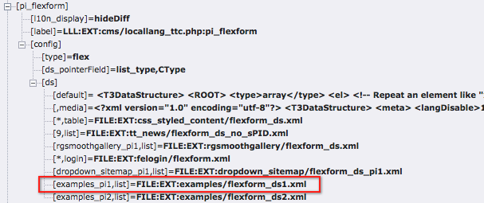
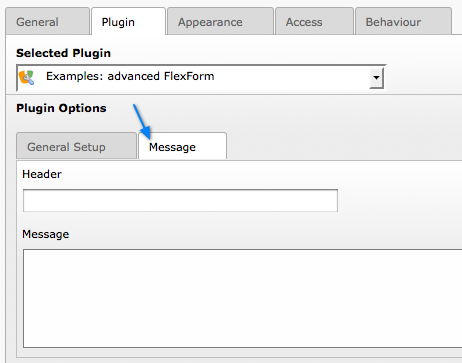

.. include:: /Includes.rst.txt
.. _columns-flex-examples:

========
Examples
========

    A flex form with two sheets and some sheet description (flex_1)

    A flex form field with two flex section containers (flex_2)

.. _columns-flex-example-simple:

Example: Simple FlexForm
------------------------

The extension "examples" provides some sample FlexForms. The "simple FlexForm" plugin provides a very basic
configuration with just a select-type field to choose a page from the "pages" table.

    A plugin with a simple, one-field flexform

The DS used to render this field is found in the file "flexform\_ds1.xml" inside the "examples" extension.
Notice the <TCEforms> tags:

.. code-block:: xml

    <T3DataStructure>
        <meta>
            <langDisable>1</langDisable>
        </meta>
        <sheets>
            <sDEF>
                <ROOT>
                    <TCEforms>
                        <sheetTitle>LLL:EXT:examples/locallang_db.xml: examples.pi_flexform.sheetGeneral</sheetTitle>
                    </TCEforms>
                    <type>array</type>
                    <el>
                        <pageSelector>
                            <TCEforms>
                                <label>LLL:EXT:examples/locallang_db.xml: examples.pi_flexform.pageSelector</label>
                                <config>
                                    <type>select</type>
                                    <renderType>selectSingle</renderType>
                                    <items type="array">
                                        <numIndex index="0" type="array">
                                            <numIndex index="0">LLL:EXT:examples/locallang_db.xml:examples.pi_flexform.choosePage</numIndex>
                                            <numIndex index="1">0</numIndex>
                                        </numIndex>
                                    </items>
                                    <foreign_table>pages</foreign_table>
                                    <foreign_table_where>ORDER BY title</foreign_table_where>
                                    <minitems>0</minitems>
                                    <maxitems>1</maxitems>
                                </config>
                            </TCEforms>
                        </pageSelector>
                    </el>
                </ROOT>
            </sDEF>
        </sheets>
    </T3DataStructure>

It's clear that the contents of <TCEforms> is a direct reflection of
the field configurations we normally set up in the :php:`$GLOBALS['TCA']` array.

The Data Structure for this FlexForm is loaded in the "pi\_flexform" field of the "tt\_content" table by adding the
following to the ext\_tables.php file of the "examples" extension:

.. code-block:: php

    $GLOBALS['TCA']['tt_content']['types']['list']['subtypes_addlist']['examples_pi1'] = 'pi_flexform';
    \TYPO3\CMS\Core\Utility\ExtensionManagementUtility::addPiFlexFormValue('examples_pi1', 'FILE:EXT:examples/Configuration/FlexForms/Main.xml');

In the first line the tt\_content field "pi\_flexform" is added to the display of fields when the Plugin type is selected
and set to "examples\_pi1". In the second line the DS xml file is configured to be the source of the FlexForm DS used.

If we browse the definition for the "pi\_flexform" field in "tt\_content" below "columns" using the Admin > Configuration module for "$GLOBALS['TCA'] (Table configuration array)",
we can see the following:

    Checking the TCA configuration for the newly added Flexform

As you can see there are quite a few extensions that have added pointers to their Data Structures.
Towards the bottom we can find the one we have just been looking at.

.. _columns-flex-example-sheets:

Example: FlexForm with two sheets
---------------------------------

In this example we create a FlexForm field with two "sheets". Each sheet can contain a separate FlexForm structure.
We build it up on top of the previous example, so the first sheet still has a select-type field related to the "pages"
table. In the second sheet, we add a simple input field and a text field.

.. code-block:: xml

    <T3DataStructure>
        <meta>
            <langDisable>1</langDisable>
        </meta>
        <sheets>
            <sDEF>
                <ROOT>
                    <TCEforms>
                        <sheetTitle>LLL:EXT:examples/locallang_db.xml: examples.pi_flexform.sheetGeneral</sheetTitle>
                    </TCEforms>
                    <type>array</type>
                    <el>
                        <pageSelector>
                            <TCEforms>
                                <label>LLL:EXT:examples/locallang_db.xml: examples.pi_flexform.pageSelector</label>
                                <config>
                                    <type>select</type>
                                    <renderType>selectSingle</renderType>
                                    <items type="array">
                                        <numIndex index="0" type="array">
                                            <numIndex index="0">LLL:EXT:examples/locallang_db.xml:examples.pi_flexform.choosePage</numIndex>
                                                <numIndex index="1">0</numIndex>
                                            </numIndex>
                                    </items>
                                    <foreign_table>pages</foreign_table>
                                    <foreign_table_where>ORDER BY title</foreign_table_where>
                                    <minitems>0</minitems>
                                    <maxitems>1</maxitems>
                                </config>
                            </TCEforms>
                        </pageSelector>
                    </el>
                </ROOT>
            </sDEF>
            <s_Message>
                <ROOT>
                    <TCEforms>
                        <sheetTitle>LLL:EXT: examples/locallang_db.xml:examples.pi_flexform.s_Message</sheetTitle>
                    </TCEforms>
                    <type>array</type>
                    <el>
                        <header>
                            <TCEforms>
                                <label>LLL:EXT: examples/locallang_db.xml:examples.pi_flexform.header</label>
                                <config>
                                    <type>input</type>
                                    <size>30</size>
                                </config>
                            </TCEforms>
                        </header>
                        <message>
                            <TCEforms>
                                <label>LLL:EXT: examples/locallang_db.xml:examples.pi_flexform.message</label>
                                <config>
                                    <type>text</type>
                                    <cols>40</cols>
                                    <rows>5</rows>
                                </config>
                            </TCEforms>
                        </message>
                    </el>
                </ROOT>
            </s_Message>
        </sheets>
    </T3DataStructure>

The result from this configuration is a form which looks like this:

..  figure:: ../../Images/TypeFlexSheet1.png
    :alt: The first sheet
    :class: with-shadow

    The first sheet of our more complex FlexForm

This looks very much like the first example, but notice the second tab. Clicking on "Message", we can access
the second sheet which shows some other fields:

    The second sheet of our more complex FlexForm

If you look at the XML stored in the database field "pi\_flexform" this is how it looks:

.. code-block:: xml

   <?xml version="1.0" encoding="utf-8" standalone="yes" ?>
   <T3FlexForms>
       <data>
           <sheet index="sDEF">
               <language index="lDEF">
                   <field index="pageSelector">
                       <value index="vDEF">9</value>
                   </field>
               </language>
           </sheet>
           <sheet index="s_Message">
               <language index="lDEF">
                   <field index="header">
                       <value index="vDEF">My Header</value>
                   </field>
                   <field index="message">
                       <value index="vDEF">And my message.</value>
                   </field>
               </language>
           </sheet>
       </data>
   </T3FlexForms>

Notice how the data of the two sheets are separated.

.. _columns-flex-example-rte:

Example: Rich Text Editor in FlexForms
--------------------------------------

Creating a RTE in FlexForms is done by enabling "enableRichtext" content to the <TCEforms> tag:

.. code-block:: xml

    <TCEforms>
        <label>Subtitle</label>
        <config>
            <type>text</type>
            <cols>48</cols>
            <rows>5</rows>
            <enableRichtext>1</enableRichtext>
        </config>
    </TCEforms>
