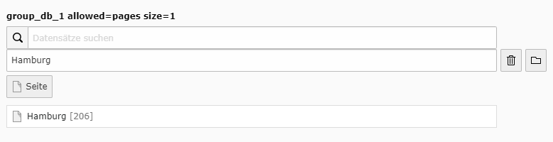
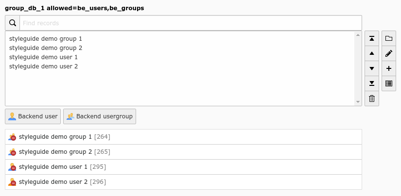
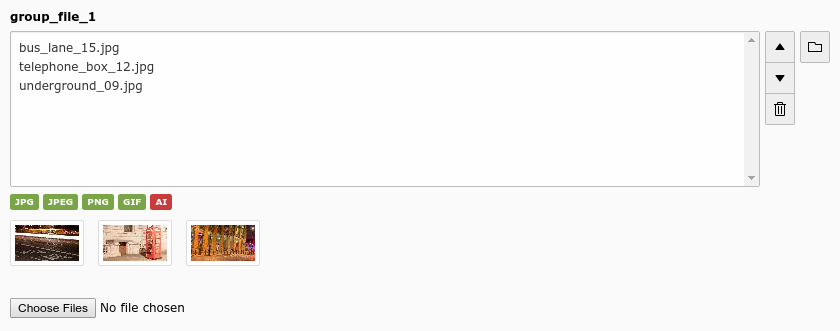

.. include:: ../../Includes.txt

.. _columns-group:

==============
type = 'group'
==============

.. contents:: Table of contents:
   :local:
   :depth: 1

.. _columns-group-introduction:

Introduction
============

The group element in TYPO3 makes it possible to create references to records from multiple tables in the system.
This is especially useful (compared to the "select" type) when records are scattered over the page tree and require
the Element Browser to be selected.

For database relations however, the `type='group'` field is the right and a powerful choice especially if dealing
with lots of re-usable child records, and if :ref:`type='inline' <columns-inline>` is not suitable.

This type is very flexible in its display options with all its different
:ref:`fieldControl <columns-group-properties-fieldControl>` and
:ref:`fieldWizard <columns-group-properties-fieldWizard>` options. A lot of them are available by default but disabled.

It is required to set :ref:`internal_type <columns-group-properties-internal-type>`. Most common usage is to model
database relations (n:1 or n:m) with `internal_type='db'`.
In this case property :ref:`allowed <columns-group-properties-allowed>` is required.

The group field uses either CSV format to store uids of related records or intermediate mm table
(in this case :ref:`MM <columns-group-properties-mm>` property is required).

You can read more on how data is structured in :ref:`columns-group-data` chapter.

.. _columns-group-examples:

Examples
========

Group relation to a single page
-------------------------------

   Group relation to a single page (group_db_single)

.. code-block:: php

   'group_db_single' => [
      'label' => 'group_db_1 allowed=pages size=1',
      'config' => [
         'type' => 'group',
         'internal_type' => 'db',
         'allowed' => 'pages',
         'maxitems' => 1,
         'minitems' => 0,
         'size' => 1,
         'default' => 0,
         'suggestOptions' => [
            'default' => [
               'additionalSearchFields' => 'nav_title, alias, url',
               'addWhere' => 'AND pages.doktype = 1'
            ]
         ]
      ]
   ]

Group relation to be_groups and be_users
----------------------------------------

   Group relation to be_groups and be_users with some selected records (group_db_1)

.. code-block:: php

    'group_db_1' => [
        'label' => 'group_db_1 allowed=be_users,be_groups',
        'config' => [
            'type' => 'group',
            'internal_type' => 'db',
            'allowed' => 'be_users,be_groups',
            'fieldControl' => [
                'editPopup' => [
                    'disabled' => false,
                ],
                'addRecord' => [
                    'disabled' => false,
                ],
                'listModule' => [
                    'disabled' => false,
                ],
            ],
        ],
    ],

Group file relation
-------------------

   Group file relation with some selected files (group_file_1)

.. _columns-group-properties:
.. _columns-group-properties-type:

Properties
==========

.. contents::
   :local:
   :depth: 1

.. _columns-group-properties-allowed:

allowed
-------

.. include:: ../Properties/GroupAllowed.rst.txt

.. _columns-group-properties-appearance:

appearance
----------

.. include:: ../Properties/GroupAppearance.rst.txt

.. _columns-group-properties-autosizemax:

autoSizeMax
-----------

.. include:: ../Properties/CommonAutoSizeMax.rst.txt

.. _columns-group-properties-behaviour:

behaviour
---------

.. include:: ../Properties/CommonBehaviour.rst.txt

behaviour => allowLanguageSynchronization
~~~~~~~~~~~~~~~~~~~~~~~~~~~~~~~~~~~~~~~~~

.. include:: ../Behaviour/CommonAllowLanguageSynchronization.rst.txt

.. _columns-group-properties-default:

default
-------

.. include:: ../Properties/CommonDefault.rst.txt

.. _columns-group-properties-disallowed:

disallowed
----------

.. deprecated:: 9.5
   The internal types `file` and `file_reference` have been deprecated with
   TYPO3 9 and removed with TYPO3 10. The property `disallowed` only worked
   with there properties

.. _columns-group-properties-dontremaptablesoncopy:

dontRemapTablesOnCopy
---------------------

.. include:: ../Properties/CommonDontRemapTablesOnCopy.rst.txt

.. _columns-group-properties-fieldControl:

fieldControl
------------

.. include:: ../Properties/CommonFieldControl.rst.txt

The following fieldControls are available for this type:

.. contents::
   :local:
   :depth: 1

fieldControl => addRecord
~~~~~~~~~~~~~~~~~~~~~~~~~

.. include:: ../FieldControl/AddRecord.rst.txt

fieldControl => editPopup
~~~~~~~~~~~~~~~~~~~~~~~~~

.. include:: ../FieldControl/EditPopup.rst.txt

.. _columns-group-properties-elementBrowser:

fieldControl => elementBrowser
~~~~~~~~~~~~~~~~~~~~~~~~~~~~~~

.. include:: ../FieldControl/ElementBrowser.rst.txt

fieldControl => insertClipboard
~~~~~~~~~~~~~~~~~~~~~~~~~~~~~~~

.. include:: ../FieldControl/InsertClipboard.rst.txt

fieldControl => listModule
~~~~~~~~~~~~~~~~~~~~~~~~~~

.. include:: ../FieldControl/ListModule.rst.txt

.. _columns-group-properties-fieldInformation:

fieldInformation
----------------

.. include:: ../Properties/CommonFieldInformation.rst.txt

.. _columns-group-properties-fieldWizard:

fieldWizard
-----------

.. include:: ../Properties/CommonFieldWizard.rst.txt

The following wizards are available for this type:

.. contents::
   :local:
   :depth: 1

fieldWizard => defaultLanguageDifferences
~~~~~~~~~~~~~~~~~~~~~~~~~~~~~~~~~~~~~~~~~

.. include:: ../FieldWizard/DefaultLanguageDifferences.rst.txt

fieldWizard => localizationStateSelector
~~~~~~~~~~~~~~~~~~~~~~~~~~~~~~~~~~~~~~~~

.. include:: ../FieldWizard/LocalizationStateSelector.rst.txt

fieldWizard => recordsOverview
~~~~~~~~~~~~~~~~~~~~~~~~~~~~~~

.. include:: ../FieldWizard/RecordsOverview.rst.txt

fieldWizard => tableList
~~~~~~~~~~~~~~~~~~~~~~~~

.. include:: ../FieldWizard/TableList.rst.txt

fieldWizard => otherLanguageContent
~~~~~~~~~~~~~~~~~~~~~~~~~~~~~~~~~~~

.. include:: ../FieldWizard/OtherLanguageContent.rst.txt

.. _columns-group-properties-filter:

filter
------

.. include:: ../Properties/GroupFilter.rst.txt

.. _columns-group-properties-foreign-table:

foreign\_table
--------------

.. include:: ../Properties/GroupForeignTable.rst.txt

.. _columns-group-properties-hideMoveIcons:

hideMoveIcons
-------------

.. include:: ../Properties/GroupHideMoveIcons.rst.txt

.. _columns-group-properties-hideSuggest:

hideSuggest
-----------

.. include:: ../Properties/GroupHideSuggest.rst.txt

.. _columns-group-properties-internal-type:

internal\_type
--------------

.. include:: ../Properties/GroupInternalType.rst.txt

.. _columns-group-properties-localizereferencesatparentlocalization:

localizeReferencesAtParentLocalization
--------------------------------------

.. include:: ../Properties/CommonLocalizeReferencesAtParentLocalization.rst.txt

.. _columns-group-properties-max-size:

max\_size
---------

.. deprecated:: 9.5
   The internal types `file` and `file_reference` have been deprecated with
   TYPO3 9 and removed with TYPO3 10. The property `max_size` only worked
   with there properties

.. _columns-group-properties-maxitems:

maxitems
--------

.. include:: ../Properties/CommonMaxitems.rst.txt

.. _columns-group-properties-minitems:

minitems
--------

.. include:: ../Properties/CommonMinitems.rst.txt

.. _columns-group-properties-mm:

MM
--

.. include:: ../Properties/CommonMm.rst.txt

.. _columns-group-properties-mm-hasuidfield:

MM\_hasUidField
---------------

.. include:: ../Properties/CommonMmHasUidField.rst.txt

.. _columns-group-properties-mm-insert-fields:

MM\_insert\_fields
------------------

.. include:: ../Properties/CommonMmInsertFields.rst.txt

.. _columns-group-properties-mm-match-fields:

MM\_match\_fields
-----------------

.. include:: ../Properties/CommonMmMatchFields.rst.txt

.. _columns-group-properties-mm-opposite-field:

MM\_opposite\_field
-------------------

.. include:: ../Properties/CommonOppositeField.rst.txt

.. _columns-group-properties-mm-opposite-usage:

MM\_oppositeUsage
-----------------

.. include:: ../Properties/CommonMmOppositeUsage.rst.txt

.. _columns-group-properties-mm-table-where:

MM\_table\_where
----------------

.. include:: ../Properties/CommonMmTableWhere.rst.txt

.. _columns-group-properties-multiple:

multiple
--------

.. include:: ../Properties/CommonMultiple.rst.txt

.. _columns-group-properties-prepend-tname:

prepend\_tname
--------------

.. include:: ../Properties/GroupPrependTname.rst.txt

.. _columns-group-properties-readOnly:

readOnly
--------

.. include:: ../Properties/CommonReadOnly.rst.txt

.. _columns-group-properties-size:

size
----

.. include:: ../Properties/CommonSize.rst.txt

.. _columns-group-properties-suggestOptions:

suggestOptions
--------------

.. include:: ../Properties/GroupSuggestOptions.rst.txt

.. _columns-group-properties-uploadfolder:

uploadfolder
------------

.. deprecated:: 9.5
   The internal types `file` and `file_reference` have been deprecated with
   TYPO3 9 and removed with TYPO3 10. The property `uploadfolder` only worked
   with there properties

.. _columns-group-data:

Stored data values
==================

.. note::
    This structural in-depth study should probably be moved elsewhere and cleaned up since it contains some
    invalid information.

Since the "group" element allows to store references to multiple elements we might want to look at how these
references are stored internally.

.. _columns-group-data-storage:

Storage methods
---------------

There are two main methods for this:

- Stored in a comma list

- Stored with a join table (MM relation)

The default and most wide spread method is the comma list.

.. _columns-group-data-reserved:

Reserved tokens
---------------

In the comma list the token "," is used to separate the values. In addition the pipe sign "\|" is used to separate
value from label value when delivered to the interface. Therefore these tokens are not allowed in reference
values, not even if the MM method is used.

.. _columns-group-data-commalist:

The "Comma list" method (default)
---------------------------------

When storing references as a comma list the values are simply stored one after another, separated by a comma in between
(with no space around!). The database field type is normally a varchar, text or blob field in order to handle this.

From the examples above the four Content Elements will be stored as "26,45,49,1" which is the UID values of the records.

Since "db" references can be stored for multiple tables the rule is that uid numbers *without* a table name prefixed
are implicitly from the first table in the allowed table list! Thus the list "26,45,49,1" is implicitly understood as
"tt\_content\_26,tt\_content\_45,tt\_content\_49,tt\_content\_1". That would be equally good for storage, but by default
the "default" table name is not prefixed in the stored string. As an example, lets say you wanted a relation to a
Content Element and a Page in the same list. That would look like "tt\_content\_26,pages\_123" or alternatively
"26,pages\_123" where "26" implicitly points to a "tt\_content" record given that the list of allowed tables
were "tt\_content,pages".

.. _columns-group-data-mm:

The "MM" method
---------------

Using the MM method you have to create a new database table which you configure with the key "MM". The table must
contain a field, "uid\_local" which contains the reference to the uid of the record that contains the list of elements
(the one you are editing). The "uid\_foreign" field contains the uid of the reference record you are referring to.
In addition a "tablename" and "sorting" field exists if there are references to more than one table.

Lets take the examples from before and see how they would be stored in an MM table:

+-------------------------------------+--------------+-------------+---------+
| uid\_local                          | uid\_foreign | tablename   | sorting |
+=====================================+==============+=============+=========+
| [uid of the record you are editing] | 26           | tt\_content | 1       |
+-------------------------------------+--------------+-------------+---------+
| [uid of the record you are editing] | 45           | tt\_content | 2       |
+-------------------------------------+--------------+-------------+---------+
| [uid of the record you are editing] | 49           | tt\_content | 3       |
+-------------------------------------+--------------+-------------+---------+
| [uid of the record you are editing] | 1            | tt\_content | 4       |
+-------------------------------------+--------------+-------------+---------+

Or for "tt\_content\_26,pages\_123":

+-------------------------------------+--------------+-------------+---------+
| uid\_local                          | uid\_foreign | tablename   | sorting |
+=====================================+==============+=============+=========+
| [uid of the record you are editing] | 26           | tt\_content | 1       |
+-------------------------------------+--------------+-------------+---------+
| [uid of the record you are editing] | 123          | pages       | 2       |
+-------------------------------------+--------------+-------------+---------+

.. _columns-group-data-api:

API for getting the reference list
----------------------------------

Class :php:`TYPO3\CMS\Core\Database\RelationHandler` is designed to transform the stored reference list
values into an array where all uids are paired with the right table name. Also, this class will automatically
retrieve the list of MM relations. In other words, it provides an API for getting the references
from "group" elements into a PHP array regardless of storage method.
