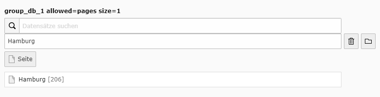
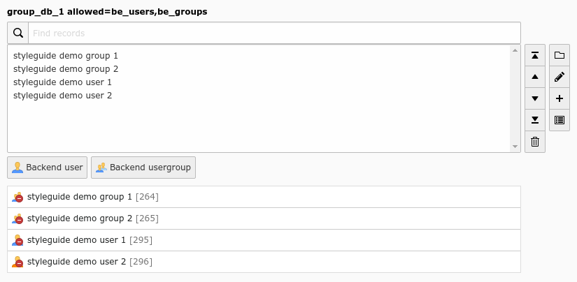

.. include:: /Includes.rst.txt
.. _columns-group-examples:

========
Examples
========

Group relation to a single page
-------------------------------

   Group relation to a single page (group_db_single)

.. code-block:: php

   'group_db_single' => [
      'label' => 'group_db_1 allowed=pages size=1',
      'config' => [
         'type' => 'group',
         'internal_type' => 'db',
         'allowed' => 'pages',
         'maxitems' => 1,
         'minitems' => 0,
         'size' => 1,
         'default' => 0,
         'suggestOptions' => [
            'default' => [
               'additionalSearchFields' => 'nav_title, alias, url',
               'addWhere' => 'AND pages.doktype = 1'
            ]
         ]
      ]
   ]

Group relation to be_groups and be_users
----------------------------------------

   Group relation to be_groups and be_users with some selected records (group_db_1)

.. code-block:: php

    'group_db_1' => [
        'label' => 'group_db_1 allowed=be_users,be_groups',
        'config' => [
            'type' => 'group',
            'internal_type' => 'db',
            'allowed' => 'be_users,be_groups',
            'fieldControl' => [
                'editPopup' => [
                    'disabled' => false,
                ],
                'addRecord' => [
                    'disabled' => false,
                ],
                'listModule' => [
                    'disabled' => false,
                ],
            ],
        ],
    ],
