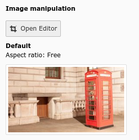

.. include:: ../../Includes.txt

.. _columns-imageManipulation:

type = 'imageManipulation'
--------------------------

.. _columns-imageManipulation-introduction:

Introduction
============

The type "imageManipulation" generates a button showing an image cropper in the backend for image files.
It is typically only used in FAL relations. The crop information is stored as an JSON array into the field.

.. _columns-imageManipulation-examples:

Examples
========

    Image manipulation button in FAL

.. figure:: ../../Images/TypeImageManipulationCropper.png
    :alt: Image manipulation cropper modal
    :class: with-shadow

    Image manipulation cropper modal

.. code-block:: php

    'crop' => [
        'label' => 'LLL:EXT:lang/Resources/Private/Language/locallang_tca.xlf:sys_file_reference.crop',
        'config' => [
            'type' => 'imageManipulation',
        ],
    ],

.. _columns-imageManipulation-properties:

Properties renderType default
=============================

.. _columns-imageManipulation-properties-allowedExtensions:
.. include:: ../Properties/ImageManipulationAllowedExtensions.rst.txt

.. _columns-imageManipulation-properties-behaviour:
.. include:: ../Properties/CommonBehaviour.rst.txt
.. include:: ../Behaviour/CommonAllowLanguageSynchronization.rst.txt

.. _columns-imageManipulation-properties-cropVariants:
.. include:: ../Properties/ImageManipulationCropVariants.rst.txt

.. _columns-imageManipulation-properties-fieldControl:
.. include:: ../Properties/CommonFieldControl.rst.txt

.. _columns-imageManipulation-properties-fieldInformation:
.. include:: ../Properties/CommonFieldInformation.rst.txt

.. _columns-imageManipulation-properties-fieldWizard:
.. include:: ../Properties/CommonFieldWizard.rst.txt
.. include:: ../FieldWizard/DefaultLanguageDifferences.rst.txt
.. include:: ../FieldWizard/LocalizationStateSelector.rst.txt
.. include:: ../FieldWizard/OtherLanguageContent.rst.txt

.. _columns-imageManipulation-properties-fileField:
.. include:: ../Properties/ImageManipulationFileField.rst.txt

.. _columns-imageManipulation-properties-readOnly:
.. include:: ../Properties/CommonReadOnly.rst.txt
