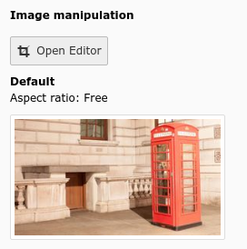
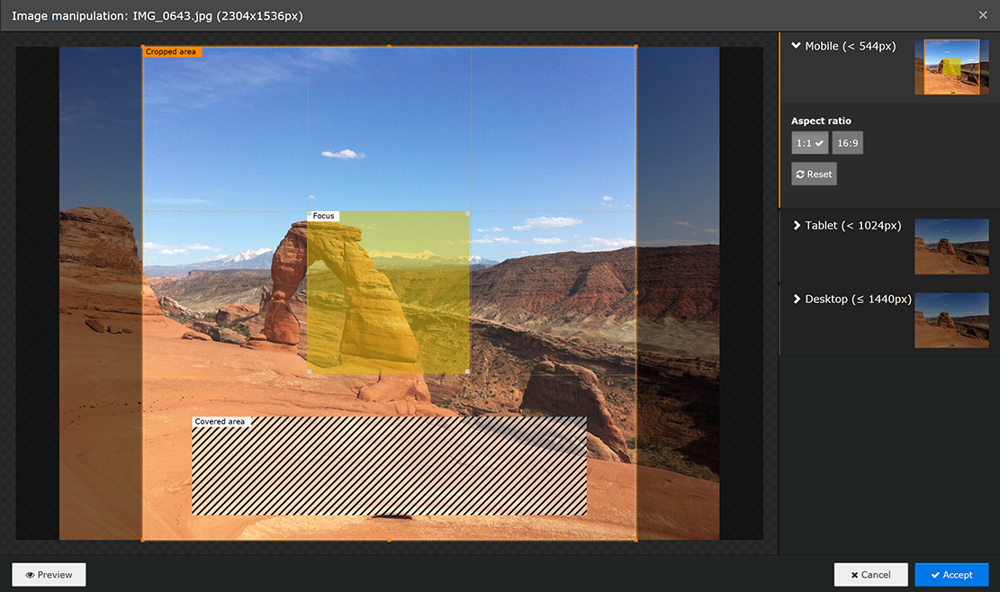

.. include:: /Includes.rst.txt
.. _columns-imageManipulation-examples:

========
Examples
========

    Image manipulation button in FAL

    Image manipulation cropper modal

.. code-block:: php

    'crop' => [
        'label' => 'LLL:EXT:core/Resources/Private/Language/locallang_tca.xlf:sys_file_reference.crop',
        'config' => [
            'type' => 'imageManipulation',
        ],
    ],
