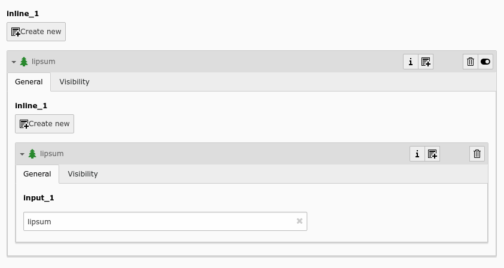
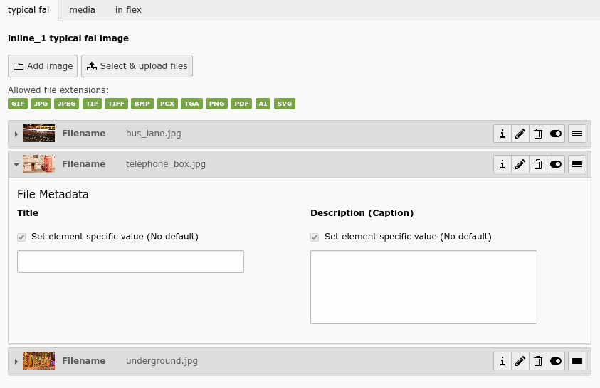
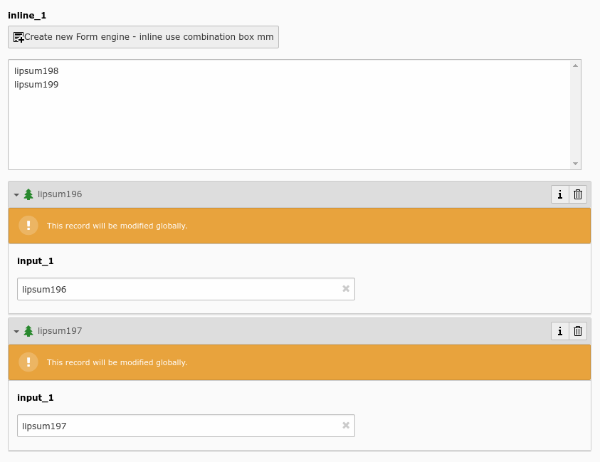

.. include:: /Includes.rst.txt
.. _columns-inline-examples:

========
Examples
========

.. _columns-inline-examples-images:

Images
======

    A nested 1:n to 1:n relation

    A typical FAL relation

    A m:n relation with combination box

.. _columns-inline-examples-1nRelation:

Simple 1:n relation
===================

This combines a table companies with persons (employees):

.. code-block:: php

    'employees' => [
        'exclude' => 1,
        'label' => 'LLL:EXT:myextension/locallang_db.xml:company.employees',
        'config' => [
            'type' => 'inline',
            'foreign_table' => 'person',
            'foreign_field' => 'parentid',
            'foreign_table_field' => 'parenttable',
            'maxitems' => 10,
            'appearance' => [
                'collapseAll' => 1,
                'expandSingle' => 1,
            ],
        ],
    ],

.. _columns-inline-examples-fal:

File Abstraction Layer
======================

Inline-type fields are massively used by the TYPO3 Core in the :ref:`File Abstraction Layer (FAL) <t3fal:start>`.

FAL provides an API for registering an inline-type field with relations to the "sys_file_reference" table containing
information related to existing media. Here is how to use it for the "image" field of table "tt_content":

.. code-block:: php

    'image' => [
        'label' => 'LLL:EXT:core/Resources/Private/Language/locallang_general.xlf:LGL.images',
        'config' => \TYPO3\CMS\Core\Utility\ExtensionManagementUtility::getFileFieldTCAConfig(
            'image',
            [
                'appearance' => [
                   'createNewRelationLinkTitle' => 'LLL:EXT:frontend/Resources/Private/Language/locallang_ttc.xlf:images.addFileReference'
                ],
                // custom configuration for displaying fields in the overlay/reference table
                // to use the image overlay palette instead of the basic overlay palette
                'overrideChildTca' => [
                    'types' => [
                        '0' => [
                            'showitem' => '
                                ==palette==;LLL:EXT:core/Resources/Private/Language/locallang_tca.xlf:sys_file_reference.imageoverlayPalette;imageoverlayPalette,
                                ==palette==;;filePalette'
                        ],
                        \TYPO3\CMS\Core\Resource\File::FILETYPE_TEXT => [
                            'showitem' => '
                                ==palette==;LLL:EXT:core/Resources/Private/Language/locallang_tca.xlf:sys_file_reference.imageoverlayPalette;imageoverlayPalette,
                                ==palette==;;filePalette'
                        ],
                    ],
                ],
            ],
            $GLOBALS['TYPO3_CONF_VARS']['GFX']['imagefile_ext']
        ),
    ],

The method to call is :php:`\TYPO3\CMS\Core\Utility\ExtensionManagementUtility::getFileFieldTCAConfig()` which takes
four parameters. The first one is the name of the field, the second one is an array of configuration options which will
be merged with the default configuration. The third one is the list of allowed file types and the fourth one
(not used above) the list of disallowed file types. The default field configuration into which the
options (second call parameter) are merged looks like:

.. code-block:: php

    $fileFieldTCAConfig = [
        'type' => 'inline',
        'foreign_table' => 'sys_file_reference',
        'foreign_field' => 'uid_foreign',
        'foreign_sortby' => 'sorting_foreign',
        'foreign_table_field' => 'tablenames',
        'foreign_match_fields' => [
            'fieldname' => $fieldName
        ],
        'foreign_label' => 'uid_local',
        'foreign_selector' => 'uid_local',
        'overrideChildTca' => [
            'columns' => [
                'uid_local' => [
                    'config' => [
                        'appearance' => [
                            'elementBrowserType' => 'file',
                            'elementBrowserAllowed' => $allowedFileExtensions
                        ],
                    ],
                ],
            ],
        ],
        'filter' => [
            [
                'userFunc' => 'TYPO3\\CMS\\Core\\Resource\\Filter\\FileExtensionFilter->filterInlineChildren',
                'parameters' => [
                    'allowedFileExtensions' => $allowedFileExtensions,
                    'disallowedFileExtensions' => $disallowedFileExtensions
                ]
            ]
        ],
        'appearance' => [
            'useSortable' => true,
            'headerThumbnail' => [
                'field' => 'uid_local',
                'width' => '45',
                'height' => '45c',
            ],
            'showPossibleLocalizationRecords' => false,
            'showRemovedLocalizationRecords' => false,
            'showSynchronizationLink' => false,
            'showAllLocalizationLink' => false,

            'enabledControls' => [
                'info' => false,
                'new' => false,
                'dragdrop' => true,
                'sort' => false,
                'hide' => true,
                'delete' => true,
                'localize' => true,
            ],
        ],
    ];

.. _columns-inline-examples-asymmetric-mm:

Attributes on anti-symmetric intermediate table
===============================================

This example combines companies with persons (employees) using an intermediate table. It is also possible to add
attributes to every relation – in this example, an attribute "jobtype" on the "person\_company" table is defined.
It is also possible to look at the relation from both sides (parent and child):

.. code-block:: php

    $GLOBALS['TCA']['person'] = [
        'columns' => [
            'employers' => [
                'label' => 'LLL:EXT:myextension/locallang_db.xml:person.employers',
                'config' => [
                    'type' => 'inline',
                    'foreign_table' => 'person_company',
                    'foreign_field' => 'person',
                    'foreign_label' => 'company',
                ],
            ],
        ],
    ];
    $GLOBALS['TCA']['company'] = [
        'columns' => [
            'employees' => [
                'label' => 'LLL:EXT:myextension/locallang_db.xml:company.employees',
                'config' => [
                    'type' => 'inline',
                    'foreign_table' => 'person_company',
                    'foreign_field' => 'company',
                    'foreign_label' => 'person',
                ],
            ],
        ],
    ];
    $GLOBALS['TCA']['person_company'] = [
        'columns' => [
            'person' => [
                'label' => 'LLL:EXT:myextension/locallang_db.xml:person_company.person',
                'config' => [
                    'type' => 'select',
                    'renderType' => 'selectSingle',
                    'foreign_table' => 'person',
                    'size' => 1,
                    'minitems' => 0,
                    'maxitems' => 1,
                ],
            ],
            'company' => [
                'label' => 'LLL:EXT:myextension/locallang_db.xml:person_company.company',
                'config' => [
                    'type' => 'select',
                    'renderType' => 'selectSingle',
                    'foreign_table' => 'company',
                    'size' => 1,
                    'minitems' => 0,
                    'maxitems' => 1,
                ],
            ],
            'jobtype' => [
                'label' => 'LLL:EXT:myextension/locallang_db.xml:person_company.jobtype',
                'config' => [
                    'type' => 'select',
                    'renderType' => 'selectSingle',
                    'items' => [
                        ['Project Manager (PM)', '0'],
                        ['Chief Executive Officer (CEO)', '1'],
                        ['Chief Technology Officer (CTO)', '2'],
                    ],
                    'size' => 1,
                    'maxitems' => 1,
                ],
            ],
        ],
    ];

.. _columns-inline-examples-symmetric-mm:

Attributes on symmetric intermediate table
==========================================

This example combines two persons with each other – imagine they are married. One person on the first side is the
husband, and one person on the other side is the wife (or generally "spouse" in the example below). Symmetric
relations combine object of the same with each other and it does not depend, from which side someone is looking to the
relation – so the husband knows his wife and the wife also knows her husband.

Sorting could be individually defined for each of the both sides (perhaps this should not be applied to a
wife-husband-relationship in real life)

.. code-block:: php

    $GLOBALS['TCA']['person'] = [
        'columns' => [
            'employers' => [
                'label' => 'LLL:EXT:myextension/locallang_db.xml:person.employers',
                'config' => [
                    'type' => 'inline',
                    'foreign_table' => 'person_symmetric',
                    'foreign_field' => 'person',
                    'foreign_sortby' => 'sorting_person',
                    'foreign_label' => 'spouse',
                    'symmetric_field' => 'spouse',
                    'symmetric_sortby' => 'sorting_spouse',
                    'symmetric_label' => 'person',
                ],
            ],
        ],
    ];
    $GLOBALS['TCA']['person_symmetric'] = [
        'columns' => [
            'person' => [
                'label' => 'LLL:EXT:myextension/locallang_db.xml:person_symmetric.person',
                'config' => [
                    'type' => 'select',
                    'renderType' => 'selectSingle',
                    'foreign_table' => 'person',
                    'size' => 1,
                    'minitems' => 0,
                    'maxitems' => 1,
                ],
            ],
            'spouse' => [
                'label' => 'LLL:EXT:myextension/locallang_db.xml:person_symmetric.spouse',
                'config' => [
                    'type' => 'select',
                    'renderType' => 'selectSingle',
                    'foreign_table' => 'person',
                    'size' => 1,
                    'minitems' => 0,
                    'maxitems' => 1,
                ],
            ],
            'someattribute' => [
                'label' => 'LLL:EXT:myextension/locallang_db.xml:person_symmetric.someattribute',
                'config' => [
                    'type' => 'input',
                ],
            ],
            'sorting_person' => [
                'config' => [
                    'type' => 'passthrough',
                ],
            ],
            'sorting_spouse' => [
                'config' => [
                    'type' => 'passthrough',
                ],
            ],
        ],
    ];

.. note::
   :ts:`TCAdefaults.<table>.pid = <page id>` can be used to define the pid of new child records. Thus, it's possible to
   have special storage folders on a per-table-basis. See the :ref:`TSconfig reference <t3tsconfig:usertoplevelobjects>`.
