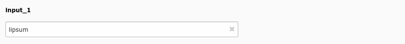
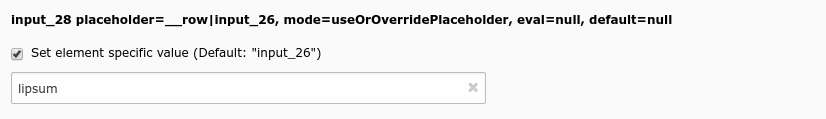
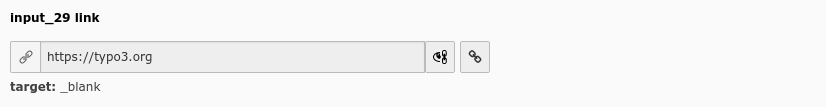
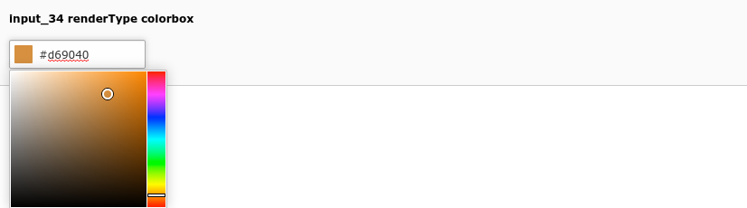

.. include:: ../../Includes.txt

.. _columns-input:

type = 'input'
--------------

.. _columns-input-introduction:

Introduction
============

type='input' generates an `<input>` field, possibly with additional features applied. There are a number of
variants to this type and it is used in various different ways, for instance with some additional wizards
or modals. Keep an eye on the different available renderTypes.

In the database, this field is typically set to a `VARCHAR` or `CHAR` field with appropriate length.

.. _columns-input-examples:

Examples
========

    Simple input field (input_1)

    Input with placeholder and null handling (input_28)

    Link field (input_29)

.. figure:: ../../Images/TypeInputStyleguide30Slider.png
    :alt: Value slider (input_30)
    :class: with-shadow

    Value slider (input_30)

.. figure:: ../../Images/TypeInputStyleguide33ValuePicker.png
    :alt: Value picker (input_33)
    :class: with-shadow

    Value picker (input_33)

    Color picker (input_34)

.. figure:: ../../Images/TypeInputDateTimeStyleguide3.png
    :alt: Date and time picker (inputdatetime_3)
    :class: with-shadow

    Date and time picker (inputdatetime_3)

.. code-block:: php

    'input_1' => [
        'label' => 'input_1',
        'config' => [
            'type' => 'input',
        ],
    ],

.. code-block:: php

    'input_28' => [
        'label' => 'input_28 placeholder=__row|input_26, mode=useOrOverridePlaceholder, eval=null, default=null',
        'config' => [
            'type' => 'input',
            'placeholder' => '__row|input_26',
            'eval' => 'null',
            'default' => null,
            'mode' => 'useOrOverridePlaceholder',
        ],
    ],

.. code-block:: php

    'input_29' => [
        'label' => 'input_29 link',
        'config' => [
            'type' => 'input',
            'renderType' => 'inputLink',
        ],
    ],

.. code-block:: php

    'input_30' => [
        'label' => 'input_30 slider, step=10, width=200, eval=trim,int',
        'config' => [
            'type' => 'input',
            'size' => 5,
            'eval' => 'trim,int',
            'range' => [
                'lower' => -90,
                'upper' => 90,
            ],
            'default' => 0,
            'slider' => [
                'step' => 10,
                'width' => 200,
            ],
        ],
    ],

.. code-block:: php

    'input_33' => [
        'label' => 'input_33 valuePicker',
        'config' => [
            'type' => 'input',
            'size' => 20,
            'eval' => 'trim',
            'valuePicker' => [
                'items' => [
                    [ 'spring', 'Spring', ],
                    [ 'summer', 'Summer', ],
                    [ 'autumn', 'Autumn', ],
                    [ 'winter', 'Winter', ],
                ],
            ],
        ],
    ],

.. code-block:: php

    'input_34' => [
        'label' => 'input_34 renderType colorbox',
        'config' => [
            'type' => 'input',
            'renderType' => 'colorpicker',
            'size' => 10,
        ],
    ],

.. code-block:: php

    'inputdatetime_3' => [
        'label' => 'inputdatetime_3 eval=datetime',
        'config' => [
            'type' => 'input',
            'renderType' => 'inputDateTime',
            'eval' => 'datetime',
        ],
    ],

.. _columns-input-renderType-default:

renderType default
==================

This normal workhorse input element is used if no renderType is set and no special functionality is needed.

.. _columns-input-properties:

.. _columns-input-properties-type:

.. _columns-input-properties-autocomplete:
.. include:: ../Properties/InputAutocomplete.rst

.. _columns-input-properties-behaviour:
.. include:: ../Properties/CommonBehaviour.rst
.. include:: ../Behaviour/AllowLanguageSynchronization.rst

.. _columns-input-properties-default:
.. include:: ../Properties/CommonDefault.rst

.. _columns-input-properties-eval:
.. include:: ../Properties/InputEval.rst

.. include:: ../Properties/CommonFieldControl.rst

.. include:: ../Properties/CommonFieldInformation.rst

.. include:: ../Properties/CommonFieldWizard.rst
.. include:: ../FieldWizard/DefaultLanguageDifferences.rst
.. _columns-input-properties-fieldWizard-localizationStateSelector:
.. include:: ../FieldWizard/LocalizationStateSelector.rst
.. include:: ../FieldWizard/OtherLanguageContent.rst

.. _columns-input-properties-is-in:
.. include:: ../Properties/InputIsIn.rst

.. _columns-input-properties-max:
.. include:: ../Properties/InputMax.rst

.. _columns-input-properties-mode:
.. include:: ../Properties/CommonMode.rst

.. _columns-input-properties-placeholder:
.. include:: ../Properties/CommonPlaceholder.rst

.. _columns-input-properties-range:
.. include:: ../Properties/InputRange.rst

.. _columns-input-properties-readOnly:
.. include:: ../Properties/CommonReadOnly.rst

.. _columns-input-properties-search:
.. include:: ../Properties/CommonSearch.rst

.. _columns-input-properties-size:
.. include:: ../Properties/InputSize.rst

.. _columns-input-properties-slider:
.. include:: ../Properties/InputSlider.rst

.. _columns-input-properties-softref:
.. include:: ../Properties/CommonSoftref.rst

.. _columns-input-properties-valuePicker:
.. include:: ../Properties/InputValuePicker.rst

.. _columns-input-renderType-colorpicker:

renderType = 'colorpicker'
==========================

An input field with a JavaScript color picker.

.. include:: ../Properties/InputAutocomplete.rst

.. include:: ../Properties/CommonBehaviour.rst
.. include:: ../Behaviour/AllowLanguageSynchronization.rst

.. include:: ../Properties/CommonDefault.rst

.. include:: ../Properties/InputEval.rst

.. note::
    A lot of the default :php:`eval` properties do not make much sense in the colorpicker. Choose with care.

.. include:: ../Properties/CommonFieldControl.rst

.. include:: ../Properties/CommonFieldInformation.rst

.. include:: ../Properties/CommonFieldWizard.rst
.. include:: ../FieldWizard/DefaultLanguageDifferences.rst
.. include:: ../FieldWizard/LocalizationStateSelector.rst
.. include:: ../FieldWizard/OtherLanguageContent.rst

.. include:: ../Properties/InputIsIn.rst

.. include:: ../Properties/InputMax.rst

.. include:: ../Properties/CommonMode.rst

.. include:: ../Properties/CommonPlaceholder.rst

.. include:: ../Properties/CommonReadOnly.rst

.. include:: ../Properties/CommonSearch.rst

.. include:: ../Properties/InputSize.rst

.. include:: ../Properties/CommonSoftref.rst

.. include:: ../Properties/InputValuePicker.rst

.. note::
    The colorpicker ignores `mode` setting of the valuePicker, new values from the select box always substitute an existing one.

.. _columns-input-renderType-inputDateTime:

renderType = 'inputDateTime'
============================

Renders an input field with date or time pickers.

.. _columns-input-properties-dbtype:
.. include:: ../Properties/InputDbType.rst

.. include:: ../Properties/CommonBehaviour.rst
.. include:: ../Behaviour/AllowLanguageSynchronization.rst

.. include:: ../Properties/CommonDefault.rst

.. _columns-input-properties-disableAgeDisplay:
.. include:: ../Properties/InputDisableAgeDisplay.rst

.. include:: ../Properties/InputEvalInputDateTime.rst

.. include:: ../Properties/CommonFieldControl.rst

.. include:: ../Properties/CommonFieldInformation.rst

.. include:: ../Properties/CommonFieldWizard.rst
.. include:: ../FieldWizard/DefaultLanguageDifferences.rst
.. include:: ../FieldWizard/LocalizationStateSelector.rst
.. include:: ../FieldWizard/OtherLanguageContent.rst

.. _columns-input-properties-format:
.. include:: ../Properties/InputFormat.rst

.. include:: ../Properties/CommonMode.rst

.. include:: ../Properties/CommonPlaceholder.rst

.. include:: ../Properties/InputRange.rst

.. include:: ../Properties/CommonReadOnly.rst

.. include:: ../Properties/CommonSearch.rst

.. include:: ../Properties/InputSize.rst

.. include:: ../Properties/CommonSoftref.rst

.. _columns-input-renderType-inputLink:

renderType = 'inputLink'
========================

An input field used to handle links and mail addresses in the backend.

.. include:: ../Properties/InputAutocomplete.rst

.. include:: ../Properties/CommonBehaviour.rst
.. include:: ../Behaviour/AllowLanguageSynchronization.rst

.. include:: ../Properties/CommonDefault.rst

.. include:: ../Properties/InputEval.rst

.. include:: ../Properties/CommonFieldControl.rst
.. include:: ../FieldControl/LinkPopup.rst

.. include:: ../Properties/CommonFieldInformation.rst

.. include:: ../Properties/CommonFieldWizard.rst
.. include:: ../FieldWizard/DefaultLanguageDifferences.rst
.. include:: ../FieldWizard/LocalizationStateSelector.rst
.. include:: ../FieldWizard/OtherLanguageContent.rst

.. include:: ../Properties/InputIsIn.rst

.. include:: ../Properties/InputMax.rst

.. include:: ../Properties/CommonMode.rst

.. include:: ../Properties/CommonPlaceholder.rst

.. include:: ../Properties/InputRange.rst

.. include:: ../Properties/CommonReadOnly.rst

.. include:: ../Properties/CommonSearch.rst

.. include:: ../Properties/InputSize.rst

.. include:: ../Properties/InputSlider.rst

.. include:: ../Properties/CommonSoftref.rst

.. include:: ../Properties/InputValuePicker.rst

.. _columns-input-renderType-rsaInput:

renderType = 'rsaInput'
=======================

If extension `rsaauth` is loaded, this renderType overrides the TCA configuration of table `be_users` and `fe_users`
and adds itself as renderType for the `password` fields. If enabled, the value of fields are not transferred in
plain text to the server, but are encrypted on client side with in a JavaScript library and decrypted on the server
side on save. This can increase security if the backend is not HTTPS enabled, to increase transmission security a bit.

.. note::
    The extension `rsaauth` is just an imperfect helper to secure little parts of the backend. It is clearly
    just a poor-man solution and no good substitution of running the entire backend with HTTPS. If you are
    concerned about communication security (you should!), there is no way around HTTPS. If the backend is forced to
    HTTPS, extension rsaauth can be unloaded.

.. include:: ../Properties/InputAutocomplete.rst

.. include:: ../Properties/CommonBehaviour.rst
.. include:: ../Behaviour/AllowLanguageSynchronization.rst

.. include:: ../Properties/CommonDefault.rst

.. include:: ../Properties/InputEval.rst

.. include:: ../Properties/CommonFieldControl.rst

.. include:: ../Properties/CommonFieldInformation.rst

.. include:: ../Properties/CommonFieldWizard.rst
.. include:: ../FieldWizard/DefaultLanguageDifferences.rst
.. include:: ../FieldWizard/OtherLanguageContent.rst

.. include:: ../Properties/InputIsIn.rst

.. include:: ../Properties/InputMax.rst

.. include:: ../Properties/InputRange.rst

.. include:: ../Properties/CommonReadOnly.rst

.. include:: ../Properties/CommonSearch.rst

.. include:: ../Properties/InputSize.rst

.. include:: ../Properties/CommonSoftref.rst
