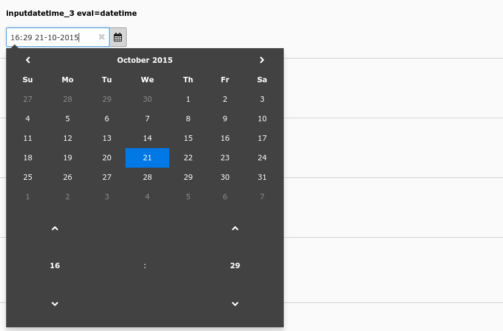

.. include:: /Includes.rst.txt

========
Examples
========

    Date and time picker (inputdatetime_3)

.. code-block:: php

    'inputdatetime_3' => [
        'label' => 'inputdatetime_3 eval=datetime',
        'config' => [
            'type' => 'input',
            'renderType' => 'inputDateTime',
            'eval' => 'datetime',
        ],
    ],
