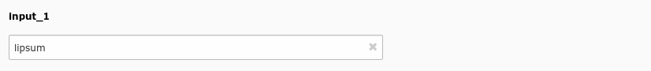
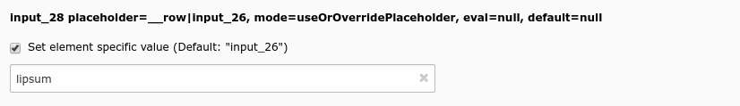
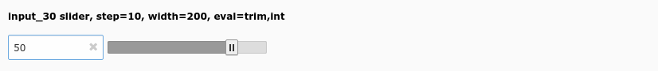
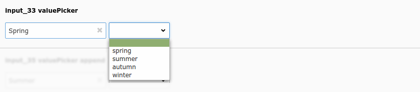

.. include:: /Includes.rst.txt
.. _columns-input-examples:

========
Examples
========

Simple input field
==================

    Simple input field (input_1)

.. code-block:: php

    'input_1' => [
        'label' => 'input_1',
        'config' => [
            'type' => 'input',
        ],
    ],

Input with placeholder and null handling
========================================

    Input with placeholder and null handling (input_28)

.. code-block:: php

    'input_28' => [
        'label' => 'input_28 placeholder=__row|input_26, mode=useOrOverridePlaceholder, eval=null, default=null',
        'config' => [
            'type' => 'input',
            'placeholder' => '__row|input_26',
            'eval' => 'null',
            'default' => null,
            'mode' => 'useOrOverridePlaceholder',
        ],
    ],

Value slider
============

    Value slider (input_30)

.. code-block:: php

    'input_30' => [
        'label' => 'input_30 slider, step=10, width=200, eval=trim,int',
        'config' => [
            'type' => 'input',
            'size' => 10,
            'eval' => 'trim,int',
            'range' => [
                'lower' => -90,
                'upper' => 90,
            ],
            'default' => 0,
            'slider' => [
                'step' => 10,
                'width' => 200,
            ],
        ],
    ],

Value picker
============

    Value picker (input_33)

.. code-block:: php

    'input_33' => [
        'label' => 'input_33 valuePicker',
        'config' => [
            'type' => 'input',
            'size' => 20,
            'eval' => 'trim',
            'valuePicker' => [
                'items' => [
                    ['spring', 'Spring'],
                    ['summer', 'Summer'],
                    ['autumn', 'Autumn'],
                    ['winter', 'Winter'],
                ],
            ],
        ],
    ],

