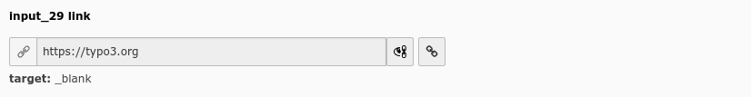

.. include:: /Includes.rst.txt

========
Examples
========

    Link field (input_29)

.. code-block:: php

    'input_29' => [
        'label' => 'input_29 link',
        'config' => [
            'type' => 'input',
            'renderType' => 'inputLink',
        ],
    ],
