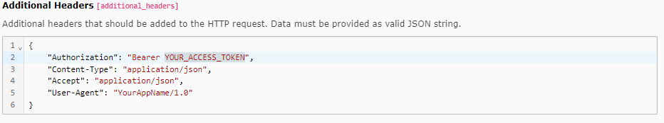

..  include:: /Includes.rst.txt

..  _columns-json:

====
Json
====

Renders a text area to enter json data.

The :ref:`according database field <t3coreapi:auto-generated-db-structure>`
is generated automatically.

..  contents:: Table of contents:
    :local:
    :depth: 1

..  _columns-json-examples-simple:

Example: Simple JSON field
==========================

The system extension :composer:`typo3/cms-webhooks` uses a TCA field of type
JSON for the input of additional HTTP request header data:

..  include:: _Examples/SysWebHook.rst.php

..  _columns-json-properties:

Properties of the TCA column type `json`
========================================

..  confval-menu::
    :name: json
    :display: table
    :type:
    :Scope:

    ..  include:: _Properties/_*.rst.txt
        :show-buttons:
