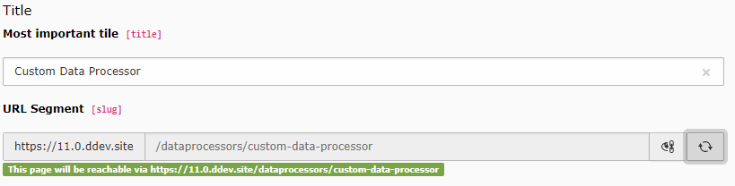

.. include:: /Includes.rst.txt

.. _columns-slug:

=================
Slugs / URL parts
=================

The main purpose of this type is to define parts of a URL path to generate and
resolve URLs.

   Slug field in the table pages, see :ref:`example <tca_example_pages_slug>`

.. toctree::
   :titlesonly:

   Introduction
   Examples
   Properties/Index
