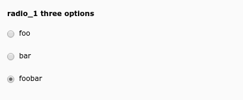

.. include:: ../../Includes.txt

.. _columns-radio:

type = 'radio'
--------------

.. _columns-radio-introduction:

Introduction
============

This type creates a set of radio buttons. The value is typically stored as integer value, each radio
item has one assigned number, but it can be a string, too.

.. _columns-radio-examples:

Examples
========

    A set of radio buttons

.. code-block:: php

    'radio_1' => [
        'label' => 'radio_1 three options',
        'config' => [
            'type' => 'radio',
            'items' => [
                [ 'foo', 1 ], // 'foo' should be a LLL reference
                [ 'bar', 2 ],
                [ 'foobar', 3 ],
            ],
        ],
    ],

.. _columns-radio-properties:

Properties renderType default
=============================

.. _columns-radio-properties-type:

.. _columns-radio-properties-behaviour:
.. include:: ../Properties/CommonBehaviour.rst.txt
.. include:: ../Behaviour/CommonAllowLanguageSynchronization.rst.txt

.. _columns-radio-properties-default:
.. include:: ../Properties/CommonDefault.rst.txt

.. _columns-radio-properties-fieldInformation:
.. include:: ../Properties/CommonFieldInformation.rst.txt

.. _columns-radio-properties-fieldWizard:
.. include:: ../Properties/CommonFieldWizard.rst.txt
.. include:: ../FieldWizard/DefaultLanguageDifferences.rst.txt
.. include:: ../FieldWizard/LocalizationStateSelector.rst.txt
.. include:: ../FieldWizard/OtherLanguageContent.rst.txt

.. _columns-radio-properties-items:
.. include:: ../Properties/RadioItems.rst.txt

.. _columns-radio-properties-itemsprocfunc:
.. include:: ../Properties/CommonItemsProcFunc.rst.txt

.. _columns-radio-properties-readOnly:
.. include:: ../Properties/CommonReadOnly.rst.txt
