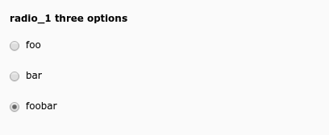

.. include:: /Includes.rst.txt
.. _columns-radio-examples:

========
Examples
========

    A set of radio buttons

.. code-block:: php

    'radio_1' => [
        'label' => 'radio_1 three options',
        'config' => [
            'type' => 'radio',
            'items' => [
                ['foo', 1], // 'foo' should be a LLL reference
                ['bar', 2],
                ['foobar', 3],
            ],
        ],
    ],

