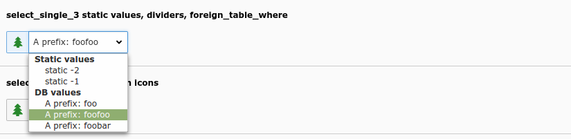
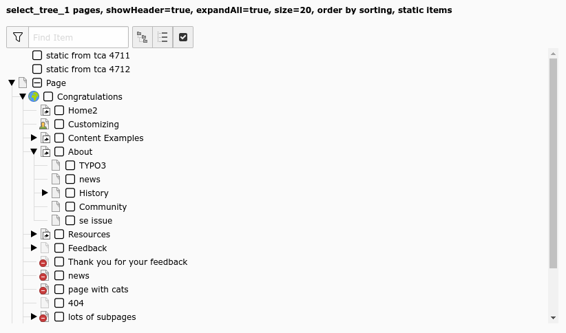

.. include:: ../../Includes.txt

.. _columns-select:

type = 'select'
---------------

.. _columns-select-introduction:

Introduction
============

Selectors boxes are very common elements in forms. By the "select" type you can create selector boxes. In
the most simple form this is a list of values among which you can chose only one.

There are various shapes of the select type, the images below give an overview. The basic idea is that all
possible child elements are always listed. This is in contrast to the group type which lists only selected
elements and helps with selecting others via element browser and other tools.

The select type is pretty powerful, there are a lot of options to steer both rendering and database handling.

.. note::
    For this type, a renderType is mandatory!

.. _columns-select-examples:

Examples
========

    Simple select drop down with static and database values (select_single_3)

.. figure:: ../../Images/ColumnsExampleSelectImages.png
    :alt: Select foreign rows which have icons configured (select_single_12)

    Select foreign rows which have icons configured (select_single_12)

.. figure:: ../../Images/TypeSelectStyleguideSingle10.png
    :alt: Select a single value from a list of elements (select_single_10)

    Select a single value from a list of elements (select_single_10)

    Select multiple values from a box (select_singlebox_1)

.. figure:: ../../Images/TypeSelectStyleguideCheckbox3.png
    :alt: Select values from a checkbox list (select_checkbox_3)

    Select values from a checkbox list (select_checkbox_3)

.. figure:: ../../Images/TypeSelectStyleguideMultipleSideBySide5.png
    :alt: Side-by-side view with filter (select_multiplesidebyside_5)

    Side-by-side view with filter (select_multiplesidebyside_5)

    A happy little tree! (select_tree_1)

.. code-block:: php

        'select_single_3' => [
            'label' => 'select_single_3 static values, dividers, foreign_table_where',
            'config' => [
                'type' => 'select',
                'renderType' => 'selectSingle',
                'items' => [
                    ['Static values', '--div--'],
                    ['static -2', -2],
                    ['static -1', -1],
                    ['DB values', '--div--'],
                ],
                'foreign_table' => 'tx_styleguide_staticdata',
                'foreign_table_where' => 'AND tx_styleguide_staticdata.value_1 LIKE \'%foo%\' ORDER BY uid',
                // @todo: docu of rootLevel says, foreign_table_where is *ignored*, which is NOT true.
                'rootLevel' => 1,
                'foreign_table_prefix' => 'A prefix: ',
            ],
        ],

.. code-block:: php

        'select_single_12' => [
            'label' => 'select_single_12 foreign_table selicon_field',
            'config' => [
                'type' => 'select',
                'renderType' => 'selectSingle',
                'foreign_table' => 'tx_styleguide_elements_select_single_12_foreign',
                'fieldWizard' => [
                    'selectIcons' => [
                        'disabled' => false,
                    ],
                ],
            ],
        ],

.. code-block:: php

        'select_single_10' => [
            'label' => 'select_single_10 size=6, three options',
            'config' => [
                'type' => 'select',
                'renderType' => 'selectSingle',
                'items' => [
                    ['foo 1', 1],
                    ['foo 2', 2],
                    ['a divider', '--div--'],
                    ['foo 3', 3],
                ],
                'size' => 6,
            ],
        ],

.. code-block:: php

        'select_singlebox_1' => [
            'label' => 'select_singlebox_1',
            'config' => [
                'type' => 'select',
                'renderType' => 'selectSingleBox',
                'items' => [
                    ['foo 1', 1],
                    ['foo 2', 2],
                    ['divider', '--div--'],
                    ['foo 3', 3],
                    ['foo 4', 4],
                ],
            ],
        ],

.. code-block:: php

        'select_checkbox_3' => [
            'label' => 'select_checkbox_3 icons, description',
            'config' => [
                'type' => 'select',
                'renderType' => 'selectCheckBox',
                'items' => [
                    ['foo 1', 1, '', 'optional description'],
                    ['foo 2', 2, 'EXT:styleguide/Resources/Public/Icons/tx_styleguide.svg', 'description'],
                    ['foo 3', 3, 'EXT:styleguide/Resources/Public/Icons/tx_styleguide.svg'],
                    ['foo 4', 4],
                ],
            ],
        ],

.. code-block:: php

        'select_multiplesidebyside_5' => [
            'label' => 'select_multiplesidebyside_5 multiSelectFilterItems, enableMultiSelectFilterTextfield=true',
            'config' => [
                'type' => 'select',
                'renderType' => 'selectMultipleSideBySide',
                'items' => [
                    ['foo 1', 1],
                    ['foo 2', 2],
                    ['foo 3', 3],
                    ['bar', 4],
                ],
                'enableMultiSelectFilterTextfield' => true,
                'multiSelectFilterItems' => [
                    ['', ''],
                    ['foo', 'foo'],
                    ['bar', 'bar'],
                ],
            ],
        ],

.. code-block:: php

        'select_tree_1' => [
            'label' => 'select_tree_1 pages, showHeader=true, expandAll=true, size=20, order by sorting, static items',
            'config' => [
                'type' => 'select',
                'renderType' => 'selectTree',
                'foreign_table' => 'pages',
                'foreign_table_where' => 'ORDER BY pages.sorting',
                'size' => 20,
                'items' => [
                    [ 'static from tca 4711', 4711 ],
                    [ 'static from tca 4712', 4712 ],
                ],
                'treeConfig' => [
                    'parentField' => 'pid',
                    'appearance' => [
                        'expandAll' => true,
                        'showHeader' => true,
                    ],
                ],
            ],
        ],

.. _columns-select-rendertype-selectSingle:

renderType = 'selectSingle'
===========================

This renderType creates a drop-down box with items to select a single value. Only if
:ref:`size <columns-select-properties-size>` is set to a value greater than one, a box is rendered containing
all selectable elements from which one can be chosen.

.. _columns-select-properties:

.. _columns-select-properties-type:

.. _columns-select-properties-allownonidvalues:
.. include:: ../Properties/SelectAllowNonIdValues.rst

.. _columns-select-properties-authmode:
.. include:: ../Properties/SelectAuthMode.rst

.. _columns-select-properties-authmode-enforce:
.. include:: ../Properties/SelectAuthModeEnforce.rst

.. _columns-select-properties-default:
.. include:: ../Properties/SelectDefault.rst

.. _columns-select-properties-disablenomatchingvalueelement:
.. include:: ../Properties/SelectDisableNonMatchingValueElement.rst

.. _columns-select-properties-dontremaptablesoncopy:
.. include:: ../Properties/CommonDontRemapTablesOnCopy.rst

.. _columns-select-properties-exclusivekeys:
.. include:: ../Properties/SelectExclusiveKeys.rst

.. _columns-select-properties-fieldControl:
.. include:: ../Properties/CommonFieldControl.rst

.. _columns-select-properties-fieldInformation:
.. include:: ../Properties/CommonFieldInformation.rst

.. _columns-select-properties-fieldWizard:
.. include:: ../Properties/CommonFieldWizard.rst
.. include:: ../FieldWizard/DefaultLanguageDifferences.rst
.. include:: ../FieldWizard/LocalizationStateSelector.rst
.. include:: ../FieldWizard/OtherLanguageContent.rst
.. include:: ../FieldWizard/SelectIcons.rst

.. _columns-select-properties-filefolder:
.. include:: ../Properties/SelectFileFolder.rst

.. _columns-select-properties-filefolder-extlist:
.. include:: ../Properties/SelectFileFolderExtList.rst

.. _columns-select-properties-filefolder-recursions:
.. include:: ../Properties/SelectFileFolderRecursions.rst

.. _columns-select-properties-foreign-table:
.. include:: ../Properties/SelectForeignTable.rst

.. _columns-select-properties-foreign-table-prefix:
.. include:: ../Properties/SelectForeignTablePrefix.rst

.. _columns-select-properties-foreign-table-where:
.. include:: ../Properties/SelectForeignTableWhere.rst

.. _columns-select-properties-items:
.. include:: ../Properties/SelectItems.rst

.. _columns-select-properties-itemsprocfunc:
.. include:: ../Properties/CommonItemsProcFunc.rst

.. _columns-select-properties-localizereferencesatparentlocalization:
.. include:: ../Properties/SelectLocalizeReferencesAtParentLocalization.rst

.. _columns-select-properties-minitems:
.. include:: ../Properties/CommonMinitems.rst

.. _columns-select-properties-mm:
.. include:: ../Properties/CommonMm.rst

.. _columns-select-properties-mm-hasuidfield:
.. include:: ../Properties/CommonMmHasUidField.rst

.. _columns-select-properties-mm-insert-fields:
.. include:: ../Properties/CommonMmInsertFields.rst

.. _columns-select-properties-mm-table-where:
.. include:: ../Properties/CommonMmTableWhere.rst

.. _columns-select-properties-mm-match-fields:
.. include:: ../Properties/CommonMmMatchFields.rst

.. _columns-select-properties-mm-opposite-field:
.. include:: ../Properties/CommonOppositeField.rst

.. _columns-select-properties-mm-opposite-usage:
.. _columns-select-properties-mm-oppositeusage:
.. include:: ../Properties/CommonMmOppositeUsage.rst

.. _columns-select-properties-multiple:
.. include:: ../Properties/CommonMultiple.rst

.. _columns-select-properties-readOnly:
.. include:: ../Properties/CommonReadOnly.rst

.. _columns-select-properties-rootlevel:
.. include:: ../Properties/SelectRootLevel.rst

.. _columns-select-properties-size:
.. include:: ../Properties/CommonSize.rst

.. _columns-select-properties-special:
.. include:: ../Properties/SelectSpecial.rst

.. _columns-select-rendertype-selectSingleBox:

renderType = 'selectSingleBox'
==============================

Renders a select field to select multiple entries from a given list.

.. include:: ../Properties/SelectAllowNonIdValues.rst

.. include:: ../Properties/SelectAuthMode.rst

.. include:: ../Properties/SelectAuthModeEnforce.rst

.. include:: ../Properties/SelectDefault.rst

.. include:: ../Properties/SelectDisableNonMatchingValueElement.rst

.. include:: ../Properties/CommonDontRemapTablesOnCopy.rst

.. include:: ../Properties/SelectExclusiveKeys.rst

.. include:: ../Properties/CommonFieldControl.rst
.. include:: ../Properties/ResetSelection.rst

.. include:: ../Properties/CommonFieldInformation.rst

.. include:: ../Properties/CommonFieldWizard.rst
.. include:: ../FieldWizard/DefaultLanguageDifferences.rst
.. include:: ../FieldWizard/LocalizationStateSelector.rst
.. include:: ../FieldWizard/OtherLanguageContent.rst

.. include:: ../Properties/SelectFileFolder.rst

.. include:: ../Properties/SelectFileFolderExtList.rst

.. include:: ../Properties/SelectFileFolderRecursions.rst

.. include:: ../Properties/SelectForeignTable.rst

.. include:: ../Properties/SelectForeignTablePrefix.rst

.. include:: ../Properties/SelectForeignTableWhere.rst

.. include:: ../Properties/SelectItems.rst

.. _columns-select-properties-itemliststyle:
.. include:: ../Properties/SelectItemListStyle.rst

.. include:: ../Properties/CommonItemsProcFunc.rst

.. include:: ../Properties/SelectLocalizeReferencesAtParentLocalization.rst

.. _columns-select-properties-maxitems:
.. include:: ../Properties/CommonMaxitems.rst

.. include:: ../Properties/CommonMinitems.rst

.. include:: ../Properties/CommonMm.rst

.. include:: ../Properties/CommonMmHasUidField.rst

.. include:: ../Properties/CommonMmInsertFields.rst

.. include:: ../Properties/CommonMmTableWhere.rst

.. include:: ../Properties/CommonMmMatchFields.rst

.. include:: ../Properties/CommonOppositeField.rst

.. include:: ../Properties/CommonMmOppositeUsage.rst

.. include:: ../Properties/CommonMultiple.rst

.. include:: ../Properties/CommonReadOnly.rst

.. include:: ../Properties/SelectRootLevel.rst

.. include:: ../Properties/CommonSize.rst

.. include:: ../Properties/SelectSpecial.rst

.. _columns-select-rendertype-selectCheckBox:

renderType = 'selectCheckBox'
==============================

Render the list of values as single check box rows in a table. Multiple items can be selected.

.. include:: ../Properties/SelectAllowNonIdValues.rst

.. include:: ../Properties/SelectAuthMode.rst

.. include:: ../Properties/SelectAuthModeEnforce.rst

.. include:: ../Properties/SelectDefault.rst

.. include:: ../Properties/SelectDisableNonMatchingValueElement.rst

.. include:: ../Properties/CommonDontRemapTablesOnCopy.rst

.. include:: ../Properties/SelectExclusiveKeys.rst

.. include:: ../Properties/CommonFieldControl.rst

.. include:: ../Properties/CommonFieldInformation.rst

.. include:: ../Properties/CommonFieldWizard.rst
.. include:: ../FieldWizard/DefaultLanguageDifferences.rst
.. include:: ../FieldWizard/LocalizationStateSelector.rst
.. include:: ../FieldWizard/OtherLanguageContent.rst

.. include:: ../Properties/SelectFileFolder.rst

.. include:: ../Properties/SelectFileFolderExtList.rst

.. include:: ../Properties/SelectFileFolderRecursions.rst

.. include:: ../Properties/SelectForeignTable.rst

.. include:: ../Properties/SelectForeignTablePrefix.rst

.. include:: ../Properties/SelectForeignTableWhere.rst

.. include:: ../Properties/SelectItems.rst

.. include:: ../Properties/CommonItemsProcFunc.rst

.. include:: ../Properties/SelectLocalizeReferencesAtParentLocalization.rst

.. include:: ../Properties/CommonMaxitems.rst

.. include:: ../Properties/CommonMinitems.rst

.. include:: ../Properties/CommonMm.rst

.. include:: ../Properties/CommonMmHasUidField.rst

.. include:: ../Properties/CommonMmInsertFields.rst

.. include:: ../Properties/CommonMmTableWhere.rst

.. include:: ../Properties/CommonMmMatchFields.rst

.. include:: ../Properties/CommonOppositeField.rst

.. include:: ../Properties/CommonMmOppositeUsage.rst

.. include:: ../Properties/CommonMultiple.rst

.. include:: ../Properties/CommonReadOnly.rst

.. include:: ../Properties/SelectRootLevel.rst

.. include:: ../Properties/CommonSize.rst

.. include:: ../Properties/SelectSpecial.rst

.. _columns-select-rendertype-selectMultipleSideBySide:

renderType = 'selectMultipleSideBySide'
=======================================

Two select fields, items can be selected from the right field, selected items are displayed in the left select.

.. include:: ../Properties/SelectAllowNonIdValues.rst

.. include:: ../Properties/SelectAuthMode.rst

.. include:: ../Properties/SelectAuthModeEnforce.rst

.. include:: ../Properties/SelectDefault.rst

.. include:: ../Properties/SelectDisableNonMatchingValueElement.rst

.. include:: ../Properties/CommonDontRemapTablesOnCopy.rst

.. _columns-select-properties-enablemultiselectfiltertextfield:
.. include:: ../Properties/SelectEnableMultiSelectFilterTextfield.rst

.. include:: ../Properties/SelectExclusiveKeys.rst

.. include:: ../Properties/CommonFieldControl.rst
.. include:: ../FieldControl/AddRecord.rst
.. include:: ../FieldControl/EditPopup.rst
.. include:: ../FieldControl/ListModule.rst

.. include:: ../Properties/CommonFieldInformation.rst

.. include:: ../Properties/CommonFieldWizard.rst
.. include:: ../FieldWizard/DefaultLanguageDifferences.rst
.. include:: ../FieldWizard/LocalizationStateSelector.rst
.. include:: ../FieldWizard/OtherLanguageContent.rst

.. include:: ../Properties/SelectFileFolder.rst

.. include:: ../Properties/SelectFileFolderExtList.rst

.. include:: ../Properties/SelectFileFolderRecursions.rst

.. include:: ../Properties/SelectForeignTable.rst

.. include:: ../Properties/SelectForeignTablePrefix.rst

.. include:: ../Properties/SelectForeignTableWhere.rst

.. include:: ../Properties/SelectItems.rst

.. include:: ../Properties/SelectItemListStyle.rst

.. include:: ../Properties/CommonItemsProcFunc.rst

.. include:: ../Properties/SelectLocalizeReferencesAtParentLocalization.rst

.. include:: ../Properties/CommonMaxitems.rst

.. include:: ../Properties/CommonMinitems.rst

.. include:: ../Properties/CommonMm.rst

.. include:: ../Properties/CommonMmHasUidField.rst

.. include:: ../Properties/CommonMmInsertFields.rst

.. include:: ../Properties/CommonMmTableWhere.rst

.. include:: ../Properties/CommonMmMatchFields.rst

.. include:: ../Properties/CommonOppositeField.rst

.. include:: ../Properties/CommonMmOppositeUsage.rst

.. include:: ../Properties/CommonMultiple.rst

.. _columns-select-properties-multiselectfilteritems:
.. include:: ../Properties/SelectMultiSelectFilterItems.rst

.. include:: ../Properties/CommonReadOnly.rst

.. include:: ../Properties/SelectRootLevel.rst

.. include:: ../Properties/CommonSize.rst

.. include:: ../Properties/SelectSpecial.rst

.. _columns-select-rendertype-selectTree:

renderType = 'selectTree'
=========================

A tree for selecting hierarchical data items.

.. include:: ../Properties/SelectAllowNonIdValues.rst

.. include:: ../Properties/SelectAuthMode.rst

.. include:: ../Properties/SelectAuthModeEnforce.rst

.. include:: ../Properties/SelectDefault.rst

.. include:: ../Properties/SelectDisableNonMatchingValueElement.rst

.. include:: ../Properties/CommonDontRemapTablesOnCopy.rst

.. include:: ../Properties/SelectExclusiveKeys.rst

.. include:: ../Properties/CommonFieldControl.rst

.. include:: ../Properties/CommonFieldInformation.rst

.. include:: ../Properties/CommonFieldWizard.rst

.. include:: ../Properties/SelectFileFolder.rst

.. include:: ../Properties/SelectFileFolderExtList.rst

.. include:: ../Properties/SelectFileFolderRecursions.rst

.. include:: ../Properties/SelectForeignTable.rst

.. include:: ../Properties/SelectForeignTablePrefix.rst

.. include:: ../Properties/SelectForeignTableWhere.rst

.. include:: ../Properties/SelectItems.rst

.. include:: ../Properties/CommonItemsProcFunc.rst

.. include:: ../Properties/SelectLocalizeReferencesAtParentLocalization.rst

.. include:: ../Properties/CommonMaxitems.rst

.. include:: ../Properties/CommonMinitems.rst

.. include:: ../Properties/CommonMm.rst

.. include:: ../Properties/CommonMmHasUidField.rst

.. include:: ../Properties/CommonMmInsertFields.rst

.. include:: ../Properties/CommonMmTableWhere.rst

.. include:: ../Properties/CommonMmMatchFields.rst

.. include:: ../Properties/CommonOppositeField.rst

.. include:: ../Properties/CommonMmOppositeUsage.rst

.. include:: ../Properties/CommonMultiple.rst

.. include:: ../Properties/CommonReadOnly.rst

.. include:: ../Properties/SelectRootLevel.rst

.. include:: ../Properties/CommonSize.rst

.. include:: ../Properties/SelectSpecial.rst

.. _columns-select-properties-treeconfig:
.. include:: ../Properties/SelectTreeConfig.rst
