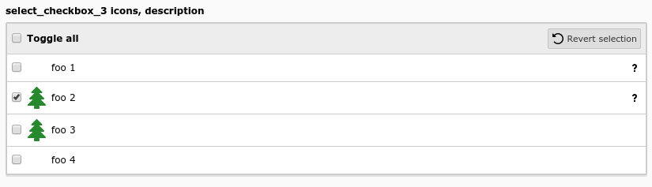

.. include:: /Includes.rst.txt

=======
Example
=======

   Select values from a checkbox list (select_checkbox_3)

.. code-block:: php

        'select_checkbox_3' => [
            'label' => 'select_checkbox_3 icons, description',
            'config' => [
                'type' => 'select',
                'renderType' => 'selectCheckBox',
                'items' => [
                    ['foo 1', 1, '', 'optional description'],
                    ['foo 2', 2, 'EXT:styleguide/Resources/Public/Icons/tx_styleguide.svg', 'description'],
                    ['foo 3', 3, 'EXT:styleguide/Resources/Public/Icons/tx_styleguide.svg'],
                    ['foo 4', 4],
                ],
            ],
        ],
