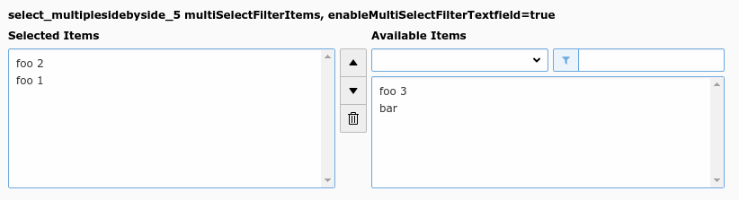

.. include:: /Includes.rst.txt

=======
Example
=======

   Side-by-side view with filter (select_multiplesidebyside_5)

.. code-block:: php

        'select_multiplesidebyside_5' => [
            'label' => 'select_multiplesidebyside_5 multiSelectFilterItems',
            'config' => [
                'type' => 'select',
                'renderType' => 'selectMultipleSideBySide',
                'items' => [
                    ['foo 1', 1],
                    ['foo 2', 2],
                    ['foo 3', 3],
                    ['bar', 4],
                ],
                'multiSelectFilterItems' => [
                    ['', ''],
                    ['foo', 'foo'],
                    ['bar', 'bar'],
                ],
            ],
        ],
