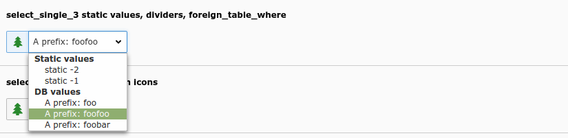

.. include:: /Includes.rst.txt

========
Examples
========

Simple select drop down with static and database values
=======================================================

   Simple select drop down with static and database values (select_single_3)

.. code-block:: php

        'select_single_3' => [
            'label' => 'select_single_3 static values, dividers, foreign_table_where',
            'config' => [
                'type' => 'select',
                'renderType' => 'selectSingle',
                'items' => [
                    ['Static values', '==div=='],
                    ['static -2', -2],
                    ['static -1', -1],
                    ['DB values', '==div=='],
                ],
                'foreign_table' => 'tx_styleguide_staticdata',
                'foreign_table_where' => 'AND {#tx_styleguide_staticdata}.{#value_1} LIKE \'%foo%\' ORDER BY uid',
                'foreign_table_prefix' => 'A prefix: ',
            ],
        ],

Select foreign rows with icons
==============================

.. figure:: ../Images/ColumnsExampleSelectImages.png
   :alt: Select foreign rows which have icons configured (select_single_12)
   :class: with-shadow

   Select foreign rows which have icons configured (select_single_12)

.. code-block:: php

        'select_single_12' => [
            'label' => 'select_single_12 foreign_table selicon_field',
            'config' => [
                'type' => 'select',
                'renderType' => 'selectSingle',
                'foreign_table' => 'tx_styleguide_elements_select_single_12_foreign',
                'fieldWizard' => [
                    'selectIcons' => [
                        'disabled' => false,
                    ],
                ],
            ],
        ],

Select a single value from a list of elements
=============================================

.. figure:: ../Images/TypeSelectStyleguideSingle10.png
   :alt: Select a single value from a list of elements (select_single_10)
   :class: with-shadow

   Select a single value from a list of elements (select_single_10)

.. code-block:: php

        'select_single_10' => [
            'label' => 'select_single_10 size=6, three options',
            'config' => [
                'type' => 'select',
                'renderType' => 'selectSingle',
                'items' => [
                    ['foo 1', 1],
                    ['foo 2', 2],
                    ['a divider', '==div=='],
                    ['foo 3', 3],
                ],
                'size' => 6,
            ],
        ],
