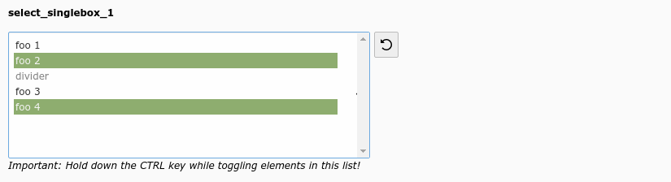

.. include:: /Includes.rst.txt

=======
Example
=======

   Select multiple values from a box (select_singlebox_1)

.. code-block:: php

   'select_singlebox_1' => [
      'label' => 'select_singlebox_1',
      'config' => [
         'type' => 'select',
         'renderType' => 'selectSingleBox',
         'items' => [
            ['foo 1', 1],
            ['foo 2', 2],
            ['divider', '--div--'],
            ['foo 3', 3],
            ['foo 4', 4],
         ],
      ],
   ],
