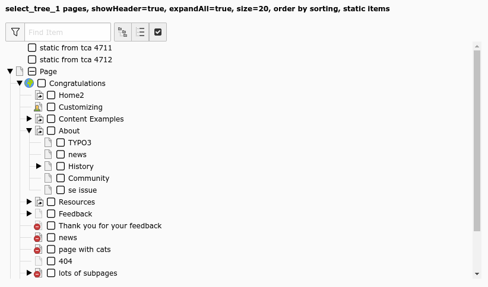

.. include:: /Includes.rst.txt

Example
=======

   A happy little tree! (select_tree_1)

.. code-block:: php

   'select_tree_1' => [
      'label' => 'select_tree_1 pages, showHeader=true, expandAll=true, size=20, order by sorting, static items',
      'config' => [
         'type' => 'select',
         'renderType' => 'selectTree',
         'foreign_table' => 'pages',
         'foreign_table_where' => 'ORDER BY pages.sorting',
         'size' => 20,
         'items' => [
            ['static from tca 4711', 4711],
            ['static from tca 4712', 4712],
         ],
         'treeConfig' => [
            'parentField' => 'pid',
            'appearance' => [
               'expandAll' => true,
               'showHeader' => true,
            ],
         ],
      ],
   ],
