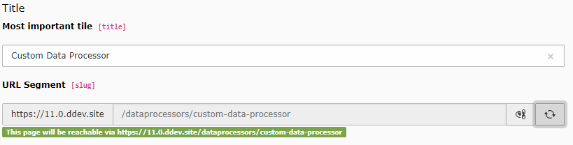

.. include:: /Includes.rst.txt
.. _columns-slug-examples:

========
Examples
========

Slug field
==========

.. code-block:: php

   'slug' => [
      'label' => '<path-to-locallang-file>.slug',
      'exclude' => 1,
      'config' => [
         'type' => 'slug',
         'generatorOptions' => [
            'fields' => ['title', 'nav_title'],
            'fieldSeparator' => '/',
            'prefixParentPageSlug' => true,
            'replacements' => [
               '/' => '',
            ],
         ],
         'appearance' => [
            'prefix' => \Vendor\Extension\UserFunctions\FormEngine\SlugPrefix::class . '->getPrefix'
         ],
         'fallbackCharacter' => '-',
         'eval' => 'uniqueInSite',
         'default' => ''
      ],
   ],

.. _tca_example_pages_slug:

Slug in table pages
===================

   Slug field in the table pages

.. code-block:: php

    'slug' => [
       'exclude' => true,
       'label' => 'LLL:EXT:core/Resources/Private/Language/locallang_tca.xlf:pages.slug',
       'displayCond' => 'USER:' . \TYPO3\CMS\Core\Compatibility\PseudoSiteTcaDisplayCondition::class . '->isInPseudoSite:pages:false',
       'config' => [
          'type' => 'slug',
          'size' => 50,
          'generatorOptions' => [
             'fields' => ['title'],
             'fieldSeparator' => '/',
             'prefixParentPageSlug' => true
          ],
          'fallbackCharacter' => '-',
          'eval' => 'uniqueInSite',
          'default' => ''
       ]
    ],

