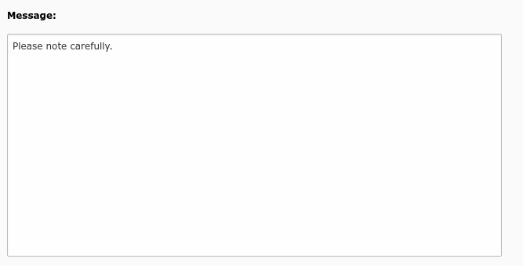
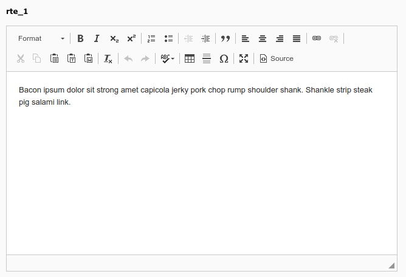
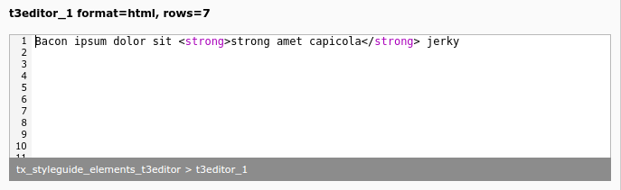
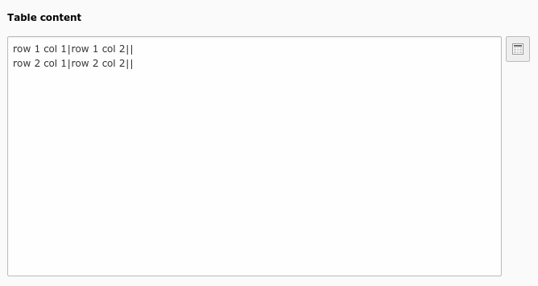

.. include:: ../../Includes.txt

.. _columns-text:

type = 'text'
-------------

.. _columns-text-introduction:

Introduction
============

The type='text' is for multi line text input, in the database :file:`ext_tables.sql` files it is typically
set to a :code:`TEXT` column type. In the Backend, it is rendered in various shapes: It can be rendered as
a simple :code:`<textarea>`, as a Rich Text Editor, as a code block with syntax highlighting, and others.

.. _columns-text-examples:

Examples
========

    Message field of system notes, a simple text area (message)

    A Rich Text Editor field (rte_1)

    Code highlighting with t3editor (t3editor_1)

    Table editor tt\_content bodytext

.. figure:: ../../Images/TypeTextBackendLayout.png
    :alt: Backend layout editor (config)
    :class: with-shadow

    Backend layout editor (config)

.. code-block:: php

    'message' => [
        'label' => 'LLL:EXT:sys_note/Resources/Private/Language/locallang_tca.xlf:sys_note.message',
        'config' => [
            'type' => 'text',
            'cols' => 40,
            'rows' => 15
        ]
    ],

.. code-block:: php

    'rte_1' => [
        'label' => 'rte_1',
        'config' => [
            'type' => 'text',
            'enableRichtext' => true,
        ],
    ],

.. code-block:: php

    't3editor_1' => [
        'label' => 't3editor_1 format=html, rows=7',
        'config' => [
            'type' => 'text',
            'renderType' => 't3editor',
            'format' => 'html',
            'rows' => 7,
        ],
    ],

.. code-block:: php

    'bodytext' => [
        'label' => '',
        'config' => [
            'type' => 'text',
            'renderType' => 'textTable',
            'wrap' => 'off',
            'cols' => 80,
            'rows' => 15,
        ],
    ],

.. code-block:: php

    'config' => [
        'label' => 'LLL:EXT:frontend/Resources/Private/Language/locallang_tca.xlf:backend_layout.config',
        'config' => [
            'type' => 'text',
            'renderType' => 'belayoutwizard',
        ]
    ],

.. _columns-text-renderType-default:

renderType default
==================

type='text' without a given specific renderType either renders a simple :code:`<textarea>`, or a Rich Text Editor
if both enabled in configuration and enabled for the user.

.. _columns-text-properties:

Properties
==========

.. _columns-text-properties-type:

.. _columns-text-properties-behaviour:
.. include:: ../Properties/CommonBehaviour.rst
.. include:: ../Behaviour/CommonAllowLanguageSynchronization.txt

.. _columns-text-properties-cols:
.. include:: ../Properties/TextCols.rst

.. _columns-text-properties-default:
.. include:: ../Properties/CommonDefault.rst

.. _columns-text-properties-enableRichtext:
.. include:: ../Properties/TextEnableRichtext.rst

.. _columns-text-properties-enableTabulator:
.. include:: ../Properties/TextEnableTabulator.rst

.. _columns-text-properties-eval:
.. include:: ../Properties/TextEval.rst

.. _columns-text-properties-fieldControl:
.. include:: ../Properties/CommonFieldControl.rst

.. _columns-text-properties-fieldInformation:
.. include:: ../Properties/CommonFieldInformation.rst

.. _columns-text-properties-fieldWizard:
.. include:: ../Properties/CommonFieldWizard.rst
.. include:: ../FieldWizard/DefaultLanguageDifferences.rst
.. include:: ../FieldWizard/LocalizationStateSelector.rst
.. include:: ../FieldWizard/OtherLanguageContent.rst

.. _columns-text-properties-fixedFont:
.. include:: ../Properties/TextFixedFont.rst

.. _columns-text-properties-is-in:
.. include:: ../Properties/TextIsIn.rst

.. _columns-text-properties-maxlength:
.. include:: ../Properties/TextMax.rst

.. _columns-text-properties-mode:
.. include:: ../Properties/CommonMode.rst

.. _columns-text-properties-placeholder:
.. include:: ../Properties/CommonPlaceholder.rst

.. _columns-text-properties-readOnly:
.. include:: ../Properties/CommonReadOnly.rst

.. _columns-text-properties-richtextConfiguration:
.. include:: ../Properties/TextRichtextConfiugration.rst

.. _columns-text-properties-rows:
.. include:: ../Properties/TextRows.rst

.. _columns-text-properties-search:
.. include:: ../Properties/CommonSearch.rst

.. _columns-text-properties-softref:
.. include:: ../Properties/CommonSoftref.rst

.. _columns-text-properties-wrap:
.. include:: ../Properties/TextWrap.rst

.. _columns-text-renderType-belayoutwizard:

renderType = 'belayoutwizard'
=============================

The :code:`renderType = 'belayoutwizard'` is a special renderType to display the backend layout
wizard when editing records of table :code:`backend_layout` in the backend. It stored a custom
syntax representing the Web -> Page layout in the database.

.. include:: ../Properties/CommonDefault.rst

.. include:: ../Properties/CommonFieldInformation.rst

.. include:: ../Properties/CommonFieldWizard.rst

.. _columns-text-renderType-t3editor:

renderType = 't3editor'
=======================

The :code:`renderType = 't3editor'` triggers a code highlighter if extension `t3editor` is loaded, otherwise
falls back to "default" renderType.

System extension "t3editor" provides an enhanced textarea for TypoScript input, with not only syntax highlighting but
also auto-complete suggestions. Beyond that the "t3editor" extension makes it possible to add syntax highlighting
to textarea fields, for several languages.

.. include:: ../Properties/CommonBehaviour.rst
.. include:: ../Behaviour/CommonAllowLanguageSynchronization.txt

.. include:: ../Properties/CommonDefault.rst

.. include:: ../Properties/CommonFieldControl.rst

.. include:: ../Properties/CommonFieldInformation.rst

.. include:: ../Properties/CommonFieldWizard.rst
.. include:: ../FieldWizard/DefaultLanguageDifferences.rst
.. include:: ../FieldWizard/LocalizationStateSelector.rst
.. include:: ../FieldWizard/OtherLanguageContent.rst

.. _columns-text-properties-format:
.. include:: ../Properties/TextFormat.rst

.. include:: ../Properties/TextRows.rst

.. include:: ../Properties/CommonSearch.rst

.. include:: ../Properties/CommonSoftref.rst

.. _columns-text-renderType-textTable:

renderType = 'textTable'
========================

The :code:`renderType = 'textTable'` triggers a view to manage frontend table display in the backend.
It is used for the "Table" tt\_content content element.

.. include:: ../Properties/CommonBehaviour.rst
.. include:: ../Behaviour/CommonAllowLanguageSynchronization.txt

.. include:: ../Properties/TextCols.rst

.. include:: ../Properties/CommonDefault.rst

.. include:: ../Properties/TextEnableTabulator.rst

.. include:: ../Properties/CommonFieldControl.rst
.. include:: ../FieldControl/TableWizard.rst

.. include:: ../Properties/CommonFieldInformation.rst

.. include:: ../Properties/CommonFieldWizard.rst
.. include:: ../FieldWizard/DefaultLanguageDifferences.rst
.. include:: ../FieldWizard/LocalizationStateSelector.rst
.. include:: ../FieldWizard/OtherLanguageContent.rst

.. include:: ../Properties/TextFixedFont.rst

.. include:: ../Properties/TextIsIn.rst

.. include:: ../Properties/TextMax.rst

.. include:: ../Properties/CommonPlaceholder.rst

.. include:: ../Properties/CommonReadOnly.rst

.. include:: ../Properties/TextRows.rst

.. include:: ../Properties/CommonSearch.rst

.. include:: ../Properties/CommonSoftref.rst

.. include:: ../Properties/TextWrap.rst
