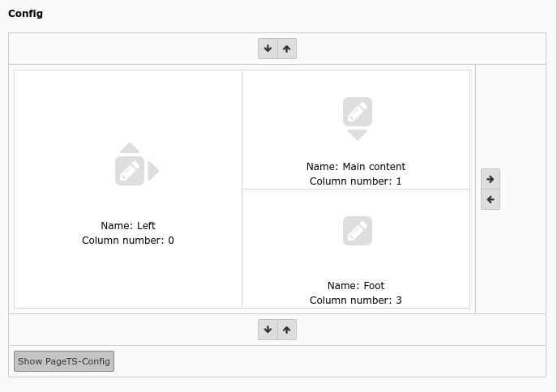

.. include:: /Includes.rst.txt

=======
Example
=======

.. _tca_example_backend_layout:

Backend layout editor
=====================

    Backend layout editor (config)

.. code-block:: php

    'config' => [
        'label' => 'LLL:EXT:frontend/Resources/Private/Language/locallang_tca.xlf:backend_layout.config',
        'config' => [
            'type' => 'text',
            'renderType' => 'belayoutwizard',
        ]
    ],
