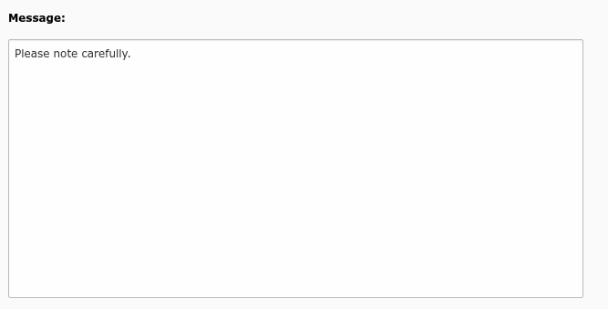
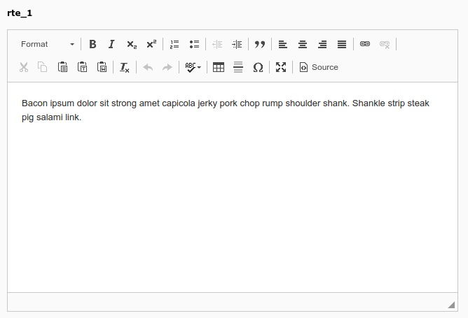

.. include:: /Includes.rst.txt
.. _columns-text-examples:

========
Examples
========

Simple text area
================

    Message field of system notes, a simple text area (message)

.. code-block:: php

    'message' => [
        'label' => 'LLL:EXT:sys_note/Resources/Private/Language/locallang_tca.xlf:sys_note.message',
        'config' => [
            'type' => 'text',
            'cols' => 40,
            'rows' => 15
        ]
    ],

Rich text editor field
======================

    A Rich Text Editor field (rte_1)

.. code-block:: php

    'rte_1' => [
        'label' => 'rte_1',
        'config' => [
            'type' => 'text',
            'enableRichtext' => true,
        ],
    ],

