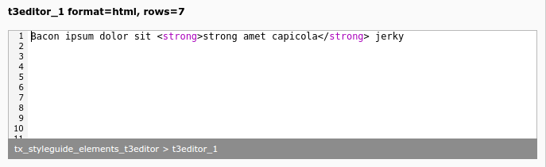

.. include:: /Includes.rst.txt

=======
Example
=======

    Code highlighting with t3editor (t3editor_1)

.. code-block:: php

    't3editor_1' => [
        'label' => 't3editor_1 format=html, rows=7',
        'config' => [
            'type' => 'text',
            'renderType' => 't3editor',
            'format' => 'html',
            'rows' => 7,
        ],
    ],

