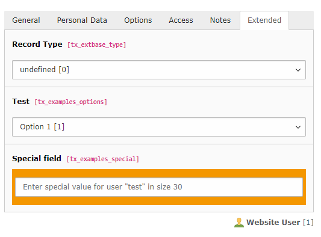

.. include:: /Includes.rst.txt

.. _columns-user:

====================
Custom inputs (user)
====================

.. contents:: Table of contents:
   :local:
   :depth: 1

.. _columns-user-introduction:

Introduction
============

There are three columns config types that do similar things, but still have subtle differences between them.
These are the :ref:`none type <columns-none>`, the :ref:`passthrough type <columns-passthrough>` and the
:ref:`user type <columns-user>`.

Characteristics of `user`:

* A value sent to the DataHandler is just kept as is and put into the database field. Default FormEngine
  however never sends values.
* Unlike none, type user must have a database field.
* FormEngine only renders a dummy element for type user fields by default. It should be combined with a
  custom renderType.
* Type user field values are rendered as-is at other places in the backend. They for instance can be selected
  to be displayed in the list module "single table view".
* Field updates by the DataHandler get logged and the history/undo function will work with such values.

The `user` field can be useful, if:

* A special rendering and evaluation is needed for a value when editing records via FormEngine.

.. note::
    In previous versions of TYPO3 core, :php:`type='user'` had a property `userFunc` to call an own class
    method of some extension. This has been substituted with a custom element using a `renderType`.
    See example below.

.. _columns-user-examples:

Examples
========

This example is part of the TYPO3 Documentation Team `extension examples
<https://extensions.typo3.org/extension/examples/>`__.

The example registers an own node element, a TCA field using it and a class
implementing a rendering. See :ref:`FormEngine docs
<t3coreapi:FormEngine-Rendering-NodeFactory>` for more details on this.

.. rst-class:: bignums

1. Register the new renderType node element

    Add to :file:`ext_localconf.php`::

       $GLOBALS['TYPO3_CONF_VARS']['SYS']['formEngine']['nodeRegistry'][<current timestamp>] = [
           'nodeName' => 'specialField',
           'priority' => 40,
           'class' => \T3docs\Examples\Form\Element\SpecialFieldElement::class,
       ];

2. Use the renderType in a TCA field definition

   Add the field to the TCA definition, here in
   :file:`Configuration/TCA/Overrides/fe_users.php`::

      'tx_examples_special' => [
         'exclude' => 0,
         'label' => 'LLL:EXT:examples/Resources/Private/Language/locallang_db.xlf:fe_users.tx_examples_special',
         'config' => [
            'type' => 'user',
            // renderType needs to be registered in ext_localconf.php
            'renderType' => 'specialField',
            'parameters' => [
               'size' => '30',
               'color' => '#F49700',
            ],
         ],
      ],

3. Implement the FormElement class

   The :php:`renderType` can be implemented by extending the class
   :php:`AbstractFormElement` and overriding the function :php:`render()`.

      <?php
      declare(strict_types = 1);
      namespace T3docs\Examples\Form\Element;

      use TYPO3\CMS\Backend\Form\Element\AbstractFormElement;
      use TYPO3\CMS\Core\Utility\GeneralUtility;
      use TYPO3\CMS\Core\Utility\StringUtility;

      class SpecialFieldElement extends AbstractFormElement
      {
         public function render():array
         {
            $row = $this->data['databaseRow'];
            $parameterArray = $this->data['parameterArray'];
            $color = $parameterArray['fieldConf']['config']['parameters']['color'];
            $size = $parameterArray['fieldConf']['config']['parameters']['size'];

            $fieldInformationResult = $this->renderFieldInformation();
            $fieldInformationHtml = $fieldInformationResult['html'];
            $resultArray = $this->mergeChildReturnIntoExistingResult($this->initializeResultArray(), $fieldInformationResult, false);

            $fieldId = StringUtility::getUniqueId('formengine-textarea-');

            $attributes = [
               'id' => $fieldId,
               'name' => htmlspecialchars($parameterArray['itemFormElName']),
               'size' => $size,
               'data-formengine-input-name' => htmlspecialchars($parameterArray['itemFormElName']),
               'onChange' => implode('', $parameterArray['fieldChangeFunc']),
            ];

            $attributes['placeholder'] = 'Enter special value for user "'.htmlspecialchars(trim($row['username'])).
               '" in size '. $size;
            $classes = [
               'form-control',
               't3js-formengine-textarea',
               'formengine-textarea',
            ];
            $itemValue = $parameterArray['itemFormElValue'];
            $attributes['class'] = implode(' ', $classes);

            $html = [];
            $html[] = '
';
            $html[] = $fieldInformationHtml;
            $html[] =   '
';
            $html[] =      '
';
            $html[] =         '
';
            $html[] =            '<input type="text" value="' . htmlspecialchars($itemValue, ENT_QUOTES) . '" ';
            $html[]=               GeneralUtility::implodeAttributes($attributes, true);
            $html[]=            ' />';
            $html[] =         '
';
            $html[] =      '
';
            $html[] =   '
';
            $html[] = '
';
            $resultArray['html'] = implode(LF, $html);

            return $resultArray;
         }
      }

      .. attention::

         The returned data in :php:`$resultArray['html']` will be output in the
         TYPO3 Backend as it is passed. Therefore don't trust user input in
         order to prevent :ref:`cross-site scripting (XSS)
         <t3core:security-xss>`.

      The array :php:`$this->data` provides the following data:

      * The row of the currently edited record in
        :php:`$this->data['databaseRow']`
      * The configuration from the TCA in
        :php:`$this->data['parameterArray']['fieldConf']['config']`
      * The name of the input field in
        :php:`$this->data['parameterArray']['itemFormElName']`
      * The current value of the field in
        :php:`$this->data['parameterArray']['itemFormElValue']`
      * The JavaScript function to be called on changing the field in
        :php:`$this->data['parameterArray']['fieldChangeFunc']`

      In order for the field to work it is vital, that the corresponding
      HTML input field has a unique :html:`id` attribute, fills the
      attributes :html:`name` and :html:`data-formengine-input-name` with the
      correct name, as provided in the :php:`itemFormElName` and calls the
      function provided by :php:`fieldChangeFunc` on changing the data.

The field would then look like this in the backend:

This example is also described in TYPO3 Explained,
:ref:`Extending TCA example <t3core:extending-examples-feusers>`.

.. _columns-user-properties-type:
.. _columns-user-properties-notablewrapping:
.. _columns-user-properties-parameters:
.. _columns-user-properties-userfunc:
.. _columns-user-properties:

Properties renderType default
=============================

The default renderType just renders a dummy entry to indicate a custom
renderType should be added.
