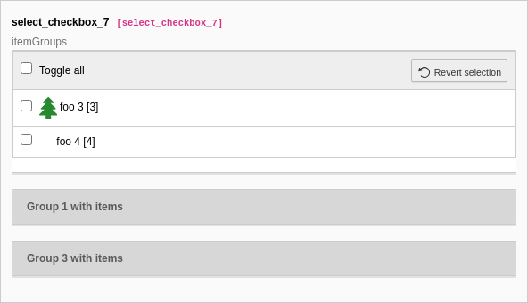

.. include:: /Includes.txt

.. _columns-select-rendertype-selectCheckBox:

=======================
select (selectCheckBox)
=======================

This page describes the :ref:`select <columns-select>` type with
renderType='selectCheckBox'.

Render the list of values as single check box rows in a table. Multiple items can be selected.

.. contents:: Table of contents:
   :local:
   :depth: 1

Example
=======

   Select values from a checkbox list (select_checkbox_7)

.. code-block:: php

     'select_checkbox_7' => [
      'exclude' => 1,
      'label' => 'select_checkbox_7',
      'description' => 'itemGroups',
      'config' => [
         'type' => 'select',
         'renderType' => 'selectCheckBox',
         'items' => [
            '0' => [
               '0' => 'foo 1',
               '1' => 1,
               '2' => '',
               '3' => 'group1',
            ],
            '1' => [
               '0' => 'foo 2',
               '1' => 2,
               '2' => 'EXT:styleguide/Resources/Public/Icons/tx_styleguide.svg',
               '3' => 'group1',
            ],
            '2' => [
               '0' => 'foo 3',
               '1' => 3,
               '2' => 'EXT:styleguide/Resources/Public/Icons/tx_styleguide.svg',
            ],
            '3' => [
               '0' => 'foo 4',
               '1' => 4,
            ],
            '4' => [
               '0' => 'foo 5',
               '1' => 1,
               '2' => '',
               '3' => 'group3',
            ],
         ],
         'itemGroups' => [
            'group1' => 'Group 1 with items',
            'group2' => 'Group 2 with no items',
            'group3' => 'Group 3 with items',
         ],
      ],
   ],
   // Example from extension "styleguide", table "tx_styleguide_elements_select"

Properties
==========

.. contents::
   :local:
   :depth: 1

allowNonIdValues
----------------

.. include:: ../Properties/SelectAllowNonIdValues.rst.txt

authMode
--------

.. include:: ../Properties/SelectAuthMode.rst.txt

authMode\_enforce
-----------------

.. include:: ../Properties/SelectAuthModeEnforce.rst.txt

behaviour
---------

.. include:: ../Properties/CommonBehaviour.rst.txt

behaviour => allowLanguageSynchronization
~~~~~~~~~~~~~~~~~~~~~~~~~~~~~~~~~~~~~~~~~

.. include:: ../Behaviour/CommonAllowLanguageSynchronization.rst.txt

default
-------

.. include:: ../Properties/SelectDefault.rst.txt

disableNoMatchingValueElement
-----------------------------

.. include:: ../Properties/SelectDisableNonMatchingValueElement.rst.txt

dontRemapTablesOnCopy
---------------------

.. include:: ../Properties/CommonDontRemapTablesOnCopy.rst.txt

exclusiveKeys
-------------

.. include:: ../Properties/SelectExclusiveKeys.rst.txt

fieldInformation
----------------

.. include:: ../Properties/CommonFieldInformation.rst.txt

fieldWizard
-----------

.. include:: ../Properties/CommonFieldWizard.rst.txt

The following fieldWizards are available for this renderType:

.. contents::
   :local:
   :depth: 1

fieldWizard => defaultLanguageDifferences
~~~~~~~~~~~~~~~~~~~~~~~~~~~~~~~~~~~~~~~~~

.. include:: ../FieldWizard/DefaultLanguageDifferences.rst.txt

fieldWizard => localizationStateSelector
~~~~~~~~~~~~~~~~~~~~~~~~~~~~~~~~~~~~~~~~

.. include:: ../FieldWizard/LocalizationStateSelector.rst.txt

fieldWizard => otherLanguageContent
~~~~~~~~~~~~~~~~~~~~~~~~~~~~~~~~~~~

.. include:: ../FieldWizard/OtherLanguageContent.rst.txt

fileFolder
----------

.. include:: ../Properties/SelectFileFolder.rst.txt

fileFolder\_extList
-------------------

.. include:: ../Properties/SelectFileFolderExtList.rst.txt

fileFolder\_recursions
----------------------

.. include:: ../Properties/SelectFileFolderRecursions.rst.txt

foreign\_table
--------------

.. include:: ../Properties/SelectForeignTable.rst.txt

foreign\_table\_prefix
----------------------

.. include:: ../Properties/SelectForeignTablePrefix.rst.txt

foreign\_table\_where
---------------------

.. include:: ../Properties/SelectForeignTableWhere.rst.txt

itemGroups
----------

.. include:: ../Properties/SelectItemGroups.rst.txt

sortItems
---------

.. include:: ../Properties/SelectSortItems.rst.txt

items
-----

.. include:: ../Properties/SelectItems.rst.txt

itemsProcFunc
-------------

.. include:: ../Properties/CommonItemsProcFunc.rst.txt

localizeReferencesAtParentLocalization
--------------------------------------

.. include:: ../Properties/CommonLocalizeReferencesAtParentLocalization.rst.txt

maxitems
--------

.. include:: ../Properties/CommonMaxitems.rst.txt

minitems
--------

.. include:: ../Properties/CommonMinitems.rst.txt

MM
--

.. include:: ../Properties/CommonMm.rst.txt

MM\_hasUidField
---------------

.. include:: ../Properties/CommonMmHasUidField.rst.txt

MM\_insert\_fields
------------------

.. include:: ../Properties/CommonMmInsertFields.rst.txt

MM\_match\_fields
-----------------

.. include:: ../Properties/CommonMmMatchFields.rst.txt

MM\_opposite\_field
-------------------

.. include:: ../Properties/CommonOppositeField.rst.txt

MM\_oppositeUsage
-----------------

.. include:: ../Properties/CommonMmOppositeUsage.rst.txt

MM\_table\_where
----------------

.. include:: ../Properties/CommonMmTableWhere.rst.txt

multiple
--------

.. include:: ../Properties/CommonMultiple.rst.txt

readOnly
--------

.. include:: ../Properties/CommonReadOnly.rst.txt

size
----

.. include:: ../Properties/CommonSize.rst.txt

special
-------

.. include:: ../Properties/SelectSpecial.rst.txt
