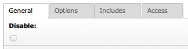
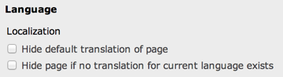

.. ==================================================
.. FOR YOUR INFORMATION
.. --------------------------------------------------
.. -*- coding: utf-8 -*- with BOM.

.. include:: ../../../Includes.txt

.. _columns-check:

TYPE: "check"
^^^^^^^^^^^^^

This type creates checkbox(es).

There can be between 1 and 10 checkboxes. The corresponding database
field must be of type integer. Each checkbox corresponds to a single
bit of the integer value, even if there is only one checkbox.

.. tip::

   This means that you should theoretically check the bit-0 of values
   from single-checkbox fields and not just whether it is true or false!.

.. only:: html

   .. contents::
      :local:
      :depth: 1

.. _columns-check-properties:

Properties
""""""""""

.. container:: ts-properties

   ================ =========
   Property         Data Type
   ================ =========
   `cols`_          integer
   `default`_       integer
   `items`_         array
   `itemsProcFunc`_ string
   `showIfRTE`_     boolean
   `type`_          string
   ================ =========

Properties details
""""""""""""""""""

.. only:: html

   .. contents::
      :local:
      :depth: 1

.. _columns-check-properties-type:

type
~~~~

.. container:: table-row

   Key
         type

   Datatype
         string

   Description
         *[Must be set to "check"]*

   Scope
         Display / Proc.

.. _columns-check-properties-items:

items
~~~~~

.. container:: table-row

   Key
         items

   Datatype
         array

   Description
         If set, this array will create an array of checkboxes instead of just
         a single "on/off" checkbox.

         **Notice:** You can have a maximum of 10 checkboxes in such an array
         and each element is represented by a single bit in the integer value
         which ultimately goes into the database.

         In this array each entry is itself an array where the first entry is
         the label (string or LLL reference) and the second entry is a blank
         value. The value sent to the database will be an integer where each
         bit represents the state of a checkbox in this array.

         **Example:** ::

            'items' => array(
                array('Green tomatoes', ''),
                array('Red peppers', '')
            ),

   Scope
         Display

.. _columns-check-properties-cols:

cols
~~~~

.. container:: table-row

   Key
         cols

   Datatype
         integer

   Description
         How many columns the checkbox array are shown in.

         Range is 1-10, 1 being default.

         (Makes sense only if the 'array' key is defining a checkbox array)

   Scope
         Display

.. _columns-check-properties-showifrte:

showIfRTE
~~~~~~~~~

.. container:: table-row

   Key
         showIfRTE

   Datatype
         boolean

   Description
         If set, this field will show  *only* if the RTE editor is enabled
         (which includes correct browser version and user-rights altogether.)

   Scope
         Display

.. _columns-check-properties-default:

default
~~~~~~~

.. container:: table-row

   Key
         default

   Datatype
         integer

   Description
         Setting the default value of the checkbox(es).

         **Notice:** Each bit corresponds to a check box (even if only one
         checkbox which maps to bit-0).

   Scope
         Display / Proc.

.. _columns-check-properties-itemsprocfunc:

itemsProcFunc
~~~~~~~~~~~~~

.. container:: table-row

   Key
         itemsProcFunc

   Datatype
         string

         (function reference)

   Description
         PHP function which is called to fill / manipulate the array with
         elements.

         The function/method will have an array of parameters passed to it
         (where the item-array is passed by reference in the key 'items'). By
         modifying the array of items, you alter the list of items.
         Since TYPO3 CMS 6.2, your function/method may throw an exception which
         will be displayed as a proper error message.

         For more information, see how user-functions are specified in the
         section about 'wizards' some pages below here.

   Scope
         Display

.. _columns-check-examples:

Examples
""""""""

.. _columns-check-examples-single:

A single checkbox
~~~~~~~~~~~~~~~~~

A plain vanilla checkbox (the "Disable" checkbox from the "sys_template" table).

.. code-block:: php

	'hidden' => array(
		'label' => 'LLL:EXT:lang/locallang_general.xlf:LGL.disable',
		'exclude' => 1,
		'config' => array(
			'type' => 'check',
			'default' => '0'
		)
	),

which results in:

   The simplest possible form of checkbox

.. _columns-check-examples-array:

A checkbox array
~~~~~~~~~~~~~~~~

This is an example of a checkbox array with two checkboxes in it. The
first checkbox will have bit-0 and the second bit-1. The example is taken
from the "pages" table.

.. code-block:: php

	'l18n_cfg' => array(
		'exclude' => 1,
		'label' => 'LLL:EXT:cms/locallang_tca.xlf:pages.l18n_cfg',
		'config' => array(
			'type' => 'check',
			'items' => array(
				array(
					'LLL:EXT:cms/locallang_tca.xlf:pages.l18n_cfg.I.1',
					''
				),
				array(
					$GLOBALS['TYPO3_CONF_VARS']['FE']['hidePagesIfNotTranslatedByDefault'] ? 'LLL:EXT:cms/locallang_tca.xlf:pages.l18n_cfg.I.2a' : 'LLL:EXT:cms/locallang_tca.xlf:pages.l18n_cfg.I.2',
					''
				)
			)
		)
	),

If we wanted both checkboxes to be checked by default, we would set the
:code:`default` property to **3** (since this contains both bit-0 and bit-1).

And this is the result in the backend:

   Checkbox with array of options
