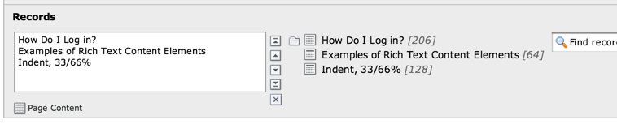
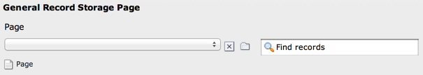

.. ==================================================
.. FOR YOUR INFORMATION
.. --------------------------------------------------
.. -*- coding: utf-8 -*- with BOM.

.. include:: ../../../Includes.txt

.. _columns-group:

TYPE: "group"
^^^^^^^^^^^^^

The group element in TYPO3 makes it possible to create references to
records from multiple tables in the system. This is especially useful
(compared to the "select" type) when records are scattered over the
page tree and require the Element Browser to be selected. In this
example, Content Element records are attached (taken from the "Insert
records" content element):

   The "Insert records" content element with 3 elements referenced

.. only:: html

   .. contents::
      :local:
      :depth: 1

.. _columns-group-properties:

Properties
""""""""""

.. container:: ts-properties

   ========================= =========
   Property                  Data Type
   ========================= =========
   `allowed`_                string
   `appearance`_             array
   `autoSizeMax`_            integer
   `disable\_controls`_      string
   `disallowed`_             string
   `dontRemapTablesOnCopy`_  string
   `filter`_                 array
   `foreign\_table`_         string
   `internal\_type`_         string
   `max\_size`_              integer
   `maxitems`_               integer
   `minitems`_               integer
   `MM`_                     string
   `MM\_hasUidField`_        boolean
   `MM\_insert\_fields`_     array
   `MM\_match\_fields`_      array
   `MM\_opposite\_field`_    string
   `MM\_opposite\_usage`_    array
   `MM\_table\_where`_       string
   `multiple`_               boolean
   `prepend\_tname`_         boolean
   `selectedListStyle`_      string
   `show\_thumbs`_           boolean
   `size`_                   integer
   `type`_                   string
   `uploadfolder`_           string
   `wizards`_                array
   ========================= =========

Property details
""""""""""""""""

.. only:: html

   .. contents::
      :local:
      :depth: 1

.. _columns-group-properties-type:

type
~~~~

.. container:: table-row

   Key
         type

   Datatype
         string

   Description
         *[Must be set to "group"]*

   Scope
         Display / Proc.

.. _columns-group-properties-internal-type:

internal\_type
~~~~~~~~~~~~~~

.. container:: table-row

   Key
         internal\_type

   Datatype
         string

   Description
         **Required!**

         Configures the internal type of the "group" type of element.

         There are four possible options to choose from:

         - "file" - this will create a field where files can be attached to the
           record.

         - "file\_reference" - this will create a field where files can be
           referenced. In contrast to "file", referenced files (usually from
           fileadmin/) will not be copied to the upload folder. **Warning:** use
           this carefully. *Your references will be broken if you delete
           referenced files in the filesystem!*

         - "folder" - this will create a field where folders can be attached to
           the record

         - "db" - this will create a field where database records can be attached
           as references.

         The default value is none of them - you must specify one of the values
         correctly!

         .. important::

            Types "file" and "file\_reference" should not be used anymore
            since TYPO3 CMS 6.0. You should use FAL references instead
            (:ref:`see example <columns-group-examples-fal>`).

   Scope
         Display / Proc.

.. _columns-group-properties-allowed:

allowed
~~~~~~~

.. container:: table-row

   Key
         allowed

   Datatype
         string

         (list of)

   Description
         **For the "file" internal type (Optional):**

         A lowercase comma list of file extensions that are permitted. E.g.
         'jpg,gif,txt'. Also see 'disallowed'.

         **For the "db" internal type (Required!):**

         A comma list of tables from $TCA.

         For example the value could be "pages,be\_users".

         Value from these tables are always the 'uid' field.

         First table in list is understood as the *default table* , if a
         table-name is not prepended to the value.

         If the value is '\*' then all tables are allowed (in this case  *you
         should set "prepend\_tname"* so all tables are prepended with their
         table name for sure).

         .. note::

            If the field is the foreign side of a bidirectional MM
            relation, only the first table is used and that must be the table of
            the records on the native side of the relation.

   Scope
         Proc. / Display

.. _columns-group-properties-disallowed:

disallowed
~~~~~~~~~~

.. container:: table-row

   Key
         disallowed

   Datatype
         string

         (list of)

   Description
         *[internal\_type =  "file" ONLY]*

         Default value is '\*' which means that anything file-extension which
         is not allowed is denied.

         If you set this value (to for example "php,inc") AND the "allowed"
         key is an empty string all extensions are permitted *except* ".php"
         and ".inc" files (works like the :code:`[BE][fileExtensions]` configuration option).

         In other words:

         - If you want to permit *only certain* file-extensions, use 'allowed'
           and not disallowed.

         - If you want to permit *all file-extensions* except a few, set
           'allowed' to blank ("") and enter the list of denied extensions in
           'disallowed'.

         - If you wish to *allow all extensions* with no exceptions, set
           'allowed' to '\*' and disallowed to ''

   Scope
         Proc. / Display

.. _columns-group-properties-filter:

filter
~~~~~~

.. container:: table-row

   Key
         filter

   Datatype
         array

   Description
         *(Available since TYPO3 CMS 6.0)*

         *[internal\_type =  "db" ONLY]*

         Define filters for item values.

         This is useful when only foreign records matching certain criteria
         should be allowed to be used as values in the group field.
         The values are filtered in the Element Browser as well as during processing in TCEMain.
         Filter userFuncs should have two input arguments ($parameters and $parentObject).
         The first argument ($parameters) is an array with the parameters of the filter
         as configured in the TCA, but with the additional parameter "values",
         which contains the array of values which should be filtered by the userFunc.
         The function must return the filtered array of values.

         Multiple filters can be defined, and an array of configuration data for each of the filters can be supplied.

         .. code-block:: php

            'filter' => array (
            	array(
            		'userFunc' => 'EXT:myext/class.tx_myext_filter.php:tx_myext_filter->doFilter',
            		'parameters' => array(
            			// optional parameters for the filter go here
            		),
            	),
            	array(
            		'userFunc' => 'EXT:foo/class.tx_foo_filter.php:tx_foo_filter->myFilter',
            		'parameters' => array(
            			// optional parameters for the filter go here
            		),
            	),
            ),

         **Example**

         Say you have a "person" table with fields "gender" (radio buttons) as well as "mother" and "father"
         (both group fields with relations to the same table.

         Now, in the field "mother" it should certainly only be possible to create relations to female persons.
         In that case, you could use the filter functionality to make sure only females can be selected
         in that field.

         The field configuration for the "mother" field could look like:

         .. code-block:: php

            'mother' => array (
            	'label' => 'Mother',
            	'config' => array (
            		'type' => 'group',
            		'internal_type' => 'db',
            		'allowed' => 'tx_myext_person',
            		'size' => 1,
            		'filter' => array (
            			array(
            				'userFunc' => 'EXT:myext/class.tx_myext_filter.php:tx_myext_filter->doFilter',
            				'parameters' => array(
            					'evaluateGender' => 'female',						),
            			),
            		),
            	)
            ),

         The corresponding filter class would look like:

         .. code-block:: php

            class tx_myext_filter {

            	public function doFilter(array $parameters, $parentObject) {
            		$fieldValues = $parameters['values'];

            		// do the filtering here
            		...

            		return $fieldValues;
            	}
            }

   Scope
         Proc. / Display

.. _columns-group-properties-foreign-table:

foreign\_table
~~~~~~~~~~~~~~

.. container:: table-row

   Key
         foreign\_table

   Datatype
         string

         (table name)

   Description
         This property does not really exist for group-type fields. It is needed
         as a workaround for an Extbase limitation. It is used to resolve
         dependencies during Extbase persistence. It should hold the same values
         as property :ref:`allowed <columns-group-properties-allowed>`. Notice that
         only one table name is allowed here in contrast to the property
         :ref:`allowed <columns-group-properties-allowed>` itself.
            

   Scope
         Proc. / Display

.. _columns-group-properties-mm:

MM
~~

.. container:: table-row

   Key
         MM

   Datatype
         string

         (table name)

   Description
         Defines MM relation table to use.

         Means that the relation to the files/db is done with a M-M relation
         through a third "join" table.

         A MM-table must have these four columns:

         - **uid\_local** - for the local uid.

         - **uid\_foreign** - for the foreign uid. If the "internal\_type" is
           "file" then the "uid\_foreign" should be a varchar or 60 or so (for
           the filename) instead of an unsigned integer as you would use for the
           uid.

         - **tablenames** - is required if you use multi-table relations and this
           field must be a varchar of approx. 30In case of files, the tablenames
           field is never used.

         - **sorting** - is a required field used for ordering the items.

         See :ref:`MM property of select-type fields <columns-select-properties-mm>`.

   Scope
         Proc.

.. _columns-group-properties-mm-opposite-field:

MM\_opposite\_field
~~~~~~~~~~~~~~~~~~~

.. container:: table-row

   Key
         MM\_opposite\_field

   Datatype
         string

         (field name)

   Description
         See :ref:`MM\_opposite\_field property of select-type fields <columns-select-properties-mm-opposite-field>`.

   Scope
         Proc.

.. _columns-group-properties-mm-match-fields:

MM\_match\_fields
~~~~~~~~~~~~~~~~~

.. container:: table-row

   Key
         MM\_match\_fields

   Datatype
         array

   Description
         See :ref:`MM\_match\_fields property of select-type fields <columns-select-properties-mm-match-fields>`.

   Scope
         Proc.

.. _columns-group-properties-mm-opposite-usage:

MM\_opposite\_usage
~~~~~~~~~~~~~~~~~~~

.. container:: table-row

   Key
         MM\_opposite\_usage

   Datatype
         array

   Description
         See :ref:`MM\_opposite\_usage property of select-type fields <columns-select-properties-mm-opposite-usage>`.

   Scope
         Proc.

.. _columns-group-properties-mm-insert-fields:

MM\_insert\_fields
~~~~~~~~~~~~~~~~~~

.. container:: table-row

   Key
         MM\_insert\_fields

   Datatype
         array

   Description
         See :ref:`MM\_insert\_fields property of select-type fields <columns-select-properties-mm-insert-fields>`.

   Scope
         Proc.

.. _columns-group-properties-mm-table-where:

MM\_table\_where
~~~~~~~~~~~~~~~~

.. container:: table-row

   Key
         MM\_table\_where

   Datatype
         string (SQL WHERE)

   Description
         See :ref:`MM\_table\_where property of select-type fields <columns-select-properties-mm-table-where>`.

   Scope
         Proc.

.. _columns-group-properties-mm-hasuidfield:

MM\_hasUidField
~~~~~~~~~~~~~~~

.. container:: table-row

   Key
         MM\_hasUidField

   Datatype
         boolean

   Description
         See :ref:`MM\_hasUidField property of select-type fields <columns-select-properties-mm-hasuidfield>`.

   Scope
         Proc.

.. _columns-group-properties-max-size:

max\_size
~~~~~~~~~

.. container:: table-row

   Key
         max\_size

   Datatype
         integer

   Description
         *[internal\_type =  **file** ONLY]*

         Files: Maximum file size allowed in KB

   Scope
         Proc.

.. _columns-group-properties-uploadfolder:

uploadfolder
~~~~~~~~~~~~

.. container:: table-row

   Key
         uploadfolder

   Datatype
         string

   Description
         *[internal\_type =  **file** ONLY]*

         Path to folder under PATH\_site in which the files are stored.

         Example: 'uploads' or 'uploads/pictures'

         .. note::

            TYPO3 does NOT create a reference to the file in its
            original position! It makes a  *copy* of the file into this folder and
            from that moment that file is not supposed to be manipulated from
            outside. Being in the upload folder means that files are understood as
            a part of the database content and should be managed by TYPO3 only.

         .. warning::

            Do NOT add a trailing slash (/) to the upload folder
            otherwise the full path stored in the references will contain a double
            slash (e.g. "uploads/pictures//stuff.png").

   Scope
         Proc.

.. _columns-group-properties-prepend-tname:

prepend\_tname
~~~~~~~~~~~~~~

.. container:: table-row

   Key
         prepend\_tname

   Datatype
         boolean

   Description
         *[internal\_type =  **db** ONLY]*

         Will prepend the table name to the stored relations (so instead of
         storing "23" you will store e.g. "tt\_content\_23").

   Scope
         Proc.

.. _columns-group-properties-dontremaptablesoncopy:

dontRemapTablesOnCopy
~~~~~~~~~~~~~~~~~~~~~

.. container:: table-row

   Key
         dontRemapTablesOnCopy

   Datatype
         string

         (list of tables)

   Description
         *[internal\_type =  **db** ONLY]*

         A list of tables which should *not* be remapped to the new element
         uids if the field holds elements that are copied in the session.

   Scope
         Proc.

.. _columns-group-properties-show-thumbs:

show\_thumbs
~~~~~~~~~~~~

.. container:: table-row

   Key
         show\_thumbs

   Datatype
         boolean

   Description
         Show thumbnails for the field in the TCEform.

   Scope
         Display

.. _columns-group-properties-size:

size
~~~~

.. container:: table-row

   Key
         size

   Datatype
         integer

   Description
         Height of the selector box in TCEforms.

         Since TYPO3 CMS 6.1, the default size is 5.

   Scope
         Display

.. _columns-group-properties-autosizemax:

autoSizeMax
~~~~~~~~~~~

.. container:: table-row

   Key
         autoSizeMax

   Datatype
         integer

   Description
         If set, then the height of element listing selector box will
         automatically be adjusted to the number of selected elements, however
         never less than "size" and never larger than the integer value of
         "autoSizeMax" itself (takes precedence over "size"). So "autoSizeMax"
         is the maximum height the selector can ever reach.

   Scope
         Display

.. _columns-group-properties-selectedliststyle:

selectedListStyle
~~~~~~~~~~~~~~~~~

.. container:: table-row

   Key
         selectedListStyle

   Datatype
         string

   Description
         If set, this will override the default style of element selector box
         (which is "width:200px").

   Scope
         Display

.. _columns-group-properties-multiple:

multiple
~~~~~~~~

.. container:: table-row

   Key
         multiple

   Datatype
         boolean

   Description
         Allows the *same item* more than once in a list.

         If used with bidirectional MM relations it must be set for both the
         native and foreign field configuration. Also, with MM relations in
         general you must use a UID field in the join table, see description
         for "MM".

   Scope
         Display / Proc.

.. _columns-group-properties-maxitems:

maxitems
~~~~~~~~

.. container:: table-row

   Key
         maxitems

   Datatype
         integer > 0

   Description
         Maximum number of items in the selector box. (Default = 1)

   Scope
         Display / Proc?

.. _columns-group-properties-minitems:

minitems
~~~~~~~~

.. container:: table-row

   Key
         minitems

   Datatype
         integer > 0

   Description
         Minimum number of items in the selector box. (Default = 0)

   Scope
         Display / Proc?

.. _columns-group-properties-hideMoveIcons:

hideMoveIcons
~~~~~~~~~~~~~

.. container:: table-row

   Key
         hideMoveIcons

   Datatype
         boolean

   Description
         Removes the move icons next to the selector box.

.. _columns-group-properties-disable-controls:

disable\_controls
~~~~~~~~~~~~~~~~~

.. container:: table-row

   Key
         disable\_controls

   Datatype
         string

   Description
         Disables sub-controls inside "group" control. Comma-separated list of
         values. Possible values are: browser (disables browse button for list
         control), list (disables list and browse button, but not delete
         button), upload (disables upload control) and delete (disables the
         delete button). See example image below.

         .. note::

           If you use the delete button when the list is disabled,
           **all** entries in the list will be deleted.

         .. figure:: ../../../Images/TypeGroupControls.png
            :alt: Disabling controls

            Disabling the various controls

   Scope
         Display / Proc.

.. _columns-group-properties-wizards:

wizards
~~~~~~~

.. container:: table-row

   Key
         wizards

   Datatype
         array

   Description
         See the :ref:`wizards section <wizards>` for more information.

   Scope
         Display

.. _columns-group-properties-appearance:

appearance
~~~~~~~~~~

.. container:: table-row

   Key
         appearance

   Datatype
         array

   Description
         Options for refining the appearance of group-type fields.

         - *elementBrowserType* (string) (since TYPO3 CMS 6.0)
           Makes it possible to set an alternative element browser type ("db" or "file")
           than would otherwise be rendered based on the "internal_type" setting.
           This is used internally for :ref:`FAL<t3fal:start>` file fields, where internal_type is "db"
           but the element browser should be the file element browser anyway.

         - *elementBrowserAllowed* (string)  (since TYPO3 CMS 6.0)
           Makes it possible to set an alternative element browser allowed string
           than would otherwise be taken from the "allowed" setting of this field.
           This is used internally for :ref:`FAL<t3fal:start>` file fields,
           where this is used to supply the comma list of allowed file types.

   Scope
         Display

.. _columns-group-examples:

Examples
""""""""

.. _columns-group-examples-records:

References to database records
~~~~~~~~~~~~~~~~~~~~~~~~~~~~~~

The "Insert records" content element can be used to reference records
from the "tt\_content" table (and possibly others, like "tt\_news" in
the screenshot below):

   The "Insert records" content element with 3 elements referenced

The corresponding TCA code::

   'records' => array(
           'label' => 'LLL:EXT:cms/locallang_ttc.xml:records',
           'config' => array(
                   'type' => 'group',
                   'internal_type' => 'db',
                   'allowed' => 'tt_content',
                   'size' => '5',
                   'maxitems' => '200',
                   'minitems' => '0',
                   'show_thumbs' => '1',
                   'wizards' => array(
                           'suggest' => array(
                                   'type' => 'suggest',
                           ),
                   ),
           ),
   ),

Note in particular how the "internal\_type" of the group field is set
to "db". Then the allowed tables is defined as "tt\_content" (Content
Elements table). This could very well be a list of tables which means
you can mix references as you like!

The limit is set to a maximum of 200 references and thumbnails should
be displayed, if possible. Finally a suggest wizard is added.

In this case it wouldn't have made sense to use a "select" type field
since the situation implies that records might be found all over the
system in a table which could potentially carry thousands of entries.
In such a case the right thing to do is to use the "group" field so
you have the Element Browser available for selector of the records.

.. _columns-group-examples-page:

Reference to another page
~~~~~~~~~~~~~~~~~~~~~~~~~

You will often see "group" type fields used when a reference to
another page is required. This makes sense since pages can hardly be
presented effectively in a big selector box and thus the Element
Browser that follows the "group" type fields is useful. An example is
the "General Record Storage page" reference:

   The general storage page selector, with link browser icon and select wizard

The configuration looks like:

.. code-block:: php
   :emphasize-lines: 9,9

	'storage_pid' => array(
		'exclude' => 1,
		'label' => 'LLL:EXT:lang/locallang_tca.xlf:storage_pid',
		'config' => array(
			'type' => 'group',
			'internal_type' => 'db',
			'allowed' => 'pages',
			'size' => '1',
			'maxitems' => '1',
			'minitems' => '0',
			'show_thumbs' => '1',
			'wizards' => array(
				'suggest' => array(
					'type' => 'suggest'
				)
			)
		)
	),

Notice how "maxitems" is used to ensure that only one relation is
created despite the ability of the "group" type field to create
multiple references.

.. _columns-group-examples-fal:

File Abstraction Layer
~~~~~~~~~~~~~~~~~~~~~~

It is possible to use FAL references in a group-type field, although
:ref:`using them with inline-type fields <columns-inline-examples-fal>`
allows for richer references (as there can be additional fields
in the relation in that case).

Here is an example taken from the "examples" extension:

.. code-block:: php

	'image_fal_group' => array(
		'label' => 'LLL:EXT:examples/Resources/Private/Language/locallang_db.xlf:tx_examples_haiku.image_fal_group',
		'config' => array(
			'type' => 'group',
			'internal_type' => 'db',
			'allowed' => 'sys_file',
			'MM' => 'sys_file_reference',
			'MM_match_fields' => array(
				'fieldname' => 'image_fal_group'
			),
			'prepend_tname' => TRUE,
			'appearance' => array(
				'elementBrowserAllowed' => $GLOBALS['TYPO3_CONF_VARS']['GFX']['imagefile_ext'],
				'elementBrowserType' => 'file'
			),
			'max_size' => $GLOBALS['TYPO3_CONF_VARS']['BE']['maxFileSize'],
			'show_thumbs' => '1',
			'size' => '3',
			'maxitems' => '200',
			'minitems' => '0',
			'autoSizeMax' => 40,
		),
	),

.. note::

   It is also possible to create relations directly to the
   "sys_file" table by not using MM information.

.. _columns-group-data:

Data format of "group" elements
"""""""""""""""""""""""""""""""

Since the "group" element allows to store references to multiple
elements we might want to look at how these references are stored
internally.

.. _columns-group-data-storage:

Storage methods
~~~~~~~~~~~~~~~

There are two main methods for this:

- Stored in a comma list

- Stored with a join table (MM relation)

The default and most wide spread method is the comma list.

.. _columns-group-data-reserved:

Reserved tokens
~~~~~~~~~~~~~~~

In the comma list the token "," is used to separate the values. In
addition the pipe sign "\|" is used to separate value from label value
when delivered to the interface. Therefore these tokens are not
allowed in reference values, not even if the MM method is used.

.. _columns-group-data-commalist:

The "Comma list" method (default)
~~~~~~~~~~~~~~~~~~~~~~~~~~~~~~~~~

When storing references as a comma list the values are simply stored
one after another, separated by a comma in between (with no space
around!). The database field type is normally a varchar, text or blob
field in order to handle this.

From the examples above the four Content Elements will be stored as
"26,45,49,1" which is the UID values of the records. The images will
be stored as their filenames in a list like "DSC\_7102\_background.jpg
,DSC\_7181.jpg,DSC\_7102\_background\_01.jpg".

Since "db" references can be stored for multiple tables the rule is
that uid numbers *without* a table name prefixed are implicitly from
the first table in the allowed table list! Thus the list "26,45,49,1"
is implicitly understood as
"tt\_content\_26,tt\_content\_45,tt\_content\_49,tt\_content\_1". That
would be equally good for storage, but by default the "default" table
name is not prefixed in the stored string. As an example, lets say you
wanted a relation to a Content Element and a Page in the same list.
That would look like "tt\_content\_26,pages\_123" or alternatively
"26,pages\_123" where "26" implicitly points to a "tt\_content" record
given that the list of allowed tables were "tt\_content,pages".

.. _columns-group-data-mm:

The "MM" method
~~~~~~~~~~~~~~~

Using the MM method you have to create a new database table which you
configure with the key "MM". The table must contain a field,
"uid\_local" which contains the reference to the uid of the record
that contains the list of elements (the one you are editing). The
"uid\_foreign" field contains the uid of the reference record you are
referring to. In addition a "tablename" and "sorting" field exists if
there are references to more than one table.

Lets take the examples from before and see how they would be stored in
an MM table:

+-------------------------------------+--------------+-------------+---------+
| uid\_local                          | uid\_foreign | tablename   | sorting |
+=====================================+==============+=============+=========+
| [uid of the record you are editing] | 26           | tt\_content | 1       |
+-------------------------------------+--------------+-------------+---------+
| [uid of the record you are editing] | 45           | tt\_content | 2       |
+-------------------------------------+--------------+-------------+---------+
| [uid of the record you are editing] | 49           | tt\_content | 3       |
+-------------------------------------+--------------+-------------+---------+
| [uid of the record you are editing] | 1            | tt\_content | 4       |
+-------------------------------------+--------------+-------------+---------+

Or for "tt\_content\_26,pages\_123":

+-------------------------------------+--------------+-------------+---------+
| uid\_local                          | uid\_foreign | tablename   | sorting |
+=====================================+==============+=============+=========+
| [uid of the record you are editing] | 26           | tt\_content | 1       |
+-------------------------------------+--------------+-------------+---------+
| [uid of the record you are editing] | 123          | pages       | 2       |
+-------------------------------------+--------------+-------------+---------+

Or for "DSC\_7102\_background.jpg,DSC\_7181.jpg,DSC\_7102\_background\
_01.jpg":

+-------------------------------------+-------------------------------+-------------+---------+
| uid\_local                          | uid\_foreign                  | tablename   | sorting |
+=====================================+===============================+=============+=========+
| [uid of the record you are editing] | DSC\_7102\_background.jpg     | N/A         | 1       |
+-------------------------------------+-------------------------------+-------------+---------+
| [uid of the record you are editing] | DSC\_7181.jpg                 | N/A         | 2       |
+-------------------------------------+-------------------------------+-------------+---------+
| [uid of the record you are editing] | DSC\_7102\_background\_01.jpg | N/A         | 3       |
+-------------------------------------+-------------------------------+-------------+---------+

.. _columns-group-data-api:

API for getting the reference list
~~~~~~~~~~~~~~~~~~~~~~~~~~~~~~~~~~

Class :ref:`TYPO3\\CMS\\Core\\Database\\RelationHandler <t3cmsapi:TYPO3\\CMS\\Core\\Database\\RelationHandler>`
is designed to transform the stored reference list values into an array where all uids are paired
with the right table name. Also, this class will automatically
retrieve the list of MM relations. In other words, it provides an API
for getting the references from "group" elements into a PHP array
regardless of storage method.

.. _columns-group-data-tceforms:

Passing the list of references to TCEforms
~~~~~~~~~~~~~~~~~~~~~~~~~~~~~~~~~~~~~~~~~~

Regardless of storage method, the reference list has to be "enriched"
with proper title values when given to TCEforms for rendering. In
particular this is important for database records. Passing the list
"26,45,49,1" will not give TCEforms a chance to render the titles of
the records.

Class :ref:`TYPO3\\CMS\\Backend\\Form\\DataPreprocessor <t3cmsapi:TYPO3\\CMS\\Backend\\Form\\DataPreprocessor>`
is doing such transformations (among other things) and this is how the transformation happens:

+-----------+----------------------------------+------------------------------------------------------------------+
| Int. type | In Database:                     | When given to TCEforms:                                          |
+===========+==================================+==================================================================+
| "db"      | 26,45,49,1                       | tt_content_26\|%20adfs%20asdf%20asdf%20,tt_content_45\|This%20is |
|           |                                  | %20a%20test%20%28copy%203%29,tt_content_49\|%5B...               |
|           |                                  | %5D,tt_content_1\|%5B...%5D                                      |
+-----------+----------------------------------+------------------------------------------------------------------+
| "file"    | DSC_7102_background.jpg,DSC_7181 | DSC_7102_background.jpg\|DSC_7102_background.jpg,DSC_7181.jpg\|  |
|           |                                  | DSC_7181.jpg,DSC_7102_background_01.jpg\|                        |
|           |                                  | DSC_7102_background_01.jpg                                       |
+-----------+----------------------------------+------------------------------------------------------------------+

The syntax is::

   [ref. value]|[ref. label rawurlencoded],[ref. value]|[ref. label rawurlencoded],....

Values are transferred back to the database as a comma separated list
of values without the labels but if labels are in the value they are
automatically removed.

Alternately you can also submit each value as an item in an array;
TCEmain will detect an array of values and implode it internally to a
comma list. (This is used for the "select" type, in renderMode
"singlebox" and "checkbox").

.. _columns-group-data-files:

Managing file references
~~~~~~~~~~~~~~~~~~~~~~~~

When a new file is attached to a record the TCE will detect the new
file based on whether it has a path prefixed or not. New files are
copied into the upload folder that has been configured and the final
value list going into the database will contain the new filename of
the copy.

If images are removed from the list that is detected by simply
comparing the original file list with the one submitted. Any files not
listed anymore are deleted.

Examples:

+----------------------+------------------------------+-------------------------------------+--------------------------------------+
| Current DB value     | Submitted data from TCEforms | New DB value                        | Processing done                      |
+======================+==============================+=====================================+======================================+
| first.jpg,second.jpg | first.jpg,/www/typo3/fileadm | first.jpg,newfile_01.jpg,second.jpg | /www/typo3/fileadmin/newfile.jpg     |
|                      | in/newfile.jpg,second.jpg    |                                     | was copied to "uploads/[some-        |
|                      |                              |                                     | dir]/newfile_01.jpg". The filename   |
|                      |                              |                                     | was appended with "_01" because      |
|                      |                              |                                     | another file with the name           |
|                      |                              |                                     | "newfile.jpg" already existed in the |
|                      |                              |                                     | location.                            |
+----------------------+------------------------------+-------------------------------------+--------------------------------------+
| first.jpg,second.jpg | first.jpg                    | first.jpg                           | "uploads/[some-dir]/second.jpg" was  |
|                      |                              |                                     | deleted from the location.           |
+----------------------+------------------------------+-------------------------------------+--------------------------------------+
