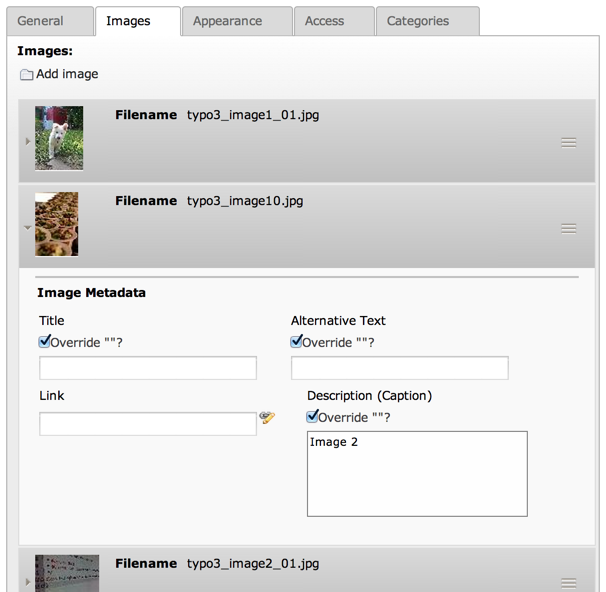

.. ==================================================
.. FOR YOUR INFORMATION
.. --------------------------------------------------
.. -*- coding: utf-8 -*- with BOM.

.. include:: ../../../Includes.txt

.. _columns-inline:

TYPE: "inline"
^^^^^^^^^^^^^^

Inline-Relational-Record-Editing (IRRE) offers a way of directly
editing parent-child-relations in one backend view. New child records
are created using AJAX calls to prevent a reload of the complete
backend view.

   Images in content elements use IRRE to related to FAL records

Please note that IRRE does not fully work in conjunction with
versioning. Only 1:n relationships are supported in workspaces (since
TYPO3 4.5).

.. note::

   :code:`TCAdefaults.<table>.pid = <page id>` can be used to define the pid of
   new child records. Thus, it's possible to have special storage folders
   on a per-table-basis. See the :ref:`TSconfig reference <t3tsconfig:usertoplevelobjects>`.

.. only:: html

   .. contents::
      :local:
      :depth: 1

.. _columns-inline-properties:

Properties
""""""""""

.. container:: ts-properties

   ======================================= =========
   Property                                Data Type
   ======================================= =========
   `appearance`_                           array
   `autoSizeMax`_                          integer
   `behaviour`_                            array
   `customControls`_                       array
   `filter`_                               array
   `foreign\_default\_sortby`_             string
   `foreign\_field`_                       string
   `foreign\_label`_                       string
   `foreign\_match\_fields`_               array
   `foreign\_record\_defaults`_            array
   `foreign\_selector`_                    string
   `foreign\_selector\_fieldTcaOverride`_  array
   `foreign\_sortby`_                      string
   `foreign\_table`_                       string
   `foreign\_table\_field`_                string
   `foreign\_types`_                       array
   `foreign\_unique`_                      string
   `minitems`_                             integer
   `maxitems`_                             integer
   `MM`_                                   string
   `size`_                                 integer
   `symmetric\_field`_                     string
   `symmetric\_label`_                     string
   `symmetric\_sortby`_                    string
   `type`_                                 string
   ======================================= =========

Property details
""""""""""""""""

.. only:: html

   .. contents::
      :local:
      :depth: 1

.. _columns-inline-properties-type:

type
~~~~

.. container:: table-row

   Key
         type

   Datatype
         string

   Description
         *[Must be set to "inline"]*

   Scope
         Display / Proc.

.. _columns-inline-properties-foreign-table:

foreign\_table
~~~~~~~~~~~~~~

.. container:: table-row

   Key
         foreign\_table

   Datatype
         string

         (table name)

   Description
         *[Must be set, there is no type "inline" without a foreign table]* The
         table name of the child records is defined here. The table must be
         configured in $TCA.

         See the other related options below.

   Scope
         Display / Proc.

.. _columns-inline-properties-appearance:

appearance
~~~~~~~~~~

.. container:: table-row

   Key
         appearance

   Datatype
         array

   Description
         Has information about the appearance of child-records, namely:

         - *collapseAll* (boolean) Show all child-records collapsed (if false, all
           are expanded)

         - *expandSingle* (boolean) Show only one child-record expanded each time.
           If a collapsed record is clicked, the currently open one collapses and
           the clicked one expands.

         - *newRecordLinkAddTitle* (boolean) Adds the title of the
           :ref:`foreign_table <columns-inline-properties-foreign-table>`
           to the "New record" link.

           -  false: "Create new"
           -  true: "Create new <title of foreign\_table>", e.g. "Create new address"

           |

         - *newRecordLinkTitle* (string) *(since TYPO3 CMS 6.2)* Overwrites the title
           of the "New record" link with a localised string. This will work only if
           :code:`newRecordLinkAddTitle` is **not** set to true.

           Example:

           .. code-block:: php

              'newRecordLinkTitle' => 'LLL:EXT:myext/Resources/Private/Language/locallang_db.xlf:my_new_record_label'

         - *newRecordLinkPosition* (string) **Deprecated** : use
           *levelLinksPosition* instead

         - *levelLinksPosition* (string) Values: 'top', 'bottom', 'both', 'none' –
           default: 'top'Defines where to show the "New record" link in relation
           to the child records.

         - *useCombination* (boolean) This is only useful on bidirectional
           relations using an intermediate table with attributes. In a
           "combination" it is possible to edit the attributes AND the related
           child record itself. If using a :ref:`foreign_selector <columns-inline-properties-foreign-selector>`
           in such a case, the :ref:`foreign_unique <columns-inline-properties-foreign-unique>`
           property  **must** be set to the same field as the
           :ref:`foreign_selector <columns-inline-properties-foreign-selector>`.

         - *suppressCombinationWarning* (boolean) Suppresses the warning FlashMessage
           that will be displayed when using **useCombination**.
           You can also override the message with your own message using the example below.

           Example:

           .. code-block:: php

             $GLOBALS['TCA']['tx_demo_domain_model_demoinline']['columns']['irre_records']['config'] = array(
                 'foreign_types_combination' => array(
                     '1' => array(
                         'showitem' => 'title'
                     )
                  )
                  'appearance' => array(
                      'overwriteCombinationWarningMessage' => 'LLL:EXT:demo/Resources/Private/Language/locallang_db.xlf:tx_demo_domain_model_demoinline.irre_records.useCombinationWarning',
                      'useCombination' => TRUE
                  )
             )

         - *useSortable* (boolean) Activate drag & drop.

         - *showPossibleLocalizationRecords* (boolean) Show unlocalized records
           which are in the original language, but not yet localized.

         - *showRemovedLocalizationRecords* (boolean) Show records which were once
           localized but do not exist in the original language anymore.

         - *showAllLocalizationLink* (boolean) Defines whether to show the
           "localize all records" link to fetch untranslated records from the
           original language.

         - *showSynchronizationLink* (boolean) Defines whether to show a
           "synchronize" link to update to a 1:1 translation with the original
           language.

         - *enabledControls* (array) Associative array with the keys 'info',
           'new', 'dragdrop', 'sort', 'hide', 'delete', 'localize'. If the
           accordant values are set to a boolean value (true or false), the
           control is shown or hidden in the header of each record.

         - *showPossibleRecordsSelector* (boolean) (since TYPO3 CMS 4.7) Can be used
           to hide the foreign record selector from the interface, even if you
           have a :ref:`foreign_selector <columns-inline-properties-foreign-selector>` configured.
           This can be used to keep the technical functionality of the
           :ref:`foreign_selector <columns-inline-properties-foreign-selector>` but is useful if you
           want to replace it with your own implementation using a custom control
           (see :ref:`customControls <columns-inline-properties-customcontrols>`).

         - *headerThumbnail* (boolean) (since TYPO3 CMS 6.0) Defines whether a
           thumbnail should be rendered in the inline elements' header. This is
           used by the File Abstraction Layer to render a preview of the related
           image.

         - *fileUploadAllowed* (boolean) (since TYPO3 CMS 6.2) Defines whether the
           button "Select & upload file" should be rendered. This can be used for
           file fields to directly upload files and create a reference to the file.
           The button is limited to file fields using File Abstraction Layer. It will
           only appear to backend users which have write access to the user upload folder.
           By default this folder is :file:`fileadmin/user_upload` but it can be changed in
           User TSconfig using :code:`options.defaultUploadFolder`.
           See the :ref:`TSconfig reference <t3tsconfig:useroptions>`.

           The button is shown by default unless this option is set to :code:`FALSE`.

   Scope
         Display

.. _columns-inline-properties-behaviour:

behaviour
~~~~~~~~~

.. container:: table-row

   Key
         behaviour

   Datatype
         array

   Description
         Has information about the behavior of child-records, namely:

         - *localizationMode* ('keep', 'select')Defines in general whether
           children are really localizable (set to 'select') or just taken from
           the default language (set to 'keep'). If this property is not set, but
           the affected parent and child tables were localizable, the mode
           'select' is used by default.

           - Mode 'keep': This is not a real localization, since the children are
             taken from the parent of the original language. But the children can
             be moved, deleted, modified etc. on the localized parent which - of
             course - also affects the original language.

           - Mode 'select': This mode provides the possibility to have a selective
             localization and to compare localized data to the pendants of the
             original language. Furthermore this mode is extended by a 'localize
             all' feature, which works similar to the localization of content on
             pages, and a 'synchronize' feature which offers the possibility to
             synchronize a localization with its original language.

         - *localizeChildrenAtParentLocalization* (boolean)Defines whether
           children should be localized when the localization of the parent gets
           created.

         - *disableMovingChildrenWithParent* (boolean)Disables that child records
           get moved along with their parent records.

         - *enableCascadingDelete* (boolean) Enables the deletion of child records
           along with their parent record. Defaults to TRUE.

   Scope
         Display / Proc.

.. _columns-inline-properties-customcontrols:

customControls
~~~~~~~~~~~~~~

.. container:: table-row

   Key
         customControls

   Datatype
         array

   Description
         *(Available since TYPO3 CMS 4.7)*

         Numerical array containing definitions of custom
         header controls for IRRE fields. This makes it possible to create
         special controls by calling user-defined functions (userFuncs). Each
         item in the array item must be an array itself, with at least on key
         "userFunc" pointing to the user function to call.

         The userFunc string is defined as usual in TYPO3 as [file-
         reference":"]["&"]class/function["->"method-name], e.g. ::

            EXT:myext/class.tx_myext_myclass:tx_myext_myclass->myUserFuncMethod

         .. todo:: Undefined

            TYPO3\\CMS\\Backend\\Form\\Element\\InlineElement

         For more details, see the implementation in
         :ref:`TYPO3\\CMS\\Backend\\Form\\Element\\InlineElement <t3api:TYPO3\\CMS\\Backend\\Form\\Element\\InlineElement>`
         and search for "customControls".

   Scope
         Display

.. _columns-inline-properties-foreign-field:

foreign\_field
~~~~~~~~~~~~~~

.. container:: table-row

   Key
         foreign\_field

   Datatype
         string

   Description
         The :code:`foreign_field` is the field of the child record pointing to the
         parent record. This defines where to store the uid of the parent
         record.

   Scope
         Display / Proc.

.. _columns-inline-properties-foreign-label:

foreign\_label
~~~~~~~~~~~~~~

.. container:: table-row

   Key
         foreign\_label

   Datatype
         string

   Description
         If set, it overrides the label set in
         :code:`$TCA[<foreign_table>]['ctrl']['label']` for the inline-view.

   Scope
         Display / Proc.

.. _columns-inline-properties-foreign-selector:

foreign\_selector
~~~~~~~~~~~~~~~~~

.. container:: table-row

   Key
         foreign\_selector

   Datatype
         string

   Description
         A selector is used to show all possible child records that could be
         used to create a relation with the parent record. It will be rendered
         as a multi-select-box. On clicking on an item inside the selector a
         new relation is created.The :code:`foreign_selector` points to a field of the
         :ref:`foreign_table <columns-inline-properties-foreign-table>` that is responsible
         for providing a selector-box – this field on the :code:`foreign_table` usually
         is of type :ref:`select <columns-select>` and also has a :code:`foreign_table` defined.

   Scope
         Display / Proc.

.. _columns-inline-properties-foreign-selector-fieldtcaoverride:

foreign\_selector\_fieldTcaOverride
~~~~~~~~~~~~~~~~~~~~~~~~~~~~~~~~~~~

.. container:: table-row

   Key
         foreign\_selector\_fieldTcaOverride

   Datatype
         array

   Description
         *(Available since TYPO3 CMS 6.0)*

         TCA file configuration that overrides the configuration of the field defined
         in the :ref:`foreign_selector <columns-inline-properties-foreign-selector>` property.

         **Example** ::

            'foreign_selector_fieldTcaOverride' => array(
            	'config' => array(
            		'appearance' => array(
            			'elementBrowserType' => 'file',
            			'elementBrowserAllowed' => $allowedFileExtensions
            		)
            	)
            ),

   Scope
         Display / Proc.

.. _columns-inline-properties-foreign-sortby:

foreign\_sortby
~~~~~~~~~~~~~~~

.. container:: table-row

   Key
         foreign\_sortby

   Datatype
         string

   Description
         Define a field on the child record (or on the intermediate table) that
         stores the manual sorting information. It is possible to have a
         different sorting, depending from which side of the relation we look
         at parent or child.

         .. important::

            If you use the table only as an inline element, did not put the
            :ref:`sortby <ctrl-reference-sortby>` field
            in the :ref:`ctrl <ctrl>` section, otherwise TYPO3 CMS
            will sort with every update the entire table.
            For example, if you have 10000 records, each with 4 inline elements,
            TYPO3 CMS will sort 40000 records even if only 4 must be to sort.

   Scope
         Display / Proc.

.. _columns-inline-properties-foreign-default-sortby:

foreign\_default\_sortby
~~~~~~~~~~~~~~~~~~~~~~~~

.. container:: table-row

   Key
         foreign\_default\_sortby

   Datatype
         string

   Description
         If a field name for :ref:`foreign_sortby <columns-inline-properties-foreign-sortby>`
         is defined, then this is ignored.

         Otherwise this is used as the "ORDER BY" statement to sort the records
         in the table when listed.

   Scope
         Display

.. _columns-inline-properties-foreign-table-field:

foreign\_table\_field
~~~~~~~~~~~~~~~~~~~~~

.. container:: table-row

   Key
         foreign\_table\_field

   Datatype
         string

   Description
         The  :code:`foreign_table_field` is the field of the child record pointing
         to the parent record. This defines where to store the table name of
         the parent record. On setting this configuration key together with
         :ref:`foreign_field <columns-inline-properties-foreign-field>`,
         the child record knows what its parent record is –
         so the child record could also be used on other parent tables.This
         issue is also known as "weak entity".Do not confuse with
         :ref:`foreign_table <columns-inline-properties-foreign-table>`
         or :ref:`foreign_field <columns-inline-properties-foreign-field>`. It has its own behavior.

   Scope
         Display / Proc.

.. _columns-inline-properties-foreign-record-defaults:

foreign\_record\_defaults
~~~~~~~~~~~~~~~~~~~~~~~~~

.. container:: table-row

   Key
         foreign\_record\_defaults

   Datatype
         array

   Description
         *(Available since TYPO3 CMS 6.2)*

         This property makes it possible to set default values for the
         foreign records created via the inline relation.

         **Example:**

         .. code-block:: php

			'foreign_table' => 'tt_content',
			'foreign_record_defaults' => array(
				'CType' => 'image'
			);

         This example would make every new content element created inline
         an "image" content element by default.

   Scope
         Proc.

.. _columns-inline-properties-foreign-unique:

foreign\_unique
~~~~~~~~~~~~~~~

.. container:: table-row

   Key
         foreign\_unique

   Datatype
         string

   Description
         Field which must be unique for all children of a parent record.

         Example: Say you have two tables, products, your parent table, and
         prices, your child table (products) can have multiple prices. The
         prices table has a field called customer\_group, which is a selector
         box. Now you want to be able to specify prices for each customer group
         when you edit a product, but of course you don't want to specify
         contradicting prices for one product (i.e. two different prices for
         the same customer\_group). That's why you would set :code:`foreign_unique` to
         the field name "customer\_group", to prevent that two prices for the
         same customer group can be created for one product.

   Scope
         Display / Proc.

.. _columns-inline-properties-filter:

filter
~~~~~~

.. container:: table-row

   Key
         filter

   Datatype
         array

   Description
         *(Available since TYPO3 CMS 6.0)*

         Possibility to define user functions to filter out child items.

         This is useful in special scenarios when used in conjunction
         with a :ref:`foreign_selector <columns-inline-properties-foreign-selector>`
         where only certain foreign records are allowed to be related to.

         For further documentation on this feature, see the
         :ref:`"filter" documentation under TYPE: "group"<columns-group-properties-filter>`.

   Scope
         Display / Proc.

.. _columns-inline-properties-mm:

MM
~~

.. container:: table-row

   Key
         MM

   Datatype
         string

         (table name)

   Description
         Means that the relation to the records of :ref:`foreign_table <columns-inline-properties-foreign-table>`
         is done with a M-M relation with a third "join" table.

         That table typically has three columns:

         - *uid\_local, uid\_foreign* for uids respectively.

         - *sorting* is a required field used for ordering the items.

         The field which is configured as "inline" is not used for data-storage
         any more but rather it's set to the number of records in the relation
         on each update, so the field should be an integer.

         .. note::

            Using MM relations you can ONLY store real relations for
            foreign tables in the list - no additional string values or non-record
            values (so no attributes).

   Scope
         Proc.

.. _columns-inline-properties-foreign-match-fields:

foreign\_match\_fields
~~~~~~~~~~~~~~~~~~~~~~

.. container:: table-row

   Key
         foreign\_match\_fields

   Datatype
         array

   Description
         *(Available since TYPO3 CMS 4.7)*

         Array of field-value pairs to both insert and match
         against when writing/reading IRRE relations. Using the match fields,
         it is possible to re-use the same child table in more than one field
         of the parent table by using a match field with different values for
         each of the use cases.

         **Example**

         Imagine you have a parent table called "company" and a child table
         called "persons". Now, if you want the company table to have two
         fields of type "inline", one called "employees" and one called
         "customers", both containing "persons". Then you could use a (hidden)
         field called "role" on the child (person) table to keep them apart.
         The match TCA configuration of the parent table would then look like
         this::

            $TCA['ty_myext_company'] = array (
                    ...
                    'columns' => array (
                            ...
                            'employees' => array (
                                    'config' => array (
                                            'type' => 'inline',
                                            'foreign_table' => 'ty_myext_person',
                                            'foreign_field' => 'company',
                                            'foreign_match_fields' => array(
                                                    'role' => 'employee',
                                            ),
                                    ),
                            ),
                            'customers' => array (
                                    'config' => array (
                                            'type' => 'inline',
                                            'foreign_table' => 'ty_myext_person',
                                            'foreign_field' => 'company',
                                            'foreign_match_fields' => array(
                                                    'role' => 'customer',
                                            ),
                                    ),
                            ),
                    ),
                    ...
            );

   Scope
         Proc.

.. _columns-inline-properties-foreign-types:

foreign\_types
~~~~~~~~~~~~~~

.. container:: table-row

   Key
         foreign\_types

   Datatype
         array

   Description
         *(Available since TYPO3 CMS 4.7)*

         This can be used to control which fields of the
         child table are displayed. You can override the "showitem", etc.
         settings of the child table here, by supplying an override for the
         "types" array of that table. For details on how the types array is
         constructed, see the chapter "['types'][key] section" later in this
         manual.

   Scope
         Display

.. _columns-inline-properties-size:

size
~~~~

.. container:: table-row

   Key
         size

   Datatype
         integer

   Description
         Height of the selector box in TCEforms.

   Scope
         Display

.. _columns-inline-properties-autosizemax:

autoSizeMax
~~~~~~~~~~~

.. container:: table-row

   Key
         autoSizeMax

   Datatype
         integer

   Description
         If set, then the height of multiple-item selector boxes (maxitem > 1)
         will automatically be adjusted to the number of selected elements,
         however never less than "size" and never larger than the integer value
         of "autoSizeMax" itself (takes precedence over "size"). So
         "autoSizeMax" is the maximum height the selector can ever reach.

   Scope
         Display

.. _columns-inline-properties-maxitems:

maxitems
~~~~~~~~

.. container:: table-row

   Key
         maxitems

   Datatype
         integer > 0

   Description
         Maximum number of items in the selector box. Defaults to 100000. Note
         that this is different from types "select" and "group" which default
         to 1.

   Scope
         Display / Proc

.. _columns-inline-properties-minitems:

minitems
~~~~~~~~

.. container:: table-row

   Key
         minitems

   Datatype
         integer > 0

   Description
         Minimum number of items in the selector box. (Default = 0)

   Scope
         Display

.. _columns-inline-properties-symmetric-field:

symmetric\_field
~~~~~~~~~~~~~~~~

.. container:: table-row

   Key
         symmetric\_field

   Datatype
         string

   Description
         This works like :ref:`foreign_field <columns-inline-properties-foreign-field>`,
         but in case of using bidirectional symmetric relations.
         :code:`symmetric_field` defines in which field on the
         :ref:`foreign_table <columns-inline-properties-foreign-table>`
         the uid of the "other" parent is stored.

   Scope
         Display / Proc.

.. _columns-inline-properties-symmetric-label:

symmetric\_label
~~~~~~~~~~~~~~~~

.. container:: table-row

   Key
         symmetric\_label

   Datatype
         string

   Description
         If set, it overrides the label set in
         :code:`$TCA[<foreign_table>]['ctrl']['label']` for the inline-view and only
         if looking to a symmetric relation from the "other" side.

   Scope
         Display / Proc.

.. _columns-inline-properties-symmetric-sortby:

symmetric\_sortby
~~~~~~~~~~~~~~~~~

.. container:: table-row

   Key
         symmetric\_sortby

   Datatype
         string

   Description
         This works like :ref:`foreign_sortby <columns-inline-properties-foreign-sortby>`,
         but in case of using bidirectional symmetric relations.
         Each side of a symmetric relation could have its
         own sorting, so :code:`symmetric_sortby` defines a field on the
         :ref:`foreign_table <columns-inline-properties-foreign-table>` where the sorting
         of the "other" side is stored.

   Scope
         Display / Proc.

.. _columns-inline-examples:

Examples
""""""""

.. _columns-inline-examples-fal:

File Abstraction Layer
~~~~~~~~~~~~~~~~~~~~~~

Inline-type fields are massively used the TYPO3 CMS Core with
regards to the :ref:`File Abstraction Layer (FAL) <t3fal:start>`.

FAL provides an API for registering an inline-type field
with relations to the "sys_file_reference" table containing information
related to existing media. Here is how it is used on the "image"
field of table "tt_content":

.. code-block:: php

	'image' => array(
		'label' => 'LLL:EXT:lang/locallang_general.xlf:LGL.images',
		'config' => \TYPO3\CMS\Core\Utility\ExtensionManagementUtility::getFileFieldTCAConfig('image',
			array(
				'appearance' => array(
					'createNewRelationLinkTitle' => 'LLL:EXT:cms/locallang_ttc.xlf:images.addFileReference'
				),
				// custom configuration for displaying fields in the overlay/reference table
				// to use the imageoverlayPalette instead of the basicoverlayPalette
				'foreign_types' => array(
					'0' => array(
						'showitem' => '
							--palette--;LLL:EXT:lang/locallang_tca.xlf:sys_file_reference.imageoverlayPalette;imageoverlayPalette,
							--palette--;;filePalette'
					),
					\TYPO3\CMS\Core\Resource\File::FILETYPE_TEXT => array(
						'showitem' => '
							--palette--;LLL:EXT:lang/locallang_tca.xlf:sys_file_reference.imageoverlayPalette;imageoverlayPalette,
							--palette--;;filePalette'
					),
					...
				)
			),
			$GLOBALS['TYPO3_CONF_VARS']['GFX']['imagefile_ext']
		)
	),

The method to call is :code:`\TYPO3\CMS\Core\Utility\ExtensionManagementUtility::getFileFieldTCAConfig()`
which takes four parameters. The first one is the name of the field, the second one is an array
of configuration options which will be merged with the default configuration. The third one is the list
of allowed file types and the fourth one (not used above) the list of disallowed file types.

The default field configuration looks like:

.. code-block:: php

	$fileFieldTCAConfig = array(
		'type' => 'inline',
		'foreign_table' => 'sys_file_reference',
		'foreign_field' => 'uid_foreign',
		'foreign_sortby' => 'sorting_foreign',
		'foreign_table_field' => 'tablenames',
		'foreign_match_fields' => array(
			'fieldname' => $fieldName
		),
		'foreign_label' => 'uid_local',
		'foreign_selector' => 'uid_local',
		'foreign_selector_fieldTcaOverride' => array(
			'config' => array(
				'appearance' => array(
					'elementBrowserType' => 'file',
					'elementBrowserAllowed' => $allowedFileExtensions
				)
			)
		),
		'filter' => array(
			array(
				'userFunc' => 'TYPO3\\CMS\\Core\\Resource\\Filter\\FileExtensionFilter->filterInlineChildren',
				'parameters' => array(
					'allowedFileExtensions' => $allowedFileExtensions,
					'disallowedFileExtensions' => $disallowedFileExtensions
				)
			)
		),
		'appearance' => array(
			'useSortable' => TRUE,
			'headerThumbnail' => array(
				'field' => 'uid_local',
				'width' => '45',
				'height' => '45c',
			),
			'showPossibleLocalizationRecords' => FALSE,
			'showRemovedLocalizationRecords' => FALSE,
			'showSynchronizationLink' => FALSE,
			'showAllLocalizationLink' => FALSE,

			'enabledControls' => array(
				'info' => FALSE,
				'new' => FALSE,
				'dragdrop' => TRUE,
				'sort' => FALSE,
				'hide' => TRUE,
				'delete' => TRUE,
				'localize' => TRUE,
			),
		),
		'behaviour' => array(
			'localizationMode' => 'select',
			'localizeChildrenAtParentLocalization' => TRUE,
		),
	);

into which the options (second call parameter) are merged.

.. _columns-inline-examples-comma-list:

Comma-separated list
~~~~~~~~~~~~~~~~~~~~

This combines companies with persons (employees) using a comma
separated list, so no :ref:`foreign_field <columns-inline-properties-foreign-field>`
is used here.

.. code-block:: php

   $TCA['company'] = array(
     'ctrl' => ...,
     'interface' => ...,
     'feInterface' => ...,
     'columns' => array(
       'hidden' => ...,
       'employees' => array(
         'exclude' => 1,
         'label' => 'LLL:EXT:myextension/locallang_db.xml:company.employees',
         'config' => array(
           'type' => 'inline',
           'foreign_table' => 'person',
           'maxitems' => 10,
           'appearance' => array(
             'collapseAll' => 1,
             'expandSingle' => 1,
           ),
         ),
       ),
     ),
     'types' => ...
     'palettes' => ...
   );

.. _columns-inline-examples-asymmetric-mm:

Attributes on anti-symmetric intermediate table
~~~~~~~~~~~~~~~~~~~~~~~~~~~~~~~~~~~~~~~~~~~~~~~

This example combines companies with persons (employees) using an
intermediate table. It is also possible to add attributes to every
relation – in this example, an attribute "jobtype" on the
"person\_company" table is defined. It is also possible to look at the
relation from both sides (parent and child).

.. code-block:: php

	$GLOBALS['TCA']['person'] = array(
		'columns' => array(
			...
			'employers' => array(
				'label' => 'LLL:EXT:myextension/locallang_db.xml:person.employers',
				'config' => array(
					'type' => 'inline',
					'foreign_table' => 'person_company',
					'foreign_field' => 'person',
					'foreign_label' => 'company',
				),
			),
		),
	);
	$GLOBALS['TCA']['company'] = array(
		'columns' => array(
			...
			'employees' => array(
				'label' => 'LLL:EXT:myextension/locallang_db.xml:company.employees',
				'config' => array(
					'type' => 'inline',
					'foreign_table' => 'person_company',
					'foreign_field' => 'company',
					'foreign_label' => 'person',
				),
			),
		),
	);
	$GLOBALS['TCA']['person_company'] = array(
		'columns' => array(
			...
			'person' => array(
				'label' => 'LLL:EXT:myextension/locallang_db.xml:person_company.person',
				'config' => array(
					'type' => 'select',
					'renderType' => 'selectSingle',
					'foreign_table' => 'person',
					'size' => 1,
					'minitems' => 0,
					'maxitems' => 1,
				),
			),
			'company' => array(
				'label' => 'LLL:EXT:myextension/locallang_db.xml:person_company.company',
				'config' => array(
					'type' => 'select',
					'renderType' => 'selectSingle',
					'foreign_table' => 'company',
					'size' => 1,
					'minitems' => 0,
					'maxitems' => 1,
				),
			),
			'jobtype' => array(
				'label' => 'LLL:EXT:myextension/locallang_db.xml:person_company.jobtype',
				'config' => array(
					'type' => 'select',
					'renderType' => 'selectSingle',
					'items' => array(
						array('Project Manager (PM)', '0'),
						array('Chief Executive Officer (CEO)', '1'),
						array('Chief Technology Officer (CTO)', '2'),
					),
					'size' => 1,
					'maxitems' => 1,
				),
			),
		),
	);

.. _columns-inline-examples-symmetric-mm:

Attributes on symmetric intermediate table
~~~~~~~~~~~~~~~~~~~~~~~~~~~~~~~~~~~~~~~~~~

This example combines two persons with each other – imagine they are
married. One person on the first side is the husband, and one person
on the other side is the wife (or generally "spouse" in the example
below). Symmetric relations combine object of the same with each other
and it does not depend, from which side someone is looking to the
relation – so the husband knows his wife and the wife also knows her
husband.

Sorting could be individually defined for each of the both sides
(perhaps this should not be applied to a wife-husband-relationship in
real life).

.. code-block:: php

	$GLOBALS['TCA']['person'] = array(
		'columns' => array(
			'employers' => array(
				'label' => 'LLL:EXT:myextension/locallang_db.xml:person.employers',
				'config' => array(
					'type' => 'inline',
					'foreign_table' => 'person_symmetric',
					'foreign_field' => 'person',
					'foreign_sortby' => 'sorting_person',
					'foreign_label' => 'spouse',
					'symmetric_field' => 'spouse',
					'symmetric_sortby' => 'sorting_spouse',
					'symmetric_label' => 'person',
				),
			),
		),
	);

	$GLOBALS['TCA']['person_symmetric'] = array(
		'columns' => array(
			'person' => array(
				'label' => 'LLL:EXT:myextension/locallang_db.xml:person_symmetric.person',
				'config' => array(
					'type' => 'select',
					'renderType' => 'selectSingle',
					'foreign_table' => 'person',
					'size' => 1,
					'minitems' => 0,
					'maxitems' => 1,
				),
			),
			'spouse' => array(
				'label' => 'LLL:EXT:myextension/locallang_db.xml:person_symmetric.spouse',
				'config' => array(
					'type' => 'select',
					'renderType' => 'selectSingle',
					'foreign_table' => 'person',
					'size' => 1,
					'minitems' => 0,
					'maxitems' => 1,
				),
			),
			'someattribute' => array(
				'label' => 'LLL:EXT:myextension/locallang_db.xml:person_symmetric.someattribute',
				'config' => array(
					'type' => 'input',
				),
			),
			'sorting_person' => array(
				'config' => array(
					'type' => 'passthrough',
				),
			),
			'sorting_spouse' => array(
				'config' => array(
					'type' => 'passthrough',
				),
			),
		),
	);
