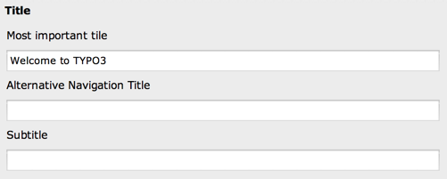

.. ==================================================
.. FOR YOUR INFORMATION
.. --------------------------------------------------
.. -*- coding: utf-8 -*- with BOM.

.. include:: ../../../Includes.txt

.. _columns-input:

TYPE: "input"
^^^^^^^^^^^^^

The type "input" generates an :code:`<input>` field, possibly with additional
features applied.

   A collection of simple input fields

.. only:: html

   .. contents::
      :local:
      :depth: 1

.. _columns-input-properties:

Properties
""""""""""

.. container:: ts-properties

   ============== =========
   Property       Data Type
   ============== =========
   `checkbox`_    string
   `default`_     string
   `eval`_        string
   `format`_      string
   `is\_in`_      string
   `max`_         integer
   `mode`_        string
   `placeholder`_ string
   `range`_       array
   `size`_        integer
   `type`_        string
   `wizards`_     array
   ============== =========

Property details
""""""""""""""""

.. only:: html

   .. contents::
      :local:
      :depth: 1

.. _columns-input-properties-type:

type
~~~~

.. container:: table-row

   Key
         type

   Datatype
         string

   Description
         *[Must be set to "input"]*

   Scope
         Display / Proc.

.. _columns-input-properties-size:

size
~~~~

.. container:: table-row

   Key
         size

   Datatype
         integer

   Description
         Abstract value for the width of the :code:`<input>` field. To set the input
         field to the full width of the form area, use the value 48. Default is
         30.

   Scope
         Display

.. _columns-input-properties-max:

max
~~~

.. container:: table-row

   Key
         max

   Datatype
         integer

   Description
         Value for the "maxlength" attribute of the :code:`<input>` field.

         If the form element edits a varchar(40) field in the database you
         should also set this value to 40. Default is 256.

   Scope
         Display

.. _columns-input-properties-default:

default
~~~~~~~

.. container:: table-row

   Key
         default

   Datatype
         string

   Description
         The default value

   Scope
         Display / Proc.

.. _columns-input-properties-eval:

eval
~~~~

.. container:: table-row

   Key
         eval

   Datatype
         list of keywords

   Description
         Configuration of field evaluation.

         Some of these evaluation keywords will trigger a JavaScript pre-
         evaluation in the form. Other evaluations will be performed in the
         backend.

         The evaluation functions will be executed in the list-order.

         Keywords:

         alpha
           Allows only a-zA-Z characters.

         alphanum
           Same as "alpha" but allows also "0-9"

         alphanum_x
           Same as "alphanum" but allows also "\_" and "-" chars.

         date
           The field will evaluate the input as a date, automatically
           converting the input to a UNIX-time in seconds. The display will be
           like "12-8-2003" while the database value stored will be "1060639200".

         datetime
           The field will evaluate the input as a date with time
           (detailed to hours and minutes), automatically converting the input to
           a UNIX-time in seconds. The display will be like "16:32 12-8-2003"
           while the database value will be "1060698720".

         domainname
           Allows a domain name such as "example.com" and automatically transforms
           the value to `punicode <https://en.wikipedia.org/wiki/Punycode>`_ if needed.

         double2
           Converts the input to a floating point with 2 decimal
           positions, using the "." (period) as the decimal delimited (accepts
           also "," for the same).

         int
           Evaluates the input to an integer.

         is\_in
           Will filter out any character in the input string which
           is  *not* found in the string entered in the key "is\_in" (see below).

         lower
           Converts the string to lowercase (only A-Z plus a selected
           set of Western European special chars).

         md5
           Will convert the input value to its md5-hash
           (the JavaScript :code:`MD5()` function is found in
           :file:`typo3/sysext/backend/Resources/Public/JavaScript/md5.js`).

         nospace
           Removes all occurrences of space characters (chr(32))

         null
           An empty value (string) will be stored as :code:`NULL` in the database.
           (requires a proper sql definition)

         num
           Allows only 0-9 characters in the field.

         password
           Will show "\*\*\*\*\*\*\*" in the field after entering
           the value and moving to another field. Thus passwords can be protected
           from display in the field.

           .. note::
              The value is visible while it is being entered!

         required
           A non-empty value is required in the field (otherwise
           the form cannot be saved).

         time
           The field will evaluate the input as a timestamp in seconds
           for the current day (with a precision of minutes). The display will be
           like "23:45" while the database will be "85500".

         timesec
           The field will evaluate the input as a timestamp in
           seconds for the current day (with a precision of seconds). The display
           will be like "23:45:13" while the database will be "85513".

         trim
           The value in the field will have white spaces around it
           trimmed away.

         tx\_\*
           User defined form evaluations. See below.

         unique
           Requires the field to be unique for the *whole* table.
           (Evaluated on the server only).

           .. note::

              When selecting on unique-fields, make sure to select using
              :code:`AND pid>=0` since the field *can* contain duplicate values
              in other versions of records (always having
              PID = -1). This also means that if you are using versioning on a table
              where the unique-feature is used you cannot set the field to be truly
              unique in the database either!

         uniqueInPid
           Requires the field to be unique for the current PID
           (among other records on the same page). (Evaluated on the server only).

         upper
           Converts to uppercase (only A-Z plus a selected set of
           Western European special chars).

         year
           Evaluates the input to a year between 1970 and 2038. If you
           need any year, then use "int" evaluation instead.

         All the above evaluations (unless noted) are done by JavaScript with
         the functions found in the script :file:`typo3/sysext/backend/Resources/Public/JavaScript/jsfunc.evalfield.js`.

         "(TCE)" means the evaluation is done in the TCE on the server. The class used for this is
         :ref:`TYPO3\CMS\Core\DataHandling\DataHandler <t3cmsapi:TYPO3\\CMS\\Core\\DataHandling\\DataHandler>`.

         **Example:**

         Setting the field to evaluate the input to a date returned to the
         database in UNIX-time (seconds):

         .. code-block:: php

            'eval' => 'date',

         Trimming the value for white space before storing in the database
         (important for varchar fields!):

         .. code-block:: php

            'eval' => 'trim',

         By this configuration the field will be stripped for any space
         characters, converted to lowercase, only accepted if filled in and on
         the server the value is required to be unique for all records from
         this table:

         .. code-block:: php

            'eval' => 'nospace,lower,unique,required'

         **User-defined form evaluations:**

         You can supply your own form evaluations in an extension by creating a
         class with two functions, one which returns the JavaScript code for
         client side validation called :code:`returnFieldJS()` and one which does the
         server side validation called :code:`evaluateFieldValue()`.

         **The function evaluateFieldValue() has 3 arguments:**

         - **$value** :The field value to be evaluated.

         - **$is\_in** : The "is\_in" value of the field configuration from TCA
           (see below).

         - **&$set** : Boolean defining if the value is written to the database
           or not. Must be passed by reference and changed if needed.

         **Example:**

         class.tx_exampleextraevaluations_extraeval1.php:

         .. code-block:: php

            <?php
            class tx_exampleextraevaluations_extraeval1 {
                    function returnFieldJS() {
                            return '
                                    return value + " [added by JS]";
                            ';
                    }
                    function evaluateFieldValue($value, $is_in, &$set) {
                            return $value . ' [added by PHP]';
                    }
            }

         ext_localconf.php

         .. code-block:: php

            <?php
            // here we register "tx_exampleextraevaluations_extraeval1"
            $TYPO3_CONF_VARS['SC_OPTIONS']['tce']['formevals']['tx_exampleextraevaluations_extraeval1'] = 'EXT:example_extraevaluations/class.tx_exampleextraevaluations_extraeval1.php';

   Scope
         Display / Proc.

.. _columns-input-properties-format:

format
~~~~~~

.. container:: table-row

   Key
         format

   Datatype
         string (keyword)

   Description
         When an input-type field is set as read-only, it actually
         gets rendered as a :ref:`none-type field <columns-none>`.
         This means that is is possible to use the
         :ref:`format property <columns-none-properties-format>` of
         such field to format the value of the input-type field.

         Read-only fields with :code:`eval` set to "date"
         will be formatted as "date", "datetime" as "datetime" and
         "time" as "time". This overrides any value of :code:`format`
         which might have been set.

.. _columns-input-properties-is-in:

is\_in
~~~~~~

.. container:: table-row

   Key
         is\_in

   Datatype
         string

   Description
         If the evaluation type "is\_in" (see :ref:`eval <columns-input-properties-eval>`) is used
         for evaluation, then the characters in the input string should be
         found in this string as well. This value is also passed as argument to
         the evaluation function if a user-defined evaluation function is
         registered.

   Scope
         Display / Proc.

.. _columns-input-properties-checkbox:

checkbox
~~~~~~~~

.. container:: table-row

   Key
         checkbox

   Datatype
         string

   Description
         **This setting is not used anymore since TYPO3 CMS 4.5.**

   Scope
         Display / Proc.

.. _columns-input-properties-range:

range
~~~~~

.. container:: table-row

   Key
         range

   Datatype
         array

   Description
         An array which defines an integer range within which the value must
         be.

         **Keys:**

         lower
           Defines the lower integer value.

         upper
           Defines the upper integer value.

         You can specify both or only one of them.

         .. note::

            This feature is evaluated *on the server only* so any
            regulation of the value will have happened after saving the form.

         **Example:**

         Limits an integer to be within the range 10 to 1000:

         .. code-block:: php

            'eval' => 'int',
            'range' => array(
              'lower' => 10,
              'upper' => 1000
            ),

         In this example the upper limit is set to the last day in year 2020
         while the lowest possible value is set to the date of yesterday.

         .. code-block:: php

            'range' => array(
              'upper' => mktime(0, 0, 0, 12, 31, 2020),
              'lower' => mktime(0,0,0,date('m'), date('d'), date('Y'))
            )

   Scope
         Proc.

.. _columns-input-properties-placeholder:

placeholder
~~~~~~~~~~~

.. container:: table-row

   Key
         placeholder

   Datatype
         string

   Description
         *(Since TYPO3 CMS 4.7)*

         Placeholder text for the input field. This can be a simple string or
         a reference to a value in the current record or another one.
         With a syntax like :code:`__row|field` the placeholder will take
         the value of the given field from the current record.

         Since TYPO3 CMS 6.2, this can be recursive. If the designated field
         is a relation to another table (i.e. is of type :ref:`select <columns-select>`,
         :ref:`group <columns-group>` or :ref:`inline <columns-inline>`), the
         related record will be loaded and the placeholder searched within it.

         **Example**:

         Taken from the "sys_file_reference" table.

         .. code-block:: php
            :emphasize-lines: 9

			'title' => array(
				'l10n_mode' => 'mergeIfNotBlank',
				'exclude' => 1,
				'label' => 'LLL:EXT:lang/locallang_tca.xlf:sys_file_reference.title',
				'config' => array(
					'type' => 'input',
					'size' => '20',
					'eval' => 'null',
					'placeholder' => '__row|uid_local|metadata|title',
					'mode' => 'useOrOverridePlaceholder',
				)
			),

         In the above placeholder syntax, :code:`uid_local` points to the
         related "sys_file" record and :code:`metadata` points to the
         "sys_file_metata" of the related "sys_file" record. From there we
         take the content of the :code:`title` field.

   Scope
         Display

.. _columns-input-properties-mode:

mode
~~~~

.. container:: table-row

   Key
         mode

   Datatype
         string (keywords)

   Description
         *(Since TYPO3 CMS 6.0)*

         Possible keywords: :code:`useOrOverridePlaceholder`

         This property is related to the
         :ref:`placeholder property <columns-input-properties-placeholder>`.
         When defined a checkbox will appear above the field. If that
         box is checked, the field can be used to enter whatever
         the user wants as usual. If the box is **not** checked, the
         field becomes read-only and the value saved to the database will
         be :code:`null`.

         What impact this has in the frontend depends on what is done in the
         code using this field. In the case of FAL relations, for example,
         if the "title" field has its box checked, the "title" from the
         related metadata will be provided.

         For example code, see the :ref:`placeholder property <columns-input-properties-placeholder>`.

         This is how the mode checkbox appears in the TYPO3 CMS backend:

         .. figure:: ../../../Images/TypeInputOverridePlaceholder.png
            :alt: Input fields with override checkboxes

            Several input or text fields with their placeholder override checkboxes

         .. warning::

            In order for this property to apply properly, the field must
            be allowed to use "null" as a value
            (i.e the :ref:`eval <columns-input-properties-eval>` property
            must list "null" as a possible evaluation.

   Scope
         Display / Proc.

.. _columns-input-properties-wizards:

wizards
~~~~~~~

.. container:: table-row

   Key
         wizards

   Datatype
         array

   Description
         See the :ref:`wizards section <wizards>` for more information.

   Scope
         Display

.. _columns-input-examples:

Examples
""""""""

.. _columns-input-examples-date:

A "date" field
~~~~~~~~~~~~~~

This is the typical configuration for a date field, like "starttime":

.. code-block:: php

	'starttime' => array(
		'exclude' => 1,
		'label' => 'LLL:EXT:lang/locallang_general.xlf:LGL.starttime',
		'config' => array(
			'type' => 'input',
			'size' => '13',
			'max' => '20',
			'eval' => 'datetime',
			'default' => '0'
		),
		'l10n_mode' => 'exclude',
		'l10n_display' => 'defaultAsReadonly'
	),

.. _columns-input-examples-username:

A "username" field
~~~~~~~~~~~~~~~~~~

In this example the field is for entering a username (from
"fe\_users"). A number of requirements are imposed onto the field,
namely that it must be unique within the page where the record is
stored, must be in lowercase and without spaces in it:

.. code-block:: php

	'username' => array(
		'label' => 'LLL:EXT:cms/locallang_tca.xlf:fe_users.username',
		'config' => array(
			'type' => 'input',
			'size' => '20',
			'max' => '50',
			'eval' => 'nospace,lower,uniqueInPid,required'
		)
	),

.. _columns-input-examples-typical:

A typical input field
~~~~~~~~~~~~~~~~~~~~~

This is just a very typical configuration which sets the size and a
character limit to the field. In addition the input value is trimmed
for surrounding whitespace which is a very good idea when you enter
values into varchar fields.

.. code-block:: php

	'name' => array(
		'exclude' => 1,
		'label' => 'LLL:EXT:lang/locallang_general.xlf:LGL.name',
		'config' => array(
			'type' => 'input',
			'size' => '40',
			'eval' => 'trim',
			'max' => '80'
		)
	),

.. _columns-input-examples-required:

Required values
~~~~~~~~~~~~~~~

Here the field is required to be filled in:

.. code-block:: php

	'title' => array(
		'label' => 'LLL:EXT:cms/locallang_tca.xlf:fe_groups.title',
		'config' => array(
			'type' => 'input',
			'size' => '20',
			'max' => '50',
			'eval' => 'trim,required'
		)
	),

