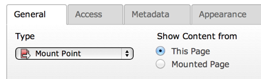

.. ==================================================
.. FOR YOUR INFORMATION
.. --------------------------------------------------
.. -*- coding: utf-8 -*- with BOM.

.. include:: ../../../Includes.txt

.. _columns-radio:

TYPE: "radio"
^^^^^^^^^^^^^

This type creates a set of radio buttons. This should not be confused
with a :ref:`select-type <columns-select>` field using radio buttons
rendering.

.. only:: html

   .. contents::
      :local:
      :depth: 1

.. _columns-radio-properties:

Properties
""""""""""

.. container:: ts-properties

   ================ =========
   Property         Data Type
   ================ =========
   `default`_       mixed
   `items`_         array
   `itemsProcFunc`_ string
   `type`_          string
   ================ =========

Property details
""""""""""""""""

.. only:: html

   .. contents::
      :local:
      :depth: 1

.. ### BEGIN~OF~TABLE ###

.. _columns-radio-properties-type:

type
~~~~

.. container:: table-row

   Key
         type

   Datatype
         string

   Description
         *[Must be set to "radio"]*

   Scope
         *Display / Proc.*

.. _columns-radio-properties-items:

items
~~~~~

.. container:: table-row

   Key
         items

   Datatype
         array

   Description
         **Required.**

         An array of the values which can be selected.

         Each entry is in itself an array where the  *first entry* is the
         *title* (string or LLL reference) and the  *second entry* is the
         *value* of the radio button.

         See example below.

   Scope
         Display

.. _columns-radio-properties-default:

default
~~~~~~~

.. container:: table-row

   Key
         default

   Datatype
         mixed

   Description
         Default value.

   Scope
         Display / Proc.

.. _columns-radio-properties-itemsprocfunc:

itemsProcFunc
~~~~~~~~~~~~~

.. container:: table-row

   Key
         itemsProcFunc

   Datatype
         string

         (function reference)

   Description
         PHP function which is called to fill or manipulate the array with
         elements.

         The function/method will have an array of parameters passed to it
         (where the item-array is passed by reference in the key 'items'). By
         modifying the array of items, you alter the list of items.
         Since TYPO3 CMS 6.2, your function/method may throw an exception which
         will be displayed as a proper error message.

         For more information, see how user-functions are specified in the
         section about 'wizards' some pages below here.

   Scope
         Display

.. _columns-radio-examples:

Example
"""""""

An example of radio buttons configuration from the "pages" table.

.. code-block:: php

	'mount_pid_ol' => array(
		'exclude' => 1,
		'label' => 'LLL:EXT:cms/locallang_tca.xlf:pages.mount_pid_ol',
		'config' => array(
			'type' => 'radio',
			'items' => array(
				array(
					'LLL:EXT:cms/locallang_tca.xlf:pages.mount_pid_ol.I.0',
					0
				),
				array(
					'LLL:EXT:cms/locallang_tca.xlf:pages.mount_pid_ol.I.1',
					1
				)
			)
		)
	),

which results in:

   A typical set of radio buttons
