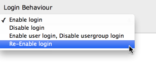
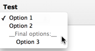
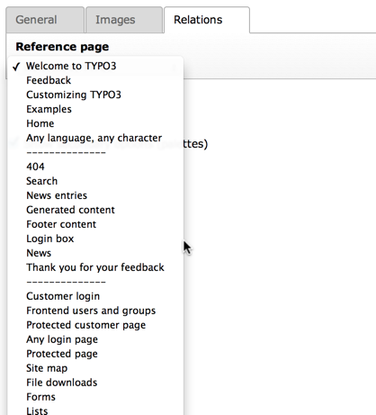
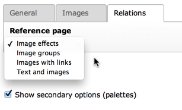
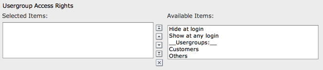
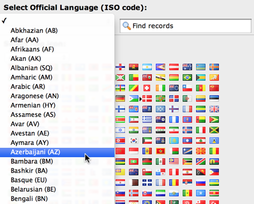
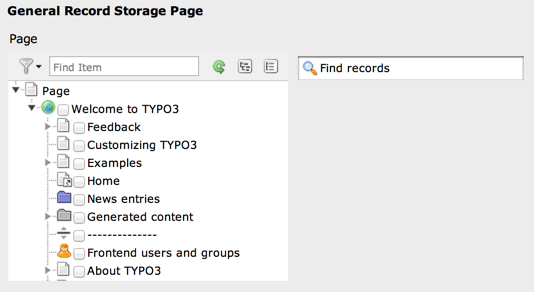
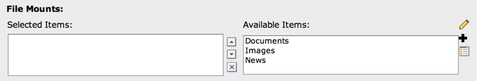
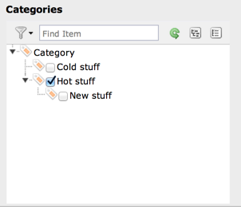

.. include:: ../../../Includes.txt

.. _columns-select:

TYPE: "select"
^^^^^^^^^^^^^^

Selectors boxes are very common elements in forms. By the "select"
type you can create selector boxes. In the most simple form this is a
list of values among which you can chose only one. In that way it is
similar to the "radio" type above.

   A simple selector box with a few options

More complex configurations are possible, see the
:ref:`examples section <columns-select-examples>` for more details.

.. only:: html

   .. contents::
      :local:
      :depth: 1

.. _columns-select-properties:

Properties
""""""""""

.. container:: ts-properties

   ========================================= =========
   Property                                  Data Type
   ========================================= =========
   `allowNonIdValues`_                       boolean
   `authMode\_enforce`_                      string
   `authMode`_                               string
   `default`_                                string
   `disableNoMatchingValueElement`_          boolean
   `dontRemapTablesOnCopy`_                  string
   `enableMultiSelectFilterTextfield`_       boolean
   `exclusiveKeys`_                          string
   `fileFolder\_extList`_                    string
   `fileFolder\_recursions`_                 string
   `fileFolder`_                             string
   `foreign\_table\_prefix`_                 string
   `foreign\_table\_where`_                  string
   `foreign\_table`_                         string
   `itemListStyle`_                          string
   `items`_                                  array
   `itemsProcFunc`_                          string
   `localizeReferencesAtParentLocalization`_ boolean
   `maxitems`_                               integer
   `minitems`_                               integer
   `MM\_hasUidField`_                        boolean
   `MM\_insert\_fields`_                     array
   `MM\_match\_fields`_                      array
   `MM\_opposite\_field`_                    string
   `MM\_oppositeUsage`_                      array
   `MM\_table\_where`_                       string
   `MM`_                                     string
   `multiple`_                               boolean
   `multiSelectFilterItems`_                 array
   `renderType`_                             string
   `rootLevel`_                              boolean
   `selectedListStyle`_                      string
   `selicon\_cols`_                          integer
   `showIconTable`_                          boolean
   `size`_                                   integer
   `special`_                                string
   `treeConfig`_                             array
   `type`_                                   string
   `wizards`_                                array
   ========================================= =========

Property details
""""""""""""""""

.. only:: html

   .. contents::
      :local:
      :depth: 1

.. _columns-select-properties-type:

type
~~~~

.. container:: table-row

   Key
         type

   Datatype
         string

   Description
         *[Must be set to "select"]*

   Scope
         Display / Proc.

.. _columns-select-properties-items:

items
~~~~~

.. container:: table-row

   Key
         items

   Datatype
         array

   Description
         Contains the elements for the selector box unless the property
         "foreign\_table" or "special" has been set in which case automated
         values are set in addition to any values listed in this array.

         Each element in this array is in itself an array where:

         -  First value is the  **item label** (string or LLL reference)

         -  Second value is the  **value of the item** .

            *  The special value `--div--` is used to insert a non-selectable value
               that appears as a divider label in the selector box (only for maxitems
               <=1)

            *  Values must not contain "," (comma) and "\|" (vertical bar). If you
               want to use "authMode" you should also refrain from using ":" (colon).

         -  Third value is an optional icon. Default path is
            :file:`typo3/sysext/t3skin/icons/gfx/` but is deprecated since TYPO3 CMS 7,
            and will be removed with TYPO3 CMS 8.
            For custom icons use a path prepended with "EXT:" to refer to an image
            file found inside an extension or use an registered icon identifier.

         -  Fourth value is an optional description text. This is only shown when
            the list is shown by `renderType`_ `selectCheckBox`.

         -  Fifth value is reserved as keyword "EXPL\_ALLOW" or "EXPL\_DENY". See
            option "authMode" / "individual" for more details.

         .. note::

            Usage of path in the third property is deprecated.
            For custom icons use a path prepended with "EXT:" to refer to an image file
            found inside an extension or use an registered icon identifier, which is the
            prefered way.

         **Example:**

         A configuration could look like this::

            'type' => 'select',
            'items' => array(
               array('English', ''),
               array('Danish', 'dk'),
               array('German', 'de'),
            )

         A more complex example could be this (includes icons)::

            'type' => 'select',
            'items' => array(
               array('LLL:EXT:cms/locallang_ttc.php:k1', 0, 'EXT:myext/Resources/Public/selicons/k1.gif'),
               array('LLL:EXT:cms/locallang_ttc.php:k2', 1, 'tx-myext-selicons-k2'),
               array('LLL:EXT:cms/locallang_ttc.php:k3', 2, 'tx-myext-selicons-k3'),
            )

   Scope
         Display

.. _columns-select-properties-itemsprocfunc:

itemsProcFunc
~~~~~~~~~~~~~

.. container:: table-row

   Key
         itemsProcFunc

   Datatype
         string

         (function reference)

   Description
         PHP function which is called to fill / manipulate the array with
         elements.

         The function/method will have an array of parameters passed to it
         (where the item-array is passed by reference in the key 'items'). By
         modifying the array of items, you alter the list of items.
         Since TYPO3 CMS 6.2, your function/method may throw an exception which
         will be displayed as a proper error message.

         For more information, see how user-functions are specified in the
         section about :ref:`wizards <wizards>` some pages below here.

   Scope
         Display

.. _columns-select-properties-selicon-cols:

selicon\_cols
~~~~~~~~~~~~~

.. container:: table-row

   Key
         selicon\_cols

   Datatype
         integer (>0)

   Description
         The number of rows in which to position the icons for the selector
         box. Default is to render as many columns as icons.

   Scope
         Display

.. _columns-select-properties-showIconTable:

showIconTable
~~~~~~~~~~~~~

.. container:: table-row

   Key
         showIconTable

   Datatype
         boolean

   Description
         Controls the rendering of the icons after the select even when icons
         for the `<select>`'s `<option>` tags were supplied.

   Scope
         Display

.. _columns-select-properties-foreign-table:

foreign\_table
~~~~~~~~~~~~~~

.. container:: table-row

   Key
         foreign\_table

   Datatype
         string

         (table name)

   Description
         The item-array will be filled with records from the table defined
         here. The table must be configured in :php:`$GLOBALS['TCA']`.

         See the other related options below.

   Scope
         Proc. / Display

.. _columns-select-properties-foreign-table-where:

foreign\_table\_where
~~~~~~~~~~~~~~~~~~~~~

.. container:: table-row

   Key
         foreign\_table\_where

   Datatype
         string

         (SQL WHERE clause)

   Description
         The items from :ref:`foreign_table <columns-select-properties-foreign-table>`
         are selected with this WHERE-clause.

         The table is joined with the "pages"-table and items are selected only
         from pages where the user has read access! (Not checking DB mount
         limitations!)

         **Example:**

         .. code-block:: sql

            AND [foreign_table].pid = 0 ORDER BY [foreign_table].sorting

         **Markers:**

         You can use markers in the WHERE clause:

         - ###REC\_FIELD\_[*field name*]### - Any field of the current record.

           .. note::

              The field name part of the marker is not in upper case letters.
              It must match the exact case used in the database.

         - ###THIS\_UID### - is current element uid (zero if new).

         - ###CURRENT\_PID### - is the current page id (pid of the record).

         - ###SITEROOT###

         - ###PAGE\_TSCONFIG\_ID### - a value you can set from Page TSconfig
           dynamically.

         - ###PAGE\_TSCONFIG\_IDLIST### - a value you can set from Page TSconfig
           dynamically.

         - ###PAGE\_TSCONFIG\_STR### - a value you can set from Page TSconfig
           dynamically.

         The markers are preprocessed so that the value of CURRENT\_PID and
         PAGE\_TSCONFIG\_ID are always integers (default is zero),
         PAGE\_TSCONFIG\_IDLIST will always be a comma-separated list of
         integers (default is zero) and PAGE\_TSCONFIG\_STR will be
         addslashes'ed before substitution (default is blank string).

         More information about markers set by Page TSconfig can be found
         in the :ref:`TSconfig reference <t3tsconfig:pagetceformconfobj>`.

         See example below "Simple selector box with TSconfig markers".

   Scope
         Proc. / Display

.. _columns-select-properties-foreign-table-prefix:

foreign\_table\_prefix
~~~~~~~~~~~~~~~~~~~~~~

.. container:: table-row

   Key
         foreign\_table\_prefix

   Datatype
         string or LLL reference

   Description
         Label prefix to the title of the records from the foreign-table.

   Scope
         Display

.. _columns-select-properties-filefolder:

fileFolder
~~~~~~~~~~

.. container:: table-row

   Key
         fileFolder

   Datatype
         string

   Description
         Specifying a folder from where files are added to the item array.

         Specify the folder relative to the PATH\_site, possibly using the
         prefix "EXT:" to point to an extension folder.

         Files from the folder is selected recursively to the level specified
         by :ref:`fileFolder_recursions <columns-select-properties-filefolder-recursions>`
         and only files of the extension defined by
         :ref:`fileFolder_extList <columns-select-properties-filefolder-extlist>`
         is selected.

         Only the file reference relative to the "fileFolder" is stored.

         If the files are images (gif,png,jpg) they will be configured as icons
         (third parameter in items array).

         **Example:** ::

            'config' => array (
                'type' => 'select',
                'items' => array (
                    array('', 0),
                ),
                'fileFolder' => 'EXT:cms/tslib/media/flags/',
                'fileFolder_extList' => 'png,jpg,jpeg,gif',
                'fileFolder_recursions' => 0,
                'selicon_cols' => 8,
                'size' => 1,
                'minitems' => 0,
                'maxitems' => 1,
            )

   Scope
         Display / Proc

.. _columns-select-properties-filefolder-extlist:

fileFolder\_extList
~~~~~~~~~~~~~~~~~~~

.. container:: table-row

   Key
         fileFolder\_extList

   Datatype
         string

   Description
         List of extensions to select. If blank, all files are selected.
         Specify list in lowercase.

         See `\TYPO3\CMS\Core\Utility\GeneralUtility::getAllFilesAndFoldersInPath()`.

   Scope
         Display / Proc

.. _columns-select-properties-filefolder-recursions:

fileFolder\_recursions
~~~~~~~~~~~~~~~~~~~~~~

.. container:: table-row

   Key
         fileFolder\_recursions

   Datatype
         integer

   Description
         Depth of directory recursions. Default is 99. Specify in range from
         0-99.

         0 (zero) means no recursion into subdirectories.

         See `\TYPO3\CMS\Core\Utility\GeneralUtility::getAllFilesAndFoldersInPath()`.

   Scope
         Display / Proc

.. _columns-select-properties-allownonidvalues:

allowNonIdValues
~~~~~~~~~~~~~~~~

.. container:: table-row

   Key
         allowNonIdValues

   Datatype
         boolean

   Description
         **If "foreign\_table" is enabled:**

         If set, then values which are not integer ids will be allowed. May be
         needed if you use itemsProcFunc or just enter additional items in the
         items array to produce some string-value elements for the list.

         Notice: If you mix non-database relations with database relations like
         this, DO NOT use integers for values and DO NOT use "\_" (underscore)
         in values either!

         Notice: Will not work if you also use "MM" relations!

   Scope
         Proc.

.. _columns-select-properties-default:

default
~~~~~~~

.. container:: table-row

   Key
         default

   Datatype
         string

   Description
         Default value.

         If empty, the first element in the items array is selected.

   Scope
         Display / Proc.

.. _columns-select-properties-dontremaptablesoncopy:

dontRemapTablesOnCopy
~~~~~~~~~~~~~~~~~~~~~

.. container:: table-row

   Key
         dontRemapTablesOnCopy

   Datatype
         string

   Description
         (:ref:`See same feature for type="group" <columns-group-properties-dontremaptablesoncopy>`)

         Set it to the exact same value as :ref:`foreign_table <columns-select-properties-foreign-table>`
         if you don't want values to be remapped on copy.

   Scope
         Proc.

.. _columns-select-properties-rootlevel:

rootLevel
~~~~~~~~~

.. container:: table-row

   Key
         rootLevel

   Datatype
         boolean

   Description
         If set, the :ref:`foreign_table_where <columns-select-properties-foreign-table-where>`
         will be ignored and a "pid=0" will be added to the query to select only records
         from root level of the page tree.

   Scope
         Display

.. _columns-select-properties-mm:

MM
~~

.. container:: table-row

   Key
         MM

   Datatype
         string

         (table name)

   Description
         Means that the relation to the records of :ref:`foreign_table <columns-select-properties-foreign-table>`
         is done with a M-M relation with a third "join" table.

         That table has three columns as a minimum:

         - *uid\_local, uid\_foreign* for uids respectively.

         - *sorting* is a required field used for ordering the items

         - *sorting\_foreign* is required if the relation is bidirectional (see
           description and example below table)

         - *tablenames* is used if multiple tables are allowed in the relation.

         - *uid* (auto-incremented and PRIMARY KEY) may be used if you need the
           "multiple" feature (which allows the same record to be references
           multiple times in the box. See :ref:`MM_hasUidField <columns-select-properties-mm-hasuidfield>`.

         - Other fields may exist, in particular if
           :ref:`MM_match_fields <columns-select-properties-mm-match-fields>`
           is involved in the set up.

         **Example SQL #1:** (most simple MM table)

         .. code-block:: php

            CREATE TABLE user_testmmrelations_one_rel_mm (
              uid_local int(11) DEFAULT '0' NOT NULL,
              uid_foreign int(11) DEFAULT '0' NOT NULL,
              sorting int(11) DEFAULT '0' NOT NULL,

              KEY uid_local (uid_local),
              KEY uid_foreign (uid_foreign)
            );

         **Example SQL #2** (Advanced with UID field, "ident" used with
         :ref:`MM_match_fields <columns-select-properties-mm-match-fields>`
         and "sorting_foreign" for bidirectional MM relations):

         .. code-block:: php

            #
            # Table structure for table 'user_testmmrelations_two_rel_mm'
            #
            #
            CREATE TABLE user_testmmrelations_two_rel_mm (
              uid int(11) NOT NULL auto_increment,
              uid_local int(11) DEFAULT '0' NOT NULL,
              uid_foreign int(11) DEFAULT '0' NOT NULL,
              tablenames varchar(30) DEFAULT '' NOT NULL,
              sorting int(11) DEFAULT '0' NOT NULL,
              sorting_foreign int(11) DEFAULT '0' NOT NULL,
              ident varchar(30) DEFAULT '' NOT NULL,

              KEY uid_local (uid_local),
              KEY uid_foreign (uid_foreign),
              PRIMARY KEY (uid)
            );

         The field name of the config is not used for data-storage anymore but
         rather it's set to the number of records in the relation on each
         update, so the field should be an integer.

         .. note::

            Using MM relations you can ONLY store real relations for
            foreign tables in the list - no additional string values or non-record
            values.

         **MM relations and flexforms**

         MM relations has been tested to work with flexforms if not in a
         repeated element in a section. See example below.

   Scope
         Proc.

.. _columns-select-properties-mm-opposite-field:

MM\_opposite\_field
~~~~~~~~~~~~~~~~~~~

.. container:: table-row

   Key
         MM\_opposite\_field

   Datatype
         string

         (field name)

   Description
         If you want to make a MM relation editable from the foreign side
         (bidirectional) of the relation as well, you need to set
         `MM_opposite_field` on the foreign side to the field name on the local
         side.

         E.g. if the field "companies.employees" is your local side and you
         want to make the same relation editable from the foreign side of the
         relation in a field called persons.employers, you would need to set
         the `MM_opposite_field` value of the TCA configuration of the
         persons.employers field to the string "employees".

         .. note::

            Bidirectional references only get registered once on the
            native side in "sys\_refindex".

   Scope
         Proc.

.. _columns-select-properties-mm-match-fields:

MM\_match\_fields
~~~~~~~~~~~~~~~~~

.. container:: table-row

   Key
         MM\_match\_fields

   Datatype
         array

   Description
         Array of field=>value pairs to both insert and match against when
         writing/reading MM relations.

   Scope
         Display / Proc.

.. _columns-select-properties-mm-opposite-usage:
.. _columns-select-properties-mm-oppositeusage:

MM\_oppositeUsage
~~~~~~~~~~~~~~~~~

.. container:: table-row

   Key
         MM\_oppositeUsage

   Datatype
         array

   Description
         *(Since TYPO3 CMS 6.2)*

         In a MM bidirectional relation using
         :ref:`match fields <columns-select-properties-mm-match-fields>`
         the opposite side needs to know about the match fields for
         certain operations (for example, when a copy is created in a
         workspace) so that relations are carried over with the correct
         information.

         `MM_oppositeUsage` is an array which references which
         fields contain the references to the opposite side, so that they
         can be queried for match field configuration.

         This is used by the Core for system categories. Whenever a table
         is registered as being categorizable, an entry in `MM_oppositeUsage`
         is created for the "sys_category" table.

         **Example**

         With "pages", "tt_content" and "sys_file_metadata" all registered
         as categorizable (using the default name of "categories" for the
         relations field) plus extension "examples" installed, the TCA
         for "sys_category" contains the following definition once
         fully assembled:

         .. code-block:: php

         	$GLOBALS['TCA']['sys_category']['columns']['items']['config']['MM_oppositeUsage'] = array(
         		'pages' => array('tx_examples_cats', 'categories'),
         		'sys_file_metadata' => array('categories'),
         		'tt_content' => array('categories'),
         	)

   Scope
         Proc.

.. _columns-select-properties-mm-insert-fields:

MM\_insert\_fields
~~~~~~~~~~~~~~~~~~

.. container:: table-row

   Key
         MM\_insert\_fields

   Datatype
         array

   Description
         Array of field=>value pairs to insert when writing new MM relations

   Scope
         Proc.

.. _columns-select-properties-mm-table-where:

MM\_table\_where
~~~~~~~~~~~~~~~~

.. container:: table-row

   Key
         MM\_table\_where

   Datatype
         string (SQL WHERE)

   Description
         Additional where clause used when reading MM relations.

   Scope
         Display

.. _columns-select-properties-mm-hasuidfield:

MM\_hasUidField
~~~~~~~~~~~~~~~

.. container:: table-row

   Key
         MM\_hasUidField

   Datatype
         boolean

   Description
         If the "multiple" feature is used with MM relations you MUST set this
         value to true and include a UID field! Otherwise sorting and removing
         relations will be buggy.

   Scope
         Proc.

.. _columns-select-properties-special:

special
~~~~~~~

.. container:: table-row

   Key
         special

   Datatype
         string

         (any of keywords)

   Description
         This configures the selector box to fetch content from some predefined
         internal source. These are the possibilities:

         - **tables** - the list of TCA tables is added to the selector
           (excluding "adminOnly" tables).

         - **pagetypes** - all "doktype"-values for the "pages" table are added.

         - **exclude** - the list of "excludeFields" as found in :php:`$GLOBALS['TCA']` is added.

         - **modListGroup** - module-lists added for groups.

         - **modListUser** - module-lists added for users.

         - **explicitValues** – List values that require explicit permissions to
           be allowed or denied. (See :ref:`authMode <columns-select-properties-authmode>`).

         - **languages** – List system languages ("sys\_language" records from page
           tree root + Default language)

         - **custom** – Custom values set by backend modules (see
           `TYPO3_CONF_VARS[BE][customPermOptions]`)

         As you might have guessed these options are used for backend user
         management and pretty worthless for most other purposes.

   Scope
         Display / Proc.

.. _columns-select-properties-size:

size
~~~~

.. container:: table-row

   Key
         size

   Datatype
         integer

   Description
         Height of the selector box in TCEforms.

   Scope
         Display

.. _columns-select-properties-selectedliststyle:

selectedListStyle
~~~~~~~~~~~~~~~~~

.. container:: table-row

   Key
         selectedListStyle

   Datatype
         string

   Description
         If set, this will override the default style of the selector box with
         selected items (which is "width:200px").

         Applies for when maxitems is > 1

   Scope
         Display

.. _columns-select-properties-itemliststyle:

itemListStyle
~~~~~~~~~~~~~

.. container:: table-row

   Key
         itemListStyle

   Datatype
         string

   Description
         If set, this will override the default style of the selector box with
         available items to select (which is "width:200px").

         Applies for when maxitems is > 1

   Scope
         Display

.. _columns-select-properties-rendertype:

renderType
~~~~~~~~~~

.. container:: table-row

   Key
         renderType

   Datatype
         string (any of keywords)

   Description
         This setting specifies how the select field should be displayed. Available options are:

         - ``selectSingle`` - Normal select field for selecting a single value.
         - ``selectSingleBox`` - Normal select field for selecting multiple values.
         - ``selectCheckBox`` - List of checkboxes for selecting muliple values.
         - ``selectMultipleSideBySide`` - Two select fields, items can be selected from the right
           field, selected items are displayed in the left select.
         - ``selectTree`` - A tree for selecting hierarchical data.

         .. note::

            Properties "maxitems" and "minitems" are not enforced in the browser
            for any of the render types here! However they will be on the server.
            It is recommended to set "minitems" to zero and "maxitems" to a very
            large number exceeding the possible number of values you can select
            (for instance set it to 1000 or so).

   Scope
         Display

.. _columns-select-properties-treeconfig:

treeConfig
~~~~~~~~~~

.. container:: table-row

   Key
         treeConfig

   Datatype
         (configuration options)

   Description
         Configuration if the `renderType`_
         is set to "selectTree". Either `childrenField` or `parentField`
         has to be set - `childrenField` takes precedence.

         **Sub-properties:**

         - **dataProvider**: Allows to define a custom data provider class for usecases where special data preparation
           is necessary. By default ``\TYPO3\CMS\Core\Tree\TableConfiguration\DatabaseTreeDataProvider`` is used.

         - **childrenField (string)** : Field name of the foreign\_table that
           references the uid of the child records (either child

         - **parentField (string)** : Field name of the foreign\_table that
           references the uid of the parent record

         - **rootUid (integer, optional)** : uid of the record that shall be
           considered as the root node of the tree. In general this might be set
           by Page TSconfig

         - **appearance (array, optional)** :

           - **showHeader (boolean)** : Whether to show the header of the tree that
             contains a field to filter the records and allows to expand or
             collapse all nodes

           - **expandAll (boolean)** : Whether to show the tree with all nodes
             expanded

           - **maxLevels (integer)** : The maximal amount of levels to be rendered
             (can be used to stop possible recursions)

           - **nonSelectableLevels (list, default "0")** : Comma-separated list of
             levels that will not be selectable, by default the root node (which is
             "0") cannot be selected

   Scope
         Display

.. _columns-select-properties-multiple:

multiple
~~~~~~~~

.. container:: table-row

   Key
         multiple

   Datatype
         boolean

   Description
         Allows the *same item* more than once in a list.

         If used with bidirectional MM relations it must be set for both the
         native and foreign field configuration. Also, with MM relations in
         general you must use a UID field in the join table, see description
         for "MM"

   Scope
         Display / Proc.

.. _columns-select-properties-maxitems:

maxitems
~~~~~~~~

.. container:: table-row

   Key
         maxitems

   Datatype
         integer > 0

   Description
         Maximum number of items in the selector box. (Default = 1)

         .. note::

            Property maxitems is ignored if `renderType`_ `selectSingle` is set.

   Scope
         Display / Proc

.. _columns-select-properties-minitems:

minitems
~~~~~~~~

.. container:: table-row

   Key
         minitems

   Datatype
         integer > 0

   Description
         Minimum number of items in the selector box. (Default = 0)

   Scope
         Display

.. _columns-select-properties-wizards:

wizards
~~~~~~~

.. container:: table-row

   Key
         wizards

   Datatype
         array

   Description
         See the :ref:`wizards section <wizards>` for more information.

   Scope
         Display

.. _columns-select-properties-disablenomatchingvalueelement:

disableNoMatchingValueElement
~~~~~~~~~~~~~~~~~~~~~~~~~~~~~

.. container:: table-row

   Key
         disableNoMatchingValueElement

   Datatype
         boolean

   Description
         If set, then no element is inserted if the current value does not
         match any of the existing elements. A corresponding options is also
         found in Page TSconfig.

   Scope
         Display

.. _columns-select-properties-enablemultiselectfiltertextfield:

enableMultiSelectFilterTextfield
~~~~~~~~~~~~~~~~~~~~~~~~~~~~~~~~

.. container:: table-row

   Key
         enableMultiSelectFilterTextfield

   Datatype
         boolean

   Description
         *(Since TYPO3 CMS 6.2)*

         If set, a textual field is shown above the available
         items in which one can type words to filter the list
         of available items.

         Applies only when :ref:`maxitems <columns-select-properties-maxitems>` is > 1.

         See :ref:`example and screenshot below <columns-select-properties-multiselectfilteritems>`.

   Scope
         Display

.. _columns-select-properties-multiselectfilteritems:

multiSelectFilterItems
~~~~~~~~~~~~~~~~~~~~~~

.. container:: table-row

   Key
         multiSelectFilterItems

   Datatype
         array

   Description
         *(Since TYPO3 CMS 6.2)*

         Contains predefined elements for the filter field enabled by
         :ref:`enableMultiSelectFilterTextfield <columns-select-properties-enablemultiselectfiltertextfield>`.
         On selecting a item, the list of available items
         gets automatically filtered.

         Each element in this array is in itself an array where:

         - First value is the  **filter value of the item** .

         - Second value is the  **item label** (string or LLL reference)

         **Example:**

         A configuration could look like this:

         .. code-block:: php

			'related_content' => array(
				'label' => 'LLL:EXT:examples/Resources/Private/Language/locallang_db.xlf:tx_examples_haiku.related_content',
				'config' => array(
					'type' => 'select',
					'foreign_table' => 'tt_content',
					'foreign_table_where' => 'ORDER BY header ASC',
					'size' => 5,
					'minitems' => 0,
					'maxitems' => 999,
					'enableMultiSelectFilterTextfield' => TRUE,
					'multiSelectFilterItems' => array(
						array(
							'image',
							'LLL:EXT:examples/Resources/Private/Language/locallang_db.xlf:tx_examples_haiku.related_content.image'
						),
						array(
							'typo3',
							'LLL:EXT:examples/Resources/Private/Language/locallang_db.xlf:tx_examples_haiku.related_content.typo3'
						),
					)
				)
			)

         And this is the result:

         .. figure:: ../../../Images/TypeSelectItemsFilter.png
            :alt: Filtering available items

            Filtering available items with both predefined keywords and free input

         Applies only when :ref:`maxitems <columns-select-properties-maxitems>` is > 1.

   Scope
         Display

.. _columns-select-properties-authmode:

authMode
~~~~~~~~

.. container:: table-row

   Key
         authMode

   Datatype
         string keyword

   Description
         Authorization mode for the selector box. Keywords are:

         - **explicitAllow** – All static values from the "items" array of the
           selector box will be added to a matrix in the backend user
           configuration where a value must be explicitlyselected if a user
           (other than admin) is allowed to use it!)

         - **explicitDeny** – All static values from the "items" array of the
           selector box will be added to a matrix in the backend user
           configuration where a value must be explicitlyselected if a user
           should be denied access.

         - **individual** – State is individually set for each item in the
           selector box. This is done by the keywords " **EXPL\_ALLOW** " and "
           **EXPL\_DENY** " entered at the 5. position in the item array (see
           "items" configuration above). Items without any of these keywords can
           be selected as usual without any access restrictions applied.

         **Notice:** The authentication modes will work only with values that
         are statically present in the "items" configuration. Any values added
         from foreign tables, file folder or by user processing will  *not* be
         configurable and the evaluation of such values is not guaranteed for!

         **maxitems > 1**

         "authMode" works also for selector boxes with maxitems > 1. In this
         case the list of values is traversed and each value is evaluated. Any
         disallowed values will be removed.

         If all submitted values turns out to be removed the result will be
         that the field is not written – basically leaving the old value. For
         maxitems <=1 (single value) this means that a non-allowed value is
         just not written. For multiple values (maxitems >1) it depends on
         whether any elements are left in the list after evaluation of each
         value.

   Scope
         Display / Proc

.. _columns-select-properties-authmode-enforce:

authMode\_enforce
~~~~~~~~~~~~~~~~~

.. container:: table-row

   Key
         authMode\_enforce

   Datatype
         string keyword

   Description
         Various additional enforcing options for
         :ref:`authMode <columns-select-properties-authmode>`.

         Keywords are:

         - **strict** - If set, then permission to edit the record will be
           granted only if the "authMode" evaluates OK. The default is that a
           record having an authMode configured field with a "non-allowed" value
           can be edited – just the value of the authMode field cannot be set to
           a value that is not allowed. **Notice:** This works only when maxitems
           <=1 (and no MM relations) since the "raw" value in the record is all
           that is evaluated!

   Scope
         Display / Proc

.. _columns-select-properties-exclusivekeys:

exclusiveKeys
~~~~~~~~~~~~~

.. container:: table-row

   Key
         exclusiveKeys

   Datatype
         string (list of)

   Description
         List of keys that exclude any other keys in a select box where
         multiple items could be selected.

         "Show at any login" of "fe\_groups" (tables "pages" and "tt\_content")
         is an example where such a configuration is used.

   Scope
         Display / Proc.

.. _columns-select-properties-localizereferencesatparentlocalization:

localizeReferencesAtParentLocalization
~~~~~~~~~~~~~~~~~~~~~~~~~~~~~~~~~~~~~~

.. container:: table-row

   Key
         localizeReferencesAtParentLocalization

   Datatype
         boolean

   Description
         Defines whether referenced records should be localized when the
         current record gets localized (mostly used in Inline Relational Record
         Editing)

   Scope
         Proc.

Here follow some code listings as examples:

.. _columns-select-examples:

Examples
""""""""

.. _columns-select-examples-simple:

Example - A simple selector box:
~~~~~~~~~~~~~~~~~~~~~~~~~~~~~~~~

This is the most simple selector box you can get. It contains a static
set of options you can select from:

   A simple selector box with a few options and a divider

And here's the corresponding code:

.. code-block:: php

   'tx_examples_options' => array (
           'exclude' => 0,
           'label' => 'LLL:EXT:examples/locallang_db.xml:fe_users.tx_examples_options',
           'config' => array (
                   'type' => 'select',
                   'renderType' => 'selectSingle',
                   'items' => array (
                           array('LLL:EXT:examples/locallang_db.xml:fe_users.tx_examples_options.I.0', '1'),
                           array('LLL:EXT:examples/locallang_db.xml:fe_users.tx_examples_options.I.1', '2'),
                           array('LLL:EXT:examples/locallang_db.xml:fe_users.tx_examples_options.I.2', '--div--'),
                           array('LLL:EXT:examples/locallang_db.xml:fe_users.tx_examples_options.I.3', '3'),
                   ),
                   'size' => 1,
                   'maxitems' => 1,
           )
   ),

In the configuration the elements are configured by the "items" array.
Each entry in the array contains pairs of label/value. Notice the
third entry of the "items" array. It defines a *divider*. This value
cannot be selected. It only helps to divide the list of options with a
label indicating a new section.

.. _columns-select-examples-simple-markers:

Simple selector box with TSconfig markers
~~~~~~~~~~~~~~~~~~~~~~~~~~~~~~~~~~~~~~~~~

This example shows the use of markers inside the
:ref:`foreign_table_where <columns-select-properties-foreign-table-where>`
property and how the corresponding TSconfig must be set up.

In the TCA definition of the "haiku" table ("examples" extension)
there is a simple select field to create a reference to a page in the
"pages" table:

.. code-block:: php

   'reference_page' => array(
           'label' => 'LLL:EXT:examples/locallang_db.xml:tx_examples_haiku.reference_page',
           'config' => array(
                   'type' => 'select',
                   'renderType' => 'selectSingle',
                   'foreign_table' => 'pages',
                   'foreign_table_where' => "AND pages.title LIKE '%###PAGE_TSCONFIG_STR###%'",
                   'size' => 1,
                   'minitems' => 0,
                   'maxitems' => 1
           ),
   ),

Without any TSconfig, the selector will display a full list of pages:

   The page selector showing all existing pages

Let's add the following bit of Tsconfig to the page containing our
"haiku" record:

.. code-block:: typoscript

   TCEFORM.tx_examples_haiku.reference_page.PAGE_TSCONFIG_STR = image

The list of pages that we can select from is now reduced to:

   The page selector showing only pages with "image" in their title

.. _columns-select-examples-multiple:

A multiple value selector with contents from a database table
~~~~~~~~~~~~~~~~~~~~~~~~~~~~~~~~~~~~~~~~~~~~~~~~~~~~~~~~~~~~~

The user group selector is based on the fe\_groups table. It appears
as a multiple selector:

   User groups selector in the access rights configuration

The corresponding TCA configuration:

.. code-block:: php

	'fe_group' => array(
		'exclude' => 1,
		'label' => 'LLL:EXT:lang/locallang_general.xlf:LGL.fe_group',
		'config' => array(
			'type' => 'select',
			'size' => 5,
			'maxitems' => 20,
			'items' => array(
				array(
					'LLL:EXT:lang/locallang_general.xlf:LGL.hide_at_login',
					-1
				),
				array(
					'LLL:EXT:lang/locallang_general.xlf:LGL.any_login',
					-2
				),
				array(
					'LLL:EXT:lang/locallang_general.xlf:LGL.usergroups',
					'--div--'
				)
			),
			'exclusiveKeys' => '-1,-2',
			'foreign_table' => 'fe_groups',
			'foreign_table_where' => 'ORDER BY fe_groups.title'
		)
	),

The value stored in the database will be a  *comma-separated list of uid numbers*
of the selected records.

An interesting point of this example is that it shows that static
values can be mixed with values fetched from a database table.

.. _columns-select-examples-lookup:

Using a look up table for single value
~~~~~~~~~~~~~~~~~~~~~~~~~~~~~~~~~~~~~~

In this case the selector box looks up languages in a static table
from an extension "static\_info\_tables":

   Language selector based on the static_languages table

The configuration looks like this (taken from the "sys\_language" table):

.. code-block:: php

	'static_lang_isocode' => array(
		'exclude' => 1,
		'label' => 'LLL:EXT:lang/locallang_tca.xlf:sys_language.isocode',
		'displayCond' => 'EXT:static_info_tables:LOADED:true',
		'config' => array(
			'type' => 'select',
                   	'renderType' => 'selectSingle',
			'items' => array(
				array('', 0)
			),
			'foreign_table' => 'static_languages',
			'foreign_table_where' => 'AND static_languages.pid=0 ORDER BY static_languages.lg_name_en',
			'size' => 1,
			'minitems' => 0,
			'maxitems' => 1
		)
	),

Notice how a condition is set that this box should only be displayed
*if* the extension it relies on exists! This is very important since
otherwise the table will not be in the database and we will get SQL
errors.

.. _columns-select-examples-grsp:

Render the General Record Storage Page selector as a tree of page
~~~~~~~~~~~~~~~~~~~~~~~~~~~~~~~~~~~~~~~~~~~~~~~~~~~~~~~~~~~~~~~~~

The following configuration change:

.. code-block:: php

   $tempConfiguration = array(
      'type' => 'select',
      'foreign_table' => 'pages',
      'size' => 10,
      'renderType' => 'selectTree',
      'treeConfig' => array(
              'expandAll' => true,
              'parentField' => 'pid',
              'appearance' => array(
                      'showHeader' => TRUE,
              ),
      ),
   );
   $GLOBALS['TCA']['pages']['columns']['storage_pid']['config'] = array_merge(
      $GLOBALS['TCA']['pages']['columns']['storage_pid']['config'],
      $tempConfiguration
   );

will transform the General Record Storage Page selector into:

   The general storage page selector modified to render as a page tree

.. _columns-select-examples-wizards:

Adding wizards
~~~~~~~~~~~~~~

This example shows how wizards can be added to a selector box. The
three typical wizards for a selector box is edit, add and list items.
This enables the user to create new items in the look up table while
being right at the selector box where he wants to select them:

The configuration is rather long and looks like this (note that
wizards are not exclusively available for selector boxes!):

.. code-block:: php
   :emphasize-lines: 11-48

	'file_mountpoints' => array(
		'label' => 'LLL:EXT:lang/locallang_tca.xlf:be_users.options_file_mounts',
		'config' => array(
			'type' => 'select',
			'foreign_table' => 'sys_filemounts',
			'foreign_table_where' => ' AND sys_filemounts.pid=0 ORDER BY sys_filemounts.title',
			'size' => '3',
			'maxitems' => 25,
			'wizards' => array(
				'_VERTICAL' => 1,
				'edit' => array(
					'type' => 'popup',
					'title' => 'LLL:EXT:lang/locallang_tca.xlf:file_mountpoints_edit_title',
					'module' => array(
						'name' => 'wizard_edit',
					),
					'icon' => 'edit2.gif',
					'popup_onlyOpenIfSelected' => 1,
					'JSopenParams' => 'height=350,width=580,status=0,menubar=0,scrollbars=1'
				),
				'add' => array(
					'type' => 'script',
					'title' => 'LLL:EXT:lang/locallang_tca.xlf:file_mountpoints_add_title',
					'icon' => 'add.gif',
					'params' => array(
						'table' => 'sys_filemounts',
						'pid' => '0',
						'setValue' => 'prepend'
					),
					'module' => array(
						'name' => 'wizard_add'
					)
				),
				'list' => array(
					'type' => 'script',
					'title' => 'LLL:EXT:lang/locallang_tca.xlf:file_mountpoints_list_title',
					'icon' => 'list.gif',
					'params' => array(
						'table' => 'sys_filemounts',
						'pid' => '0'
					),
					'module' => array(
						'name' => 'wizard_list'
					)
				)
			)
		)
	),

See the :ref:`wizards section <wizards>` for more information.

   The file mount selector with add, edit and list wizards

.. _columns-select-examples-mm:

MM relations
~~~~~~~~~~~~

This example demonstrates the use of MM relations. In particular
they are used to relate system categories to a variety of other
records. As such it is necessary to keep track in the MM table of
the nature of each such record. This is achieved by using the
"fieldname" field, referenced in the :ref:`MM_match_fields <columns-select-properties-mm-match-fields>`
configuration.

The "tablenames" field is also used in the case where multiple
category relation fields are added to the same record type
(as happens to the "pages" table when the "examples" extension
is installed).

.. code-block:: php

	'type' => 'select',
	'foreign_table' => 'sys_category',
	'foreign_table_where' => ' AND sys_category.sys_language_uid IN (-1, 0) ORDER BY sys_category.sorting ASC',
	'MM' => 'sys_category_record_mm',
	'MM_opposite_field' => 'items',
	'MM_match_fields' => array(
		'tablenames' => 'pages',
		'fieldname' => 'categories',
	),
	'size' => 10,
	'maxitems' => 9999,
	'renderType' => 'selectTree',
	'treeConfig' => array(
		'parentField' => 'parent',
		'appearance' => array(
			'expandAll' => TRUE,
			'showHeader' => TRUE,
		),
	),

The selector looks like this:

   The categories selector as added by default to pages

The above configuration also defines the MM relation as being
bidirectional, via the :ref:`MM_opposite_field <columns-select-properties-mm-opposite-field>`
property. This means that we can look at a given category and see
which items it is related to. Note that it is perfectly possible to
create relations from that side too.

.. figure:: ../../../Images/TypeSelectMmForeign.png
   :alt: The category and its items

   A category and the items it is related to

.. note::

   The TCA configuration listed above cannot be found directly
   in a TCA file, but is generated by the `addTcaColumn()` method
   of class :ref:`TYPO3\CMS\Core\Category\CategoryRegistry <t3api:TYPO3\\CMS\\Core\\Category\\CategoryRegistry>`.

.. _columns-select-data-format:

Data format of "select" elements
""""""""""""""""""""""""""""""""

Since the "select" element allows to store references to multiple
elements we might want to look at how these references are stored
internally. The principle is the same as with the
:ref:`"group" type <columns-group-data>`.
