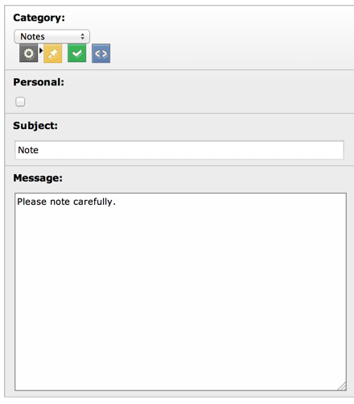

.. ==================================================
.. FOR YOUR INFORMATION
.. --------------------------------------------------
.. -*- coding: utf-8 -*- with BOM.

.. include:: ../../../Includes.txt

.. _columns-text:

TYPE: "text"
^^^^^^^^^^^^

This field type generates a :code:`<textarea>` field or inserts a RTE
(Rich Text Editor). For more details about the latter please refer to the
:ref:`special-configuration-options` section.

.. only:: html

   .. contents::
      :local:
      :depth: 1

.. _columns-text-properties:

Properties
""""""""""

.. container:: ts-properties

   ============== =========
   Property       Data Type
   ============== =========
   `cols`_        integer
   `default`_     string
   `eval`_        string
   `format`_      string
   `is\_in`_      string
   `mode`_        string
   `placeholder`_ string
   `rows`_        integer
   `type`_        string
   `wizards`_     array
   `wrap`_        string
   ============== =========

Property details
""""""""""""""""

.. only:: html

   .. contents::
      :local:
      :depth: 1

.. _columns-text-properties-type:

type
~~~~

.. container:: table-row

   Key
         type

   Datatype
         string

   Description
         *[Must be set to "text"]*

   Scope
         Display / Proc.

.. _columns-text-properties-cols:

cols
~~~~

.. container:: table-row

   Key
         cols

   Datatype
         integer

   Description
         Abstract value for the width of the :code:`<textarea>` field. To set the
         textarea to the full width of the form area, use the value 48. Default
         is 30.

   Scope
         Display

.. _columns-text-properties-rows:

rows
~~~~

.. container:: table-row

   Key
         rows

   Datatype
         integer

   Description
         The number of rows in the textarea. May be corrected for harmonization
         between browsers. Will also automatically be increased if the content
         in the field is found to be of a certain length, thus the field will
         automatically fit the content.

         Default is 5. Max value is 20.

   Scope
         Display

.. _columns-text-properties-maxlength:

max
~~~

.. container:: table-row

   Key
         max

   Datatype
         integer

   Description
         Adds the HTML5 attribute "maxlength" to a textarea.

   Scope
         Display

.. _columns-text-properties-wrap:

wrap
~~~~

.. container:: table-row

   Key
         wrap

   Datatype
         string (keyword)

   Description
         Determines the wrapping of the textarea field. There are two options:

         virtual
           (Default) The textarea will automatically wrap the
           lines like it would be expected for editing a text.

         off
           The textarea will *not* wrap the lines as you would
           expect when editing some kind of code.

         .. note::

            If the string "nowrap" is found among options in the
            :ref:`fields extra configuration <types-properties-showitem>`
            from the "types" listing, it will override
            the setting here to "off".

         **Example:**

         This configuration will create a textarea useful for entry of code
         lines since it will not wrap the lines:

         .. code-block:: php

            'config' => array(
                    'type' => 'text',
                    'cols' => '40',
                    'rows' => '15',
                    'wrap' => 'off',
            )

   Scope
         Display

.. _columns-text-properties-default:

default
~~~~~~~

.. container:: table-row

   Key
         default

   Datatype
         string

   Description
         Default value

   Scope
         Display / Proc.

.. _columns-text-properties-eval:

eval
~~~~

.. container:: table-row

   Key
         eval

   Datatype
         list of keywords

   Description
         Configuration of field evaluation.

         Some of these evaluation keywords will trigger a JavaScript pre-
         evaluation in the form. Other evaluations will be performed in the
         backend.

         The evaluation functions will be executed in the list-order.

         Keywords:

         required
           A non-empty value is required in the field (otherwise
           the form cannot be saved).

         trim
           The value in the field will have white spaces around it
           trimmed away.

         tx\_\*
           User-defined form evaluations. See the description of the
           :ref:`eval key <columns-input-properties-eval>`
           for the input-type field.

   Scope
         Display / Proc.

.. _columns-text-properties-format:

format
~~~~~~

.. container:: table-row

   Key
         format

   Datatype
         string (keyword)

   Description
         When an text-type field is set as read-only, it actually
         gets rendered as a :ref:`none-type field <columns-none>`.
         This means that is is possible to use the
         :ref:`format property <columns-none-properties-format>` of
         such field to format the value of the text-type field.

.. _columns-text-properties-is-in:

is\_in
~~~~~~

.. container:: table-row

   Key
         is\_in

   Datatype
         string

   Description
         If a user-defined evaluation is used for the field (see :ref:`eval key <columns-text-properties-eval>`),
         then this value will be passed as argument to the user-defined evaluation function.

   Scope
         Display / Proc.

.. _columns-text-properties-placeholder:

placeholder
~~~~~~~~~~~

.. container:: table-row

   Key
         placeholder

   Datatype
         string

   Description
         *(Since TYPO3 CMS 4.7)*

         :ref:`See description for input-type field. <columns-input-properties-placeholder>`

   Scope
         Display

.. _columns-text-properties-mode:

mode
~~~~

.. container:: table-row

   Key
         mode

   Datatype
         string (keywords)

   Description
         *(Since TYPO3 CMS 6.0)*

         :ref:`See description for input-type field. <columns-input-properties-mode>`

   Scope
         Display / Proc.

.. _columns-text-properties-wizards:

wizards
~~~~~~~

.. container:: table-row

   Key
         wizards

   Datatype
         array

   Description
         See the :ref:`wizards section <wizards>` for more information.

   Scope
         Display

.. _columns-text-examples:

Example
"""""""

This is the typical configuration for a textarea field:

.. code-block:: php

	'message' => array(
		'label' => 'LLL:EXT:sys_note/Resources/Private/Language/locallang_tca.xlf:sys_note.message',
		'config' => array(
			'type' => 'text',
			'cols' => '40',
			'rows' => '15'
		)
	),

which looks like:

   The message field of system notes, a typical text field
