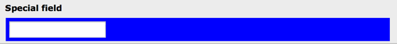

.. ==================================================
.. FOR YOUR INFORMATION
.. --------------------------------------------------
.. -*- coding: utf-8 -*- with BOM.

.. include:: ../../../Includes.txt

.. _columns-user:

TYPE: "user"
^^^^^^^^^^^^

Allows you to render a whole form field by a user function or class
method.

.. only:: html

   .. contents::
      :local:
      :depth: 1

.. _columns-user-properties:

Properties
""""""""""

.. container:: ts-properties

   ================== =========
   Property           Data Type
   ================== =========
   `noTableWrapping`_ boolean
   `parameters`_      array
   `type`_            string
   `userFunc`_        string
   ================== =========

Property details
""""""""""""""""

.. only:: html

   .. contents::
      :local:
      :depth: 1

.. _columns-user-properties-type:

type
~~~~

.. container:: table-row

   Key
         type

   Datatype
         string

   Description
         *[Must be set to "user"]*

.. _columns-user-properties-userfunc:

userFunc
~~~~~~~~

.. container:: table-row

   Key
         userFunc

   Datatype
         string

   Description
         Function or method reference.

         If you want to call a function, just enter the function name. The
         function name must be prefixed "user\_" or "tx\_".

         If you want to call a method in a class, enter
         "[classname]->[methodname]". The class name must be prefixed "user\_"
         or "tx\_".

         Two arguments will be passed to the function/method: The first
         argument is an array (passed by reference) which contains the current
         information about the current field being rendered. The second
         argument is a reference to the parent object (an instance of the
         t3lib\_TCEforms class).

         The array with the current information will contain any parameters
         declared with the "parameters" property described below.

         .. note::

            The class must be registered with the TYPO3 autoloader
            (or use namespaces since TYPO3 CMS 6.0).

.. _columns-user-properties-parameters:

parameters
~~~~~~~~~~

.. container:: table-row

   Key
         parameters

   Datatype
         array

   Description
         Array that will be passed as is to the userFunc as the "parameters"
         key of the first argument received by the user function.

         See example below.

.. _columns-user-properties-notablewrapping:

noTableWrapping
~~~~~~~~~~~~~~~

.. container:: table-row

   Key
         noTableWrapping

   Datatype
         boolean

   Description
         If set, then the output from the user function will *not* be wrapped
         in the usual table - you will have to do that yourself.

.. _columns-user-examples:

Example
"""""""

This field is rendered by custom PHP code:

   A sample user-defined field

The configuration in TCA is as simple as this:

.. code-block:: php

	'tx_examples_special' => array (
		'exclude' => 0,
		'label' => 'LLL:EXT:examples/Resources/Private/Language/locallang_db.xlf:fe_users.tx_examples_special',
		'config' => array (
			'type' => 'user',
			'size' => '30',
			'userFunc' => 'Documentation\\Examples\\Userfuncs\\Tca->specialField',
			'parameters' => array(
				'color' => 'blue'
			)
		)
	),

This is how the corresponding PHP method (in class :code:`\Documentation\Examples\Userfuncs\Tca`) looks like:

.. code-block:: php

	public function specialField($PA, $fObj) {
		$color = (isset($PA['parameters']['color'])) ? $PA['parameters']['color'] : 'red';
		$formField  = '
';
		$formField .= '<input type="text" name="' . $PA['itemFormElName'] . '"';
		$formField .= ' value="' . htmlspecialchars($PA['itemFormElValue']) . '"';
		$formField .= ' onchange="' . htmlspecialchars(implode('', $PA['fieldChangeFunc'])) . '"';
		$formField .= $PA['onFocus'];
		$formField .= ' />
';
		return $formField;
	}

This is not the place to dig into more details about user-defined
forms. With this example you can start yourself up but you will have to
figure out by yourself what options are available in the $PAarray and
how to use them.

Note in particular how the "parameters" array declared in the TCA
configuration can be retrieved as part of the first argument ($PA)
received by the method invoked.
