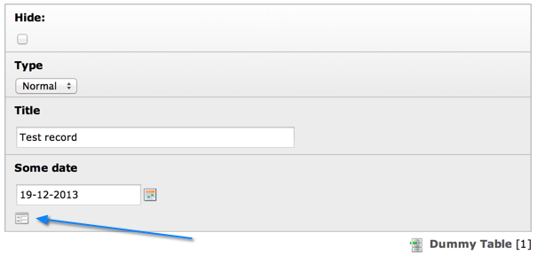
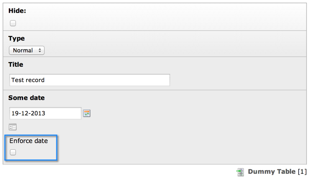

.. include:: ../../Includes.txt

.. _palettes:

['palettes'] section
^^^^^^^^^^^^^^^^^^^^

"Palettes" represent a way to move less frequently used form fields
out of sight. Palettes are groups of fields which are associated with
another field in the main form. When this field is activated the
palette fields are displayed. In the backend, "palettes" are known as
"secondary options".

Let's add a palette to the example from the previous section. The
palette itself is defined like this::

   'palettes' => array(
           '1' => array('showitem' => 'enforce_date'),
   ),

Now we change the "types" configuration to link the palette to the
`some_date` field::

   '0' => array('showitem' => 'hidden, record_type, title, some_date;;1 '),

When a palette exists, an icon appears next to the relevant field:

   A collapsed palette with the icon to expand it

.. note::

   With TYPO3 version 7.4 onwards the checkbox at the bottom “Show secondary options (palettes)” has been dropped
   and the icon is not shown any more. Palettes are now always shown and the collapse buttons are no longer rendered.

Clicking on this icon, the palette is revealed:

   The expanded palette

Palette display can be activated permanently by checking the "Show
secondary options" box at the bottom of any forms screen:

   Check this box to make all palettes expanded all the time

.. note::

   This checkbox may be hidden per TSconfig, so it may not appear all the
   time.

.. only:: html

   .. contents::
      :local:
      :depth: 1

.. _palettes-properties:

Properties
""""""""""

.. container:: ts-properties

   ================== =========
   Property           Data Type
   ================== =========
   `isHiddenPalette`_ boolean
   `showitem`_        string
   ================== =========

Property details
""""""""""""""""

.. only:: html

   .. contents::
      :local:
      :depth: 1

.. _palettes-properties-showitem:

showitem
~~~~~~~~

.. container:: table-row

   Key
         showitem

   Datatype
         string

         (list of field names)

   Description
         **Required.**

         Configuration of the displayed order of fields in the palette.

         .. important::

            A field name must not appear in more than one palette
            and not more than once in the same palette.

.. _palettes-properties-ishiddenpalette:

isHiddenPalette
~~~~~~~~~~~~~~~

.. container:: table-row

   Key
         isHiddenPalette

   Datatype
         boolean

   Description
         *(Available since TYPO3 CMS 4.7)*

         If set, then this palette will never be shown, but
         the fields of the palette are technically rendered as hidden elements
         in the TCEForm.

         This is sometimes useful when you want to set a field's value by
         JavaScript from another user-defined field. You can also use it along
         with the IRRE (TCA type :ref:`inline <columns-inline>`)
         :ref:`foreign_selector <columns-inline-properties-foreign-selector>` feature if you
         don't want the relation field to be displayed (it must be technically
         present and rendered though, that's why you should put it to a hidden
         palette in that case).

.. _palettes-linebreaks:

Line breaks
"""""""""""

By default all fields in a palette are shown on a single line.
It is possible to place them on several lines by using the
`--linebreak--` keyword.

.. _palettes-linebreaks-examples:

Example
~~~~~~~

::

   'palettes' => array(
      '1' => array('showitem' => 'salutation, firstname, lastname, --linebreak--, mobile, phone, fax, --linebreak--, email, email_work'),
   )

