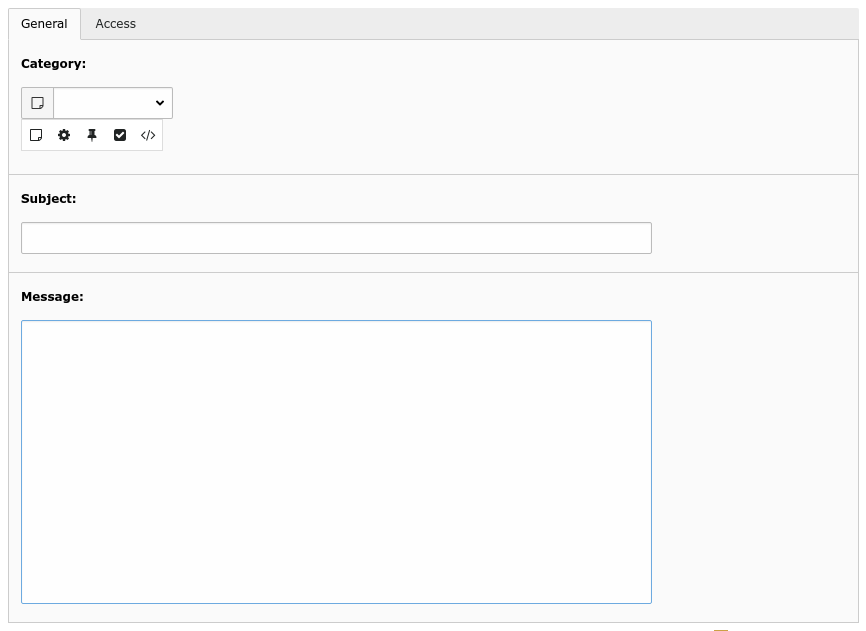
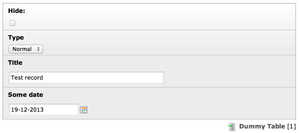
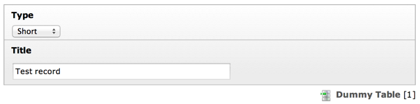
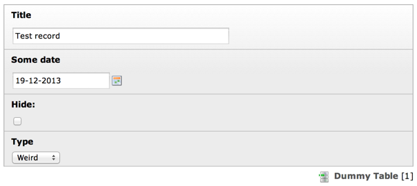

.. include:: /Includes.rst.txt

========
Examples
========

.. _types-required:

Let's take the internal notes (sys\_note) as a basic example. The ['types'] section is configured like this:

.. code-block:: php

    'types' => [
        '0' => [
            'showitem' => '
                --div--;LLL:EXT:core/Resources/Private/Language/Form/locallang_tabs.xlf:general, category, subject, message,
                --div--;LLL:EXT:core/Resources/Private/Language/Form/locallang_tabs.xlf:access, personal
            ',
        ],
    ]

It specifies two tabs: the first one labelled "general" with three fields "category" "subject" and "message", and the second one labelled "access" with the
field "personal". Only the default type "0" is specified. Opening such a record looks like this:

.. _types-optional:

The power of the "types" configuration becomes clear when you want the form composition of a record to depend on a
value from the record. Let's look at the "tx_examples_dummy" table from the "examples" extension. The
"ctrl" section of its TCA contains a "type" property:

.. code-block:: php

    'ctrl' => [
        'type' => 'record_type',
        ...
    ],

This indicates that the field called "record\_type" is to specify the "type" of any given record of
the table. Let's look at how this field is defined in ['columns']:

.. code-block:: php

    'record_type' => [
        'exclude' => 0,
        'label' => 'LLL:EXT:examples/Resources/Private/Language/locallang_db.xlf:tx_examples_dummy.record_type',
        'config' => [
            'type' => 'select',
            'renderType' => 'selectSingle',
            'items' => [
                ['LLL:EXT:examples/Resources/Private/Language/locallang_db.xlf:tx_examples_dummy.record_type.0', 0],
                ['LLL:EXT:examples/Resources/Private/Language/locallang_db.xlf:tx_examples_dummy.record_type.1', 1],
                ['LLL:EXT:examples/Resources/Private/Language/locallang_db.xlf:tx_examples_dummy.record_type.2', 2],
            ]
        ]
    ],

There's nothing unusual here. It's a pretty straightforward select field, with three options. Finally, in the "types"
section, we defined what fields should appear and in what order for every value of the "type" field:

.. code-block:: php

    'types' => [
        '0' => [
            'showitem' => 'hidden, record_type, title, some_date'
        ],
        '1' => [
            'showitem' => 'record_type, title'
        ],
        '2' => [
            'showitem' => 'title, some_date, hidden, record_type'
        ],
    ],

The result if the following display when type "Normal" is chosen:

   The "normal" layout of dummy records

Changing to type "Short" reloads the form and displays the following:

   The "short" layout displays less fields

And finally, type "Weird" also shows all fields, but in a different order:

   The "weird" layout displays the fields in a totally different order

.. note::
    It is a good idea to give all "types" speaking names, except the default type "0": In the above
    example, it would have been better to rename "1" to "short" and "2" to "weird", both for the ['types'] array
    keys and the "select" values to give those types some easy to understand meaning if looking at the array.

